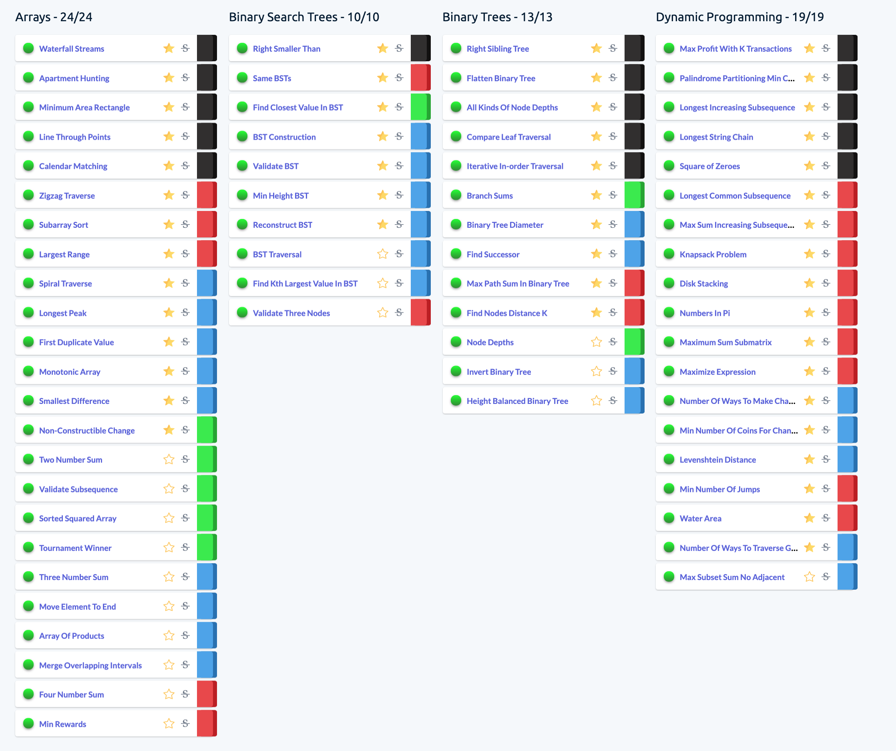
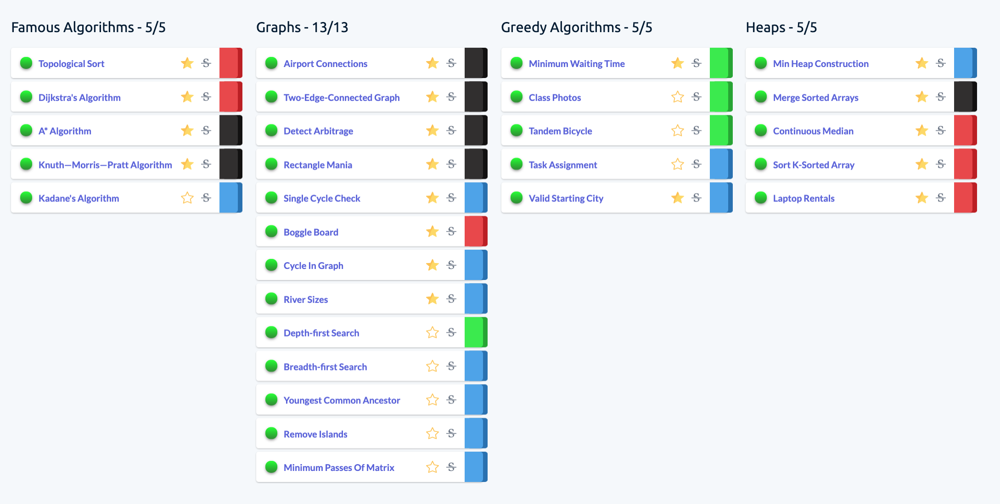
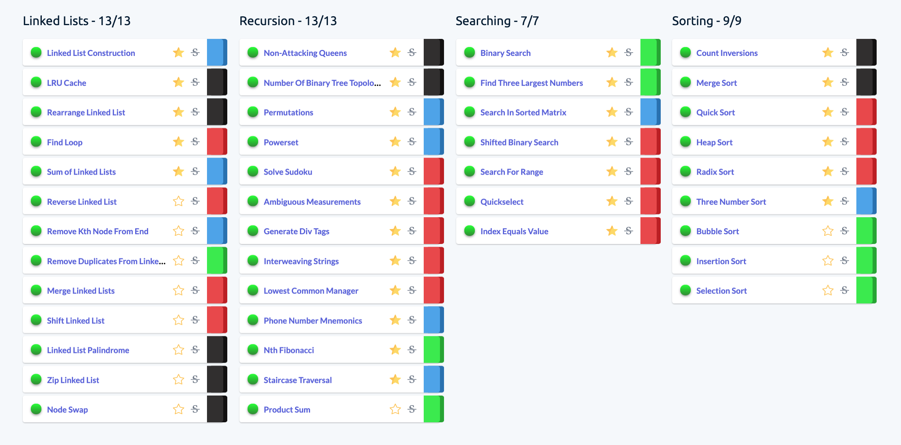
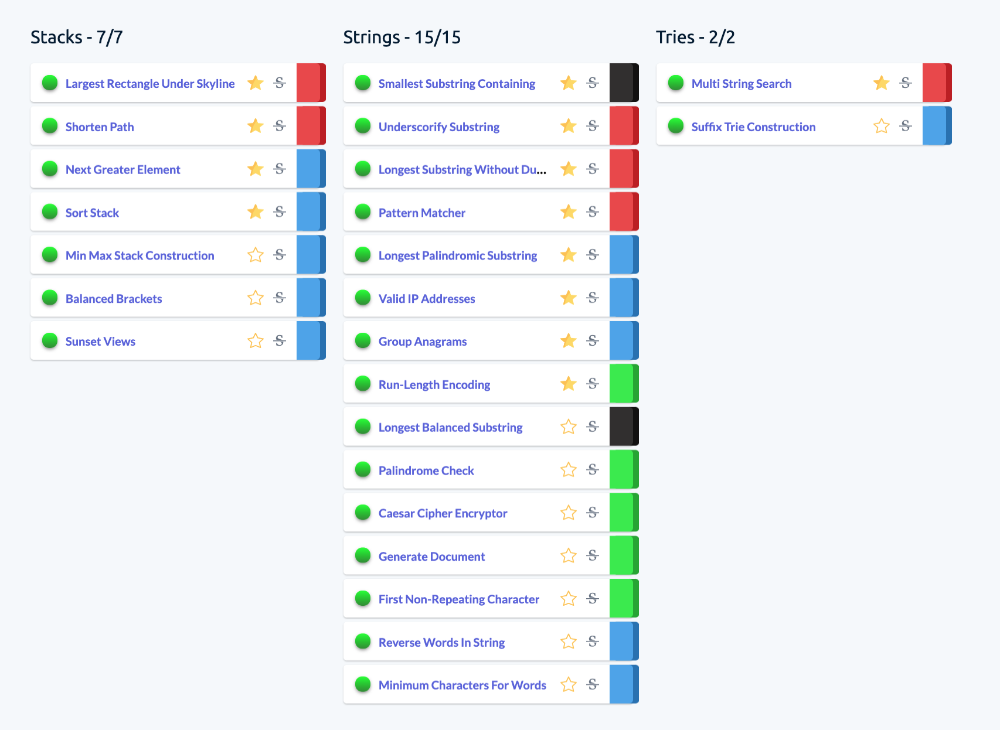

# Algoexpert

176 Coding Questions

## Star questions

### Arrays

Waterfall Streams

Apartment Hunting

Minimum Area Rectangle

Line Through Points

Calendar Matching

Zigzag Traverse

Subarray Sort

Largest Range

Spiral Traverse

Longest Peak

First Duplicate Value

Monotonic Array

Smallest Difference

Non-Constructible Change

### Binary Search Trees

Right Smaller Than

Same BSTs

Find Closest Value In BST

BST Construction

Validate BST

Min Height BST

Reconstruct BST

### Binary Trees

Right Sibling Tree

Flatten Binary Tree

All Kinds Of Node Depths

Compare Leaf Traversal

Iterative In-order Traversal

Branch Sums

Binary Tree Diameter

Find Successor

Max Path Sum In Binary Tree

Find Nodes Distance K

### Dynamic Programming

Max Profit With K Transactions

Palindrome Partitioning Min Cuts

Longest Increasing Subsequence

Longest String Chain

Square of Zeroes

Longest Common Subsequence

Max Sum Increasing Subsequence

Knapsack Problem

Disk Stacking

Numbers In Pi

Maximum Sum Submatrix

Maximize Expression

Number Of Ways To Make Change

Min Number Of Coins For Change

Levenshtein Distance

Min Number Of Jumps

Water Area

Number Of Ways To Traverse Graph

### Famous Algorithms

Topological Sort

Dijkstra's Algorithm

A* Algorithm

Knuth—Morris—Pratt Algorithm

### Graphs

Airport Connections

Two-Edge-Connected Graph

Detect Arbitrage

Rectangle Mania

Single Cycle Check

Boggle Board

Cycle In Graph

River Sizes

### Greedy Algorithms

Minimum Waiting Time

Valid Starting City

### Heaps

Min Heap Construction

Merge Sorted Arrays

Continuous Median

Sort K-Sorted Array

Laptop Rentals

### Linked Lists

Linked List Construction

LRU Cache

Rearrange Linked List

Find Loop

Sum of Linked Lists

### Recursion

Non-Attacking Queens

Number Of Binary Tree Topologies

Permutations

Powerset

Solve Sudoku

Ambiguous Measurements

Generate Div Tags

Interweaving Strings

Lowest Common Manager

Phone Number Mnemonics

Nth Fibonacci

Staircase Traversal

### Searching

Binary Search

Find Three Largest Numbers

Search In Sorted Matrix

Shifted Binary Search

Search For Range

Quickselect

Index Equals Value

### Sorting

Count Inversions

Merge Sort

Quick Sort

Heap Sort

Radix Sort

Three Number Sort

### Stacks

Largest Rectangle Under Skyline

Shorten Path

Next Greater Element

Sort Stack

### Strings

Smallest Substring Containing

Underscorify Substring

Longest Substring Without Duplication

Pattern Matcher

Longest Palindromic Substring

Valid IP Addresses

Group Anagrams

Run-Length Encoding

### Tries

Multi String Search

---

