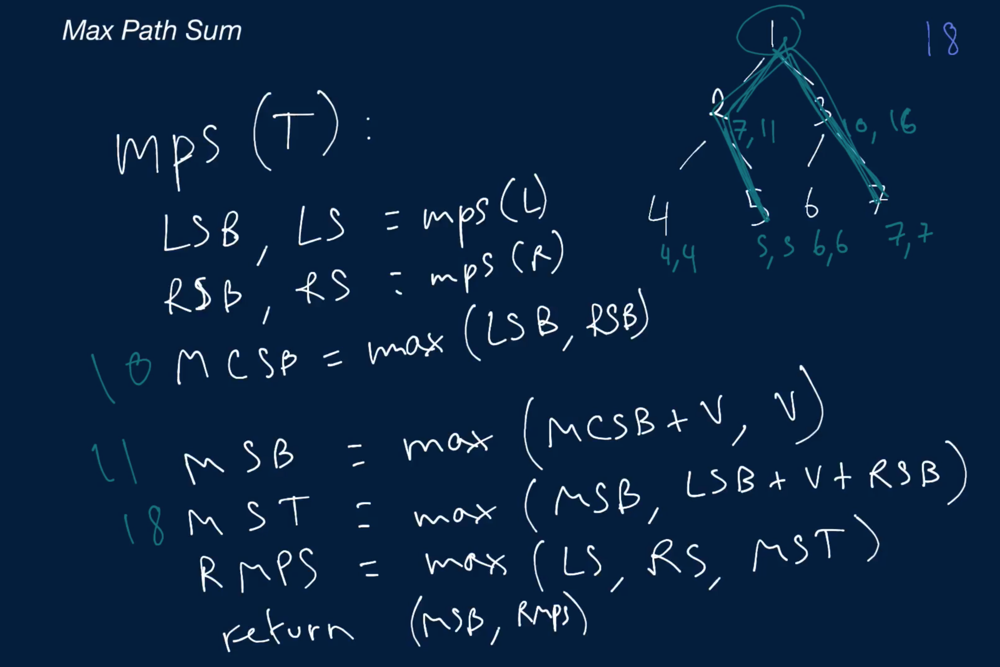

# Max Path Sum In Binary Tree

Write a function that takes in a Binary Tree and returns its max path sum.

A path is a collection of connected nodes in a tree, where no node is connected to more than two other nodes; a path sum is the sum of the values of the nodes in a particular path.

Each BinaryTree node has an integer value, a left child node, and a right child node. Children nodes can either be BinaryTree nodes themselves or None / null.

## Sample Input
```
tree = 1
    /     \
   2       3
 /   \   /   \
4     5 6     7
```

## Sample Output
```
18 // 5 + 2 + 1 + 3 + 7
```

### Hints

Hint 1
> If you were to imagine each node in a Binary Tree as the root of the Binary Tree, temporarily eliminating all of the nodes that come above it, how would you find the max path sum for each of these newly imagined Binary Trees? In simpler terms, how can you find the max path sum for each subtree in the Binary Tree?

Hint 2
> For every node in a Binary Tree, there are four options for the max path sum that includes its value: the node's value alone, the node's value plus the max path sum of its left subtree, the node's value plus the max path sum of its right subtree, or the node's value plus the max path sum of both its subtrees.

Hint 3
> A recursive algorithm that computes each node's max path sum and uses it to compute its parents' nodes' max path sums seems appropriate, but realize that you cannot have a path going through a node and both its subtrees as well as that node's parent node. In other words, the fourth option mentioned in Hint #2 poses a challenge to implementing a recursive algorithm that solves this problem. How can you get around it?

```
Optimal Space & Time Complexity
O(n) time | O(log(n)) space - where n is the number of nodes in the Binary Tree
```



### Notes

In the video explanation, we forget to handle the edge case where all nodes in the input Binary Tree have negative values.

In this case, the maxPathSum is guaranteed to be negative, since there are no positive-valued nodes.

This means that we can't set the base-case leftMaxPathSum and rightMaxPathSum values, when the left and / or right child nodes are null, to 0. Setting them to 0 means that the final maxPathSum will always be 0, since the final computation in our recursive method will compare 0 to a negative value.

```
maxPathSum = max(leftMaxPathSum, rightMaxPathSum, maxSumAsRootNode)
```
This operation will always yield 0 when maxSumAsRootNode is negative and leftMaxPathSum and / or rightMaxPathSum are 0.

Therefore, we set the base-case leftMaxPathSum and rightMaxPathSum values, when the left and / or right child nodes are null, to -Infinity (or whatever the min number in your programming language is).

```
if tree is None:
    return (0, float("-inf"))
```
