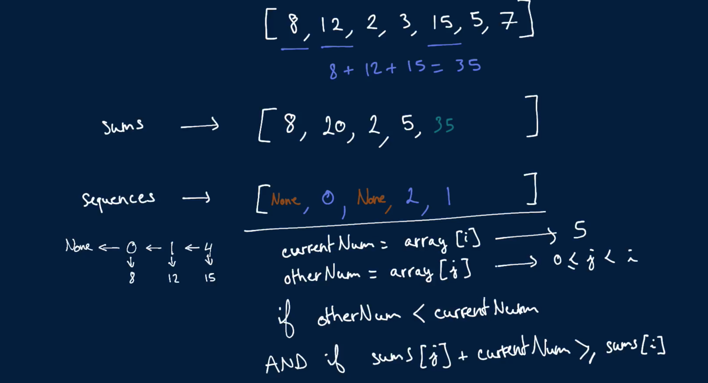
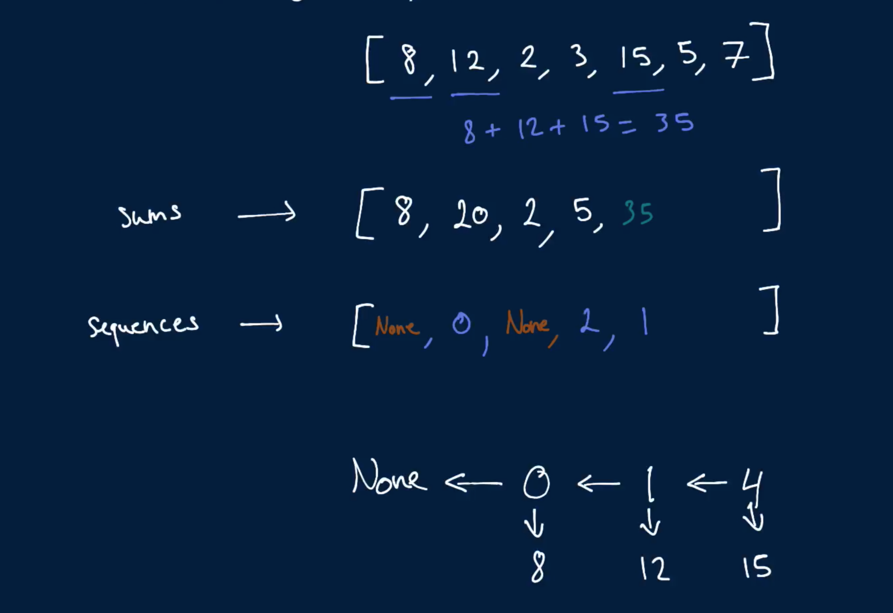

# Max Sum Increasing Subsequence

Write a function that takes in a non-empty array of integers and returns the greatest sum that can be generated from a strictly-increasing subsequence in the array as well as an array of the numbers in that subsequence.

A subsequence of an array is a set of numbers that aren't necessarily adjacent in the array but that are in the same order as they appear in the array. For instance, the numbers [1, 3, 4] form a subsequence of the array [1, 2, 3, 4], and so do the numbers [2, 4]. Note that a single number in an array and the array itself are both valid subsequences of the array.

You can assume that there will only be one increasing subsequence with the greatest sum.

## Sample Input

```
array = [10, 70, 20, 30, 50, 11, 30]
```

## Sample Output

```
[110, [10, 20, 30, 50]] // The subsequence [10, 20, 30, 50] is strictly increasing and yields the greatest sum: 110.
```

### Hints

Hint 1
> Try building an array of the same length as the input array. At each index in this new array, store the maximum sum that can be generated from an increasing subsequence ending with the number found at that index in the input array.

Hint 2
> Can you efficiently keep track of potential sequences in another array? Instead of storing entire sequences, try storing the indices of previous numbers. For example, at index 3 in this other array, store the index of the before-last number in the max-sum increasing subsequence ending with the number at index 3.

```
Optimal Space & Time Complexity
O(n^2) time | O(n) space - where n is the length of the input array
```




