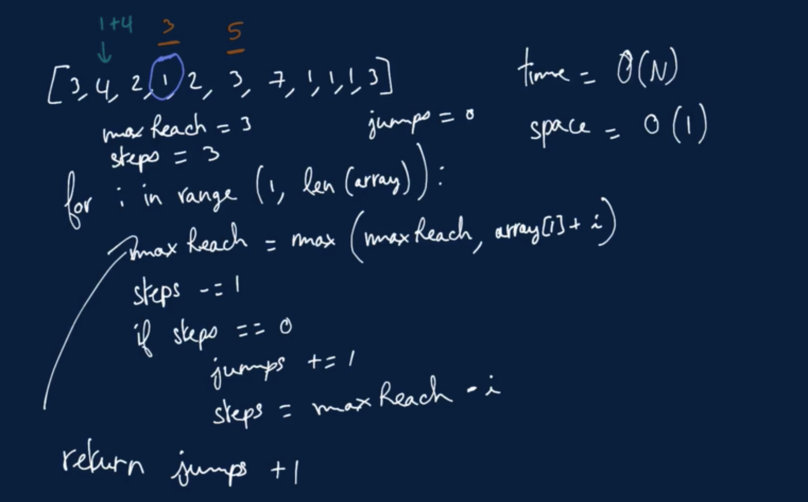
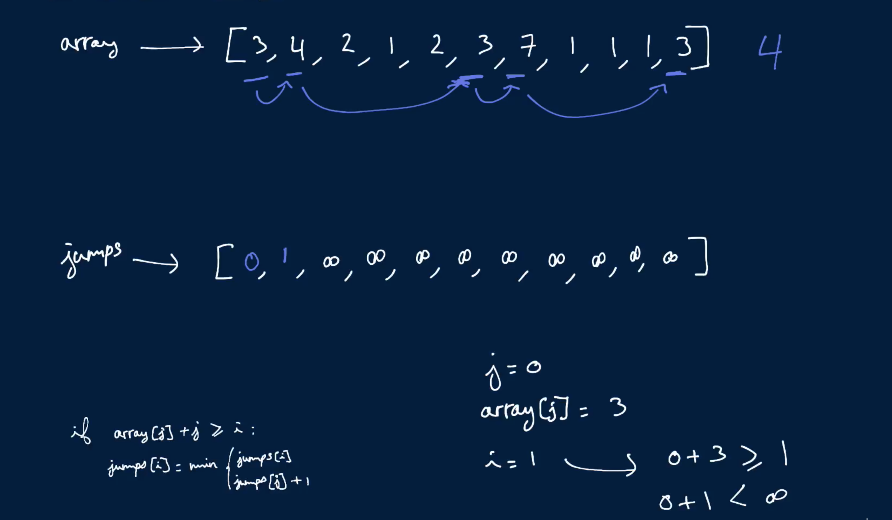

# Min Number Of Jumps

You're given a non-empty array of positive integers where each integer represents the maximum number of steps you can take forward in the array. For example, if the element at index 1 is 3, you can go from index 1 to index 2, 3, or 4.

Write a function that returns the minimum number of jumps needed to reach the final index.

Note that jumping from index i to index i + x always constitutes one jump, no matter how large x is.

## Sample Input

```
array = [3, 4, 2, 1, 2, 3, 7, 1, 1, 1, 3]
```

## Sample Output

```
4 // 3 --> (4 or 2) --> (2 or 3) --> 7 --> 3
```

### Hints

Hint 1
> Try building an array of the minimum number of jumps needed to go from index 0 to all indices. Start at index 0 and progressively build up the array, using previously calculated values to find next ones.

Hint 2
> Building the array mentioned in Hint #1 should be feasible using two for loops. In an effort to optimize your algorithm, realize that at any point in the array you know the farthest index that you can reach as well as the number of steps that you have left until you must "consume" a jump.

Hint 3
> After initializing your maximum reach as well as your current number of steps to the value stored at index 0, you can easily update your maximum reach as you traverse the input array by simply comparing it to the value stored at each index. You can also remove one step from your current number of steps at each index, since moving from one index to the next uses up one step. When your steps reach zero, find a way to calculate how many steps you actually have left using the maximum reach and the index that you're at.

```
Optimal Space & Time Complexity
O(n) time | O(1) space - where n is the length of the input array
```




