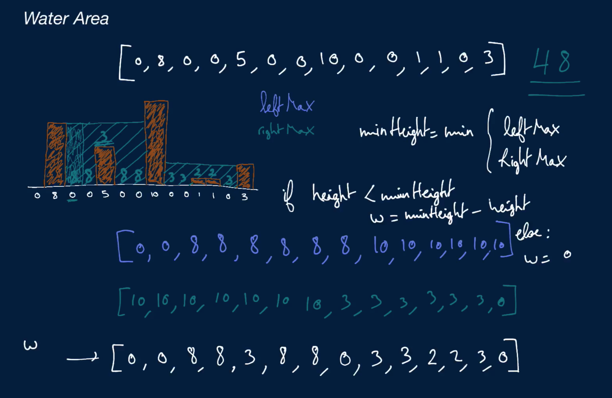

# Water Area

You're given an array of non-negative integers where each non-zero integer represents the height of a pillar of width 1. Imagine water being poured over all of the pillars; write a function that returns the surface area of the water trapped between the pillars viewed from the front. Note that spilled water should be ignored.

You can refer to the first three minutes of this question's video explanation for a visual example.

## Sample Input

```
heights = [0, 8, 0, 0, 5, 0, 0, 10, 0, 0, 1, 1, 0, 3]
```

## Sample Output

``` 
48

// Below is a visual representation of the sample input.
// The dots and vertical lines represent trapped water and pillars, respectively.
// Note that there are 48 dots.
//        |
//        |
//  |.....|
//  |.....|
//  |.....|
//  |..|..|
//  |..|..|
//  |..|..|.....|
//  |..|..|.....|
// _|..|..|..||.|
```

### Hints

Hint 1
> In order to calculate the amount of water above a single point in the input array, you must know the height of the tallest pillar to its left and the height of the tallest pillar to its right.

Hint 2
> If a point can hold water above it, then the smallest of the two heights mentioned in Hint #1 minus the height at that respective point should lead you to the amount of water above it.

Hint 3
> Try building an array of the left and right max heights for each point in the input array. You should be able to build this array and to compute the final amount of water above each point in just two loops over the input array.

```
Optimal Space & Time Complexity
O(n) time | O(1) space - where n is the length of the input array
```



### Notes
The video explanation of this question covers a solution that runs with linear space, but we can actually also solve this question with constant space (see our written Solution 2).

To do so, we have to realize that, if we just look at the two extremeties of the input array, the smaller of the two values gives us information about water to be trapped in the middle. For example, consider the following simple array:

```
heights = [4, 0, 6, 0, 10]
```

Since the leftmost value 4 is smaller than the rightmost value 10, we know that, assuming all values in between are smaller than this leftmost value, we'll trap water equal to the difference between 4 and those values.

Now of course, middle values won't always be smaller than the leftmost value, like the middlemost value in the array above which is 6. In those cases, we update the leftmost value, making the leftmost value effectively contain the greatest most recently visited value to the left.

Broadly speaking, the algorithm works by setting up two pointers—a left and right pointer—at the extremities of the input array and progressively pushing the one that points to the smallest value inward. At each value in between the pointers, we update the relevant left-or-right max value (this depends on which pointer we moved inward), and we add to our final surface area the difference between the relevant left-or-right max value and the current value. We repeat this until the left and right pointers pass each other.

Since we only need to store five values, this algorithm only requires constant space.

Solution 2 implements this algorithm.