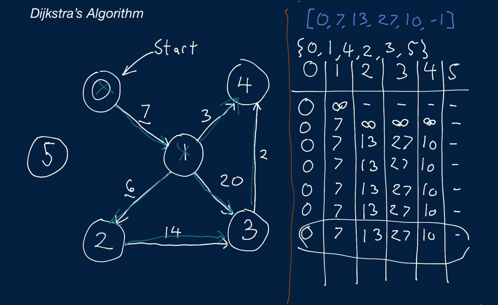
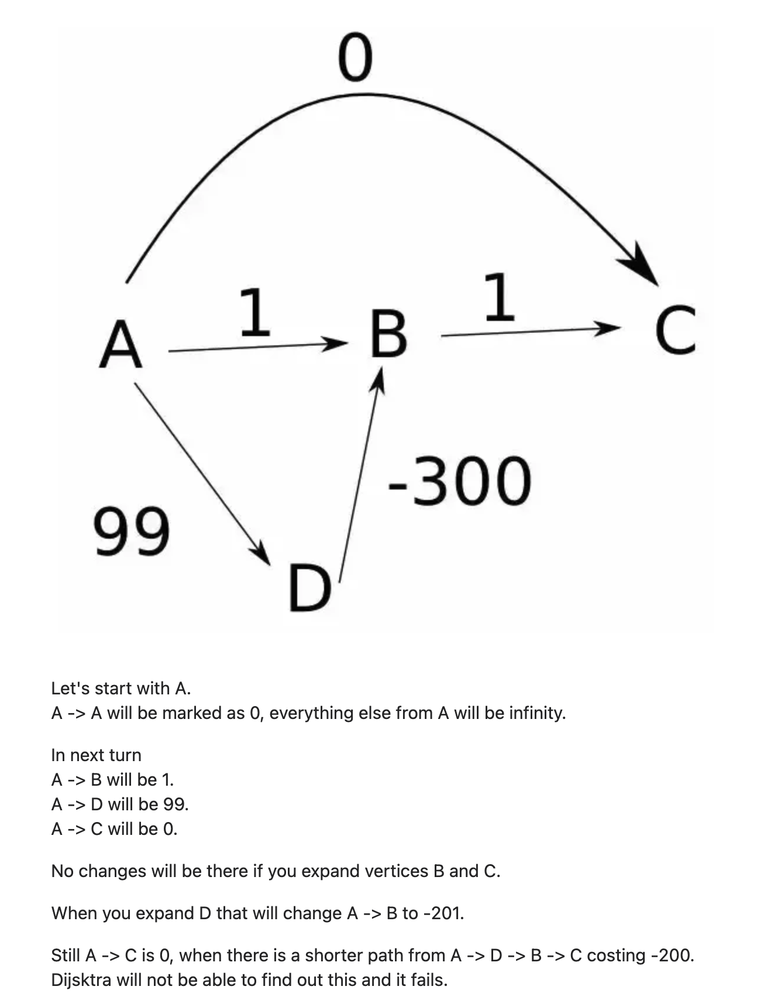

# Dijkstra's Algorithm

You're given an integer start and a list edges of pairs of integers.

The list is what's called an adjacency list, and it represents a graph. The number of vertices in the graph is equal to the length of edges, where each index i in edges contains vertex i's outbound edges, in no particular order. Each individual edge is represented by an pair of two numbers, [destination, distance], where the destination is a positive integer denoting the destination vertex and the distance is a positive integer representing the length of the edge (the distance from vertex i to vertex destination). Note that these edges are directed, meaning that you can only travel from a particular vertex to its destination—not the other way around (unless the destination vertex itself has an outbound edge to the original vertex).

Write a function that computes the lengths of the shortest paths between start and all of the other vertices in the graph using Dijkstra's algorithm and returns them in an array. Each index i in the output array should represent the length of the shortest path between start and vertex i. If no path is found from start to vertex i, then output[i] should be -1.

Note that the graph represented by edges won't contain any self-loops (vertices that have an outbound edge to themselves) and will only have positively weighted edges (i.e., no negative distances).

If you're unfamiliar with Dijkstra's algorithm, we recommend watching the Conceptual Overview section of this question's video explanation before starting to code.

## Sample Input

```
start = 0
edges = [
  [[1, 7]],
  [[2, 6], [3, 20], [4, 3]],
  [[3, 14]],
  [[4, 2]],
  [],
  [],
]
```

## Sample Output
```
[0, 7, 13, 27, 10, -1]
```

### Hints

Hint 1
> Dijkstra's algorithm works by visiting vertices in the graph, one by one, all the while keeping track of the current shortest distances from the start vertex to all other vertices and continuously updating these shortest distances. More specifically, the algorithm keeps track of unvisited vertices and visits the unvisited vertex with the shortest distance at any point in time, naturally starting with the start vertex. Whenever the algorithm visits an unvisited vertex, it looks at all of its outbound edges and tries to update the shortest distances from the start to the destinations in the edges, using the current shortest distance to the current vertex as a base. Once the algorithm has visited all of the vertices and considered all of their edges, it is guaranteed to have found the shortest path to each vertex. How can you implement this algorithm?

Hint 2
> The most challenging part of Dijkstra's algorithm is determining how to efficiently find the vertex with the current shortest distance. Can you think of a data structure that could be used to keep track of the distances and to efficiently retrieve the vertex with the current shortest distance at each step?

Hint 3
> Create an array that can store the final shortest distances between the start vertex and all other vertices, as well as a min-heap that will hold all of the unvisited vertices and their current shortest distances. For both the final distances array and the min-heap, initialize all vertices except for the start node as having a distance of infinity; the start node will have a distance 0. Next, write a while loop that will run until the min-heap is empty. At every iteration in the loop, remove the vertex from the top of the heap (the vertex with the shortest distance), loop through all of its edges, and for each edge, update the shortest distance of the destination vertex to be the minimum of the destination's current shortest distance and the currently visited vertex's distance plus the current edge's weight. Once the heap is empty, all of the vertices will have been visited, and you'll have the shortest distances to all vertices stored in your distances array.

```
Optimal Space & Time Complexity
O((v + e) * log(v)) time | O(v) space - where v is the number of vertices and e is the number of edges in the input graph
```




