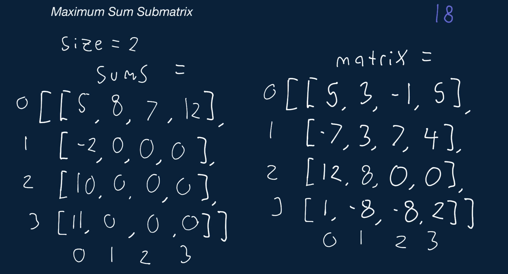
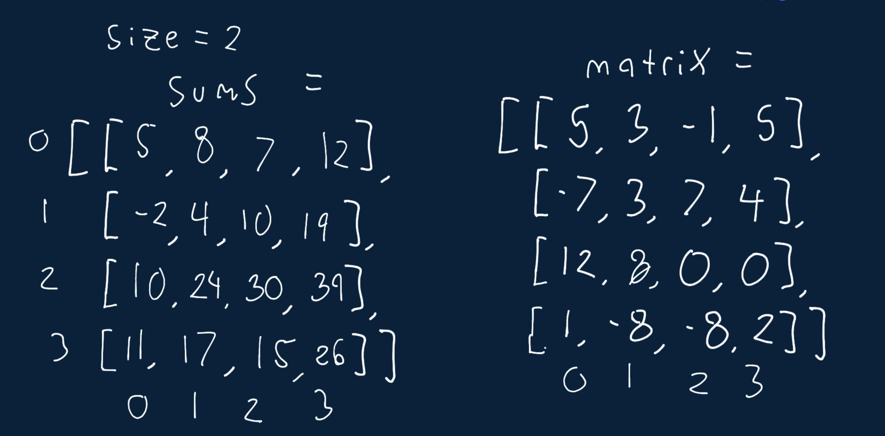
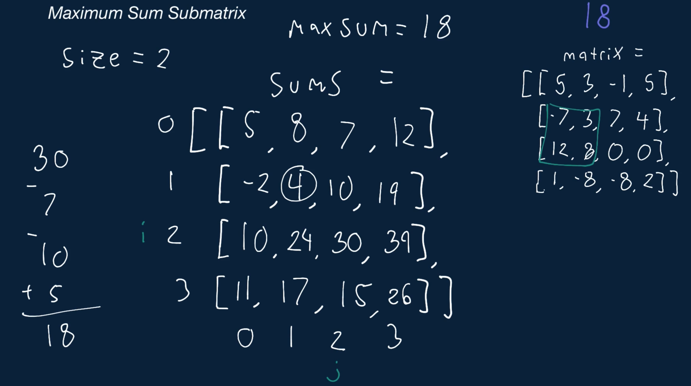
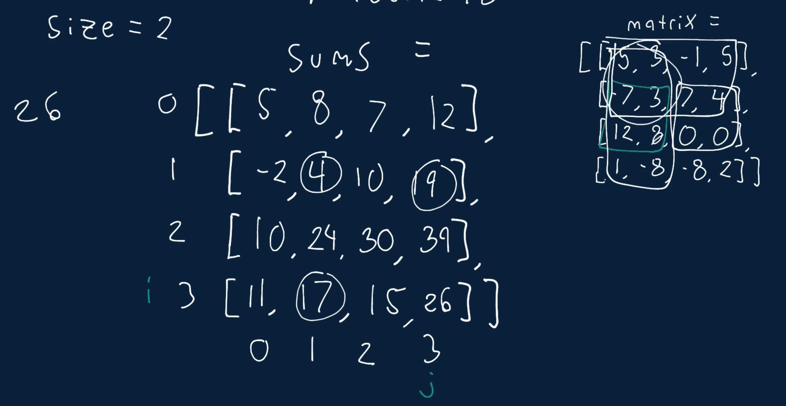

# Maximum Sum Submatrix

You're given a two-dimensional array (a matrix) of potentially unequal height and width that's filled with integers. You're also given a positive integer size. Write a function that returns the maximum sum that can be generated from a submatrix with dimensions size * size.

For example, consider the following matrix:

```
[
  [2, 4],
  [5, 6],
  [-3, 2],
]
```

If size = 2, then the 2x2 submatrices to consider are:

```
[2, 4]
[5, 6]
------
[5, 6]
[-3, 2]
```

The sum of the elements in the first submatrix is 17, and the sum of the elements in the second submatrix is 10. In this example, your function should return 17.

Note: size will always be at least 1, and the dimensions of the input matrix will always be at least size * size.

## Sample Input

```
matrix = 
[
  [5, 3, -1, 5],
  [-7, 3, 7, 4],
  [12, 8, 0, 0],
  [1, -8, -8, 2],
]
size = 2
```

## Sample Output

```
18
// [
//   [., ., ., .],
//   [., 3, 7, .],
//   [., 8, 0, .],
//   [., ., ., .],
// ]
```

### Hints

Hint 1
> The brute-force approach to solve this problem involves simply considering all possible submatrices of size size * size, determining their sums, and finally returning the maximum sum. This approach is acceptable, but it isn't optimal. Why isn't it optimal?

Hint 2
> The approach stated in Hint #1 isn't optimal because it repeats some additions. When considering submatrices of any size larger than 1, it's almost always the case that some these matrices will have overlapping elements, meaning that we'll repeatedly add up the same numbers. If we were to use the brute-force approach, we would get a time complexity of O(width * height * size). To achieve a more optimal time complexity, we need to avoid readding elements that have already been added. Can you think of a way to solve this problem in O(width * height) time?

Hint 3
> To avoid doing repeated addition, we have to use auxiliary space. Ideally, this extra space will allow us to determine the sum of a submatrix of any size in constant time. Start by creating a matrix with the same dimensions as the input matrix (we call this matrix sums). The element at position i, j (where i is the row and j is the column) in this new matrix should be the sum of all the elements in the submatrix whose top left corner is at 0, 0 and whose bottom right corner is at i, j. How can you quickly fill up this new matrix, and how can you then use it to determine the sum of a submatrix of any size in constant time?

Hint 4
> The sum of a matrix whose bottom right corner is at i, j (where size <= i <= j) is simply sums[i][j] - sums[i - size][j] - sums[i][j - size] + sums[i - size][j - size]. See the Conceptual Overview section of this question's video explanation for a more in-depth explanation.

```
Optimal Space & Time Complexity
O(w * h) time | O(w * h) space - where w is the width of the matrix and h is the height
```








