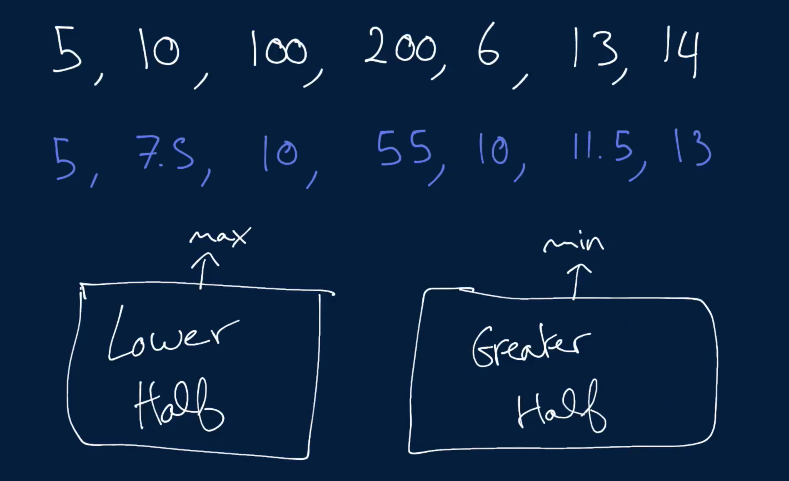
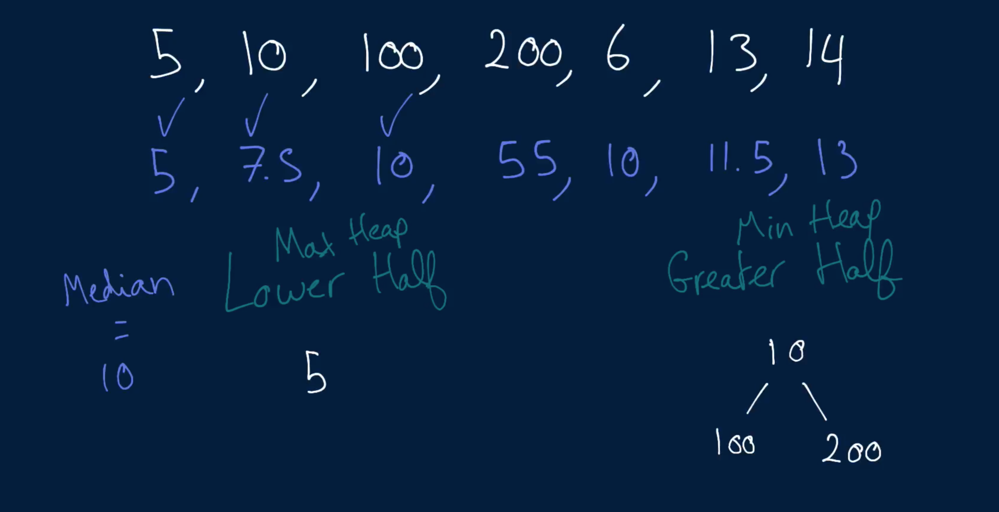
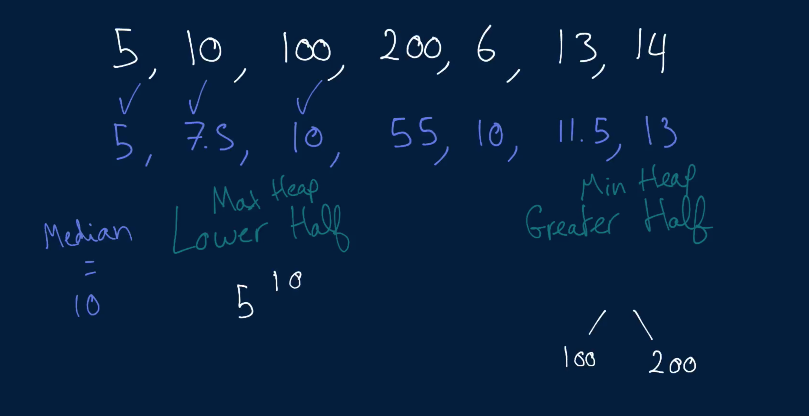
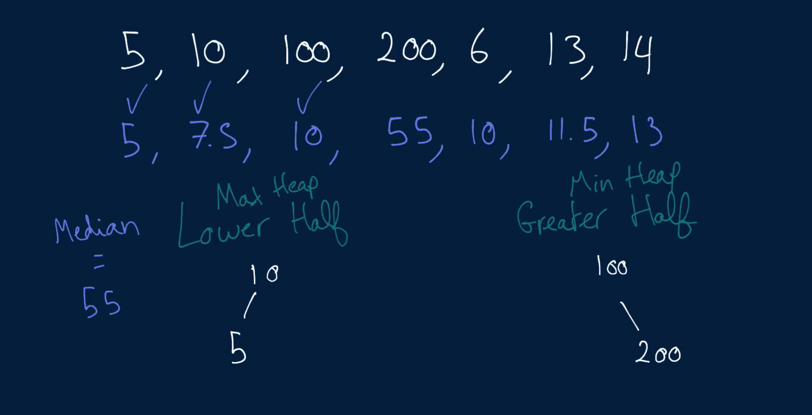
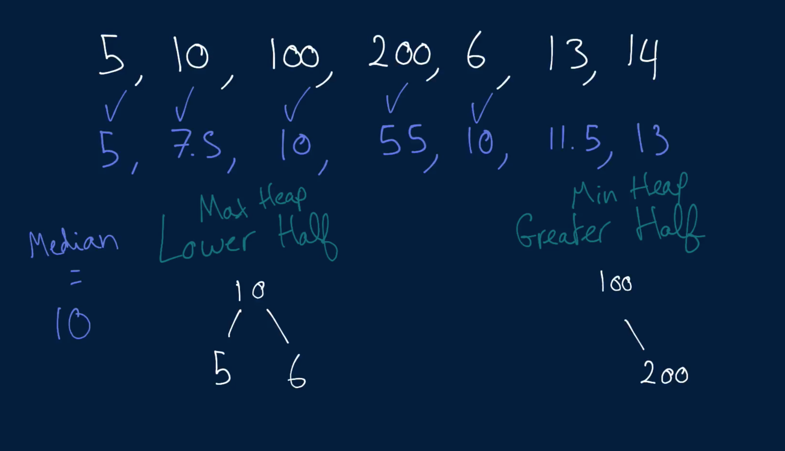
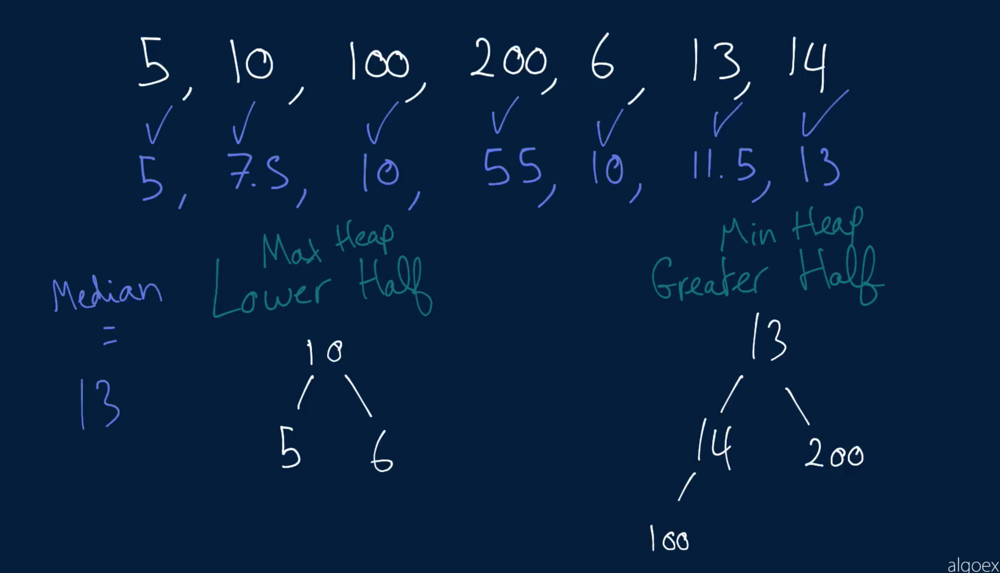

# Continuous Median

Write a ContinuousMedianHandler class that supports:

   - The continuous insertion of numbers with the insert method.
   - The instant (O(1) time) retrieval of the median of the numbers that have been inserted thus far with the getMedian method.

The getMedian method has already been written for you. You simply have to write the insert method.

The median of a set of numbers is the "middle" number when the numbers are ordered from smallest to greatest. If there's an odd number of numbers in the set, as in {1, 3, 7}, the median is the number in the middle (3 in this case); if there's an even number of numbers in the set, as in {1, 3, 7, 8}, the median is the average of the two middle numbers ((3 + 7) / 2 == 5 in this case).

## Sample Usage

```
// All operations below are performed sequentially.
ContinuousMedianHandler(): - // instantiate a ContinuousMedianHandler
insert(5): -
insert(10): -
getMedian(): 7.5
insert(100): -
getMedian(): 10
```

### Hints

Hint 1
> The median of a set of numbers is often, by definition, one of the numbers in the set. Thus, you likely have to store all of the inserted numbers somewhere to be able to continuously compute their median.

Hint 2
> The median of a set of numbers is either the middle number of that set (if the set has an odd amount of numbers) or the average of the middle numbers (if the set has an even amount of numbers). This means that if you could somehow keep track of the middle number(s) of the set of inserted numbers, you could easily compute the median by finding the indices of the middle numbers and doing some simple calculations. Perhaps storing all of the numbers in a sorted array could work, but what would be the runtime implication of inserting each new number into a sorted array?

Hint 3
> Realizing that you only need to keep track of the middle numbers in the set of inserted numbers to compute the median, try keeping track of two subsets of the numbers: a max-heap of the lower half of the numbers and a min-heap of the greater half of the numbers. Any time you insert a number, pick the heap to place it in by comparing it to the max / min values of the heaps. Then, re-balance the heaps in an effort to keep their sizes apart by at most one. Doing so will allow you to access the middle number(s) of the set of inserted numbers very easily, which will make calculating the median a trivial computation. Re-balancing the heaps can be accomplished by simply removing a value from the larger heap and inserting it in the smaller one. What are the runtime implications of all these operations?

```
Optimal Space & Time Complexity
Insert: O(log(n)) time | O(n) space - where n is the number of inserted numbers
```













