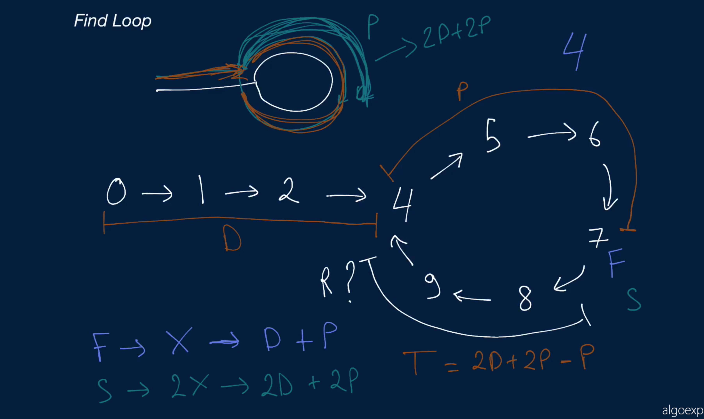
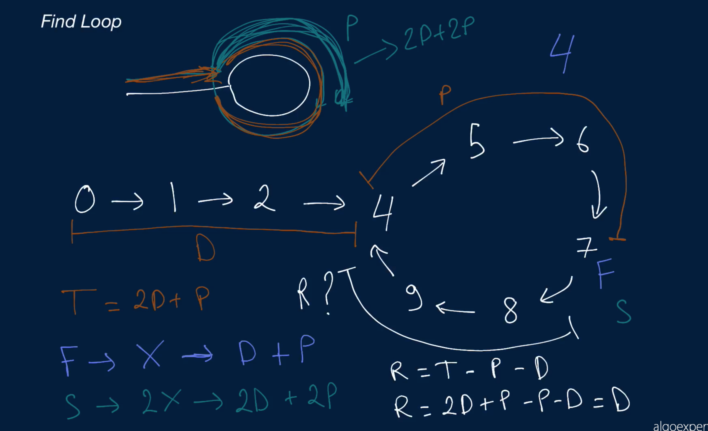

# Find Loop

Write a function that takes in the head of a Singly Linked List that contains a loop (in other words, the list's tail node points to some node in the list instead of None / null). The function should return the node (the actual node--not just its value) from which the loop originates in constant space.

Each LinkedList node has an integer value as well as a next node pointing to the next node in the list.

## Sample Input

``` 
head = 0 -> 1 -> 2 -> 3 -> 4 -> 5 -> 6 // the head node with value 0
                           ^         v
                           9 <- 8 <- 7
```

## Sample Output

```
4 -> 5 -> 6 // the node with value 4
^         v
9 <- 8 <- 7
```

### Hints

Hint 1
> Try traversing the linked list with two pointers, one iterating through every single node in the list and another iterating through every other node in the list (skipping a node every time). Eventually, both pointers will point to the same node since there is a loop in the list and since one pointer is moving faster than the other. Stop once the pointers overlap each other. How can you find the origin of the loop from here?

Hint 2
> Can you come up with a mathematical relation between the respective distances traveled by each pointer? How far will the first pointer have traveled when the pointers overlap? What about the second pointer? How can this relation then help you find the actual origin of the loop in the list?

Hint 3
> Let D be the distance between the start of the linked list and the origin of the loop in the list. Let P be distance between the origin of the loop and the node N where the first and second pointers overlap (going in the primary direction of the list). By the time the pointers reach N, the first pointer will have traveled a distance of length D + P, and the second pointer will have traveled a distance of length 2D + 2P, since it will have traveled twice as much as the first pointer. Thus, the distance between N and the origin of the loop (going in the primary direction of the list) can be arithmetically deduced to be 2D + 2P - D - 2P = D. With both pointers D length away from the origin of the loop, how can you find the origin?

```
Optimal Space & Time Complexity
O(n) time | O(1) space - where n is the number of nodes in the Linked List
```



