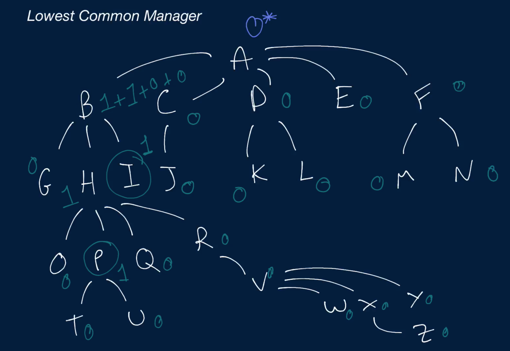

# Lowest Common Manager

You're given three inputs, all of which are instances of an OrgChart class that have a directReports property pointing to their direct reports. The first input is the top manager in an organizational chart (i.e., the only instance that isn't anybody else's direct report), and the other two inputs are reports in the organizational chart. The two reports are guaranteed to be distinct.

Write a function that returns the lowest common manager to the two reports.

## Sample Input
``` 
// From the organizational chart below.
topManager = Node A
reportOne = Node E
reportTwo = Node I
          A
       /     \
      B       C
    /   \   /   \
   D     E F     G
 /   \
H     I
``` 

## Sample Output
```
Node B
```

### Hints

Hint 1
> Given a random subtree in the organizational chart, the manager at the root of that subtree is common to any two reports in the subtree.

Hint 2
> Knowing Hint #1, the lowest common manager to two reports in an organizational chart is the root of the lowest subtree containing those two reports. Find that lowest subtree to find the lowest common manager.

Hint 3
> To find the lowest subtree containing both of the input reports, try recursively traversing the organizational chart and keeping track of the number of those reports contained in each subtree as well as the lowest common manager in each subtree. Some subtrees might contain neither of the two reports, some might contain one of them, and others might contain both; the first to contain both should return the lowest common manager for all of the subtrees above it that contain it, including the entire organizational chart.

```
Optimal Space & Time Complexity
O(n) time | O(d) space - where n is the number of people in the org and d is the depth (height) of the org chart
```


