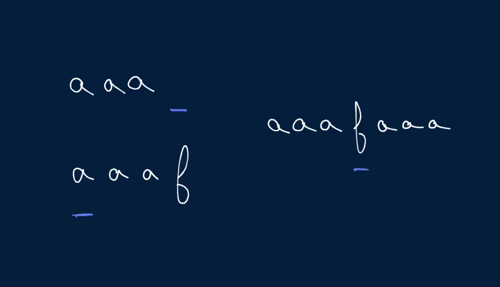
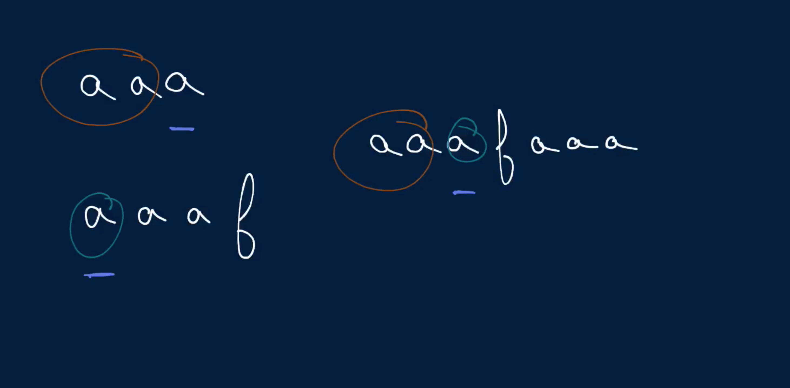

# Interweaving Strings

Write a function that takes in three strings and returns a boolean representing whether the third string can be formed by interweaving the first two strings.

To interweave strings means to merge them by alternating their letters without any specific pattern. For instance, the strings "abc" and "123" can be interwoven as "a1b2c3", as "abc123", and as "ab1c23" (this list is nonexhaustive).

Letters within a string must maintain their relative ordering in the interwoven string.

## Sample Input

```
one = "algoexpert"
two = "your-dream-job"
three = "your-algodream-expertjob"
```

## Sample Output

```
true
```

### Hints

Hint 1
> Try traversing the three strings with three different pointers to solve this problem.

Hint 2
> Declare three variables (i, j, and k, for instance) pointing to indices in the three strings, respectively, and starting at 0. At any given combination of indices, if neither the character at i in the first string nor the character at j in the second string is equal to the character at k in the third string, then the first two strings can't interweave to form the third one (at least not in whatever way led to the values of i, j, and k in question).

Hint 3
> If at any given combination of the indices i, j, and k mentioned in Hint #2, the character at i in the first string or the character at j in the second string is equal to the character at k in the third string, then you can potentially interweave the first two strings to get the third one. In such a case, try incrementing the two relevant indices (i and k or j and k) and repeating this process until you confirm whether or not the first two strings can be interwoven to form the third one. Try using recursion to implement this algorithm.

Hint 4
> By following Hint #3, you'll perform, in some cases, many computations multiple times. How can you use caching to improve the time complexity of this algorithm?

```
Optimal Space & Time Complexity
O(nm) time | O(nm) space - where n is the length of the first string and m is the length of the second string
```




