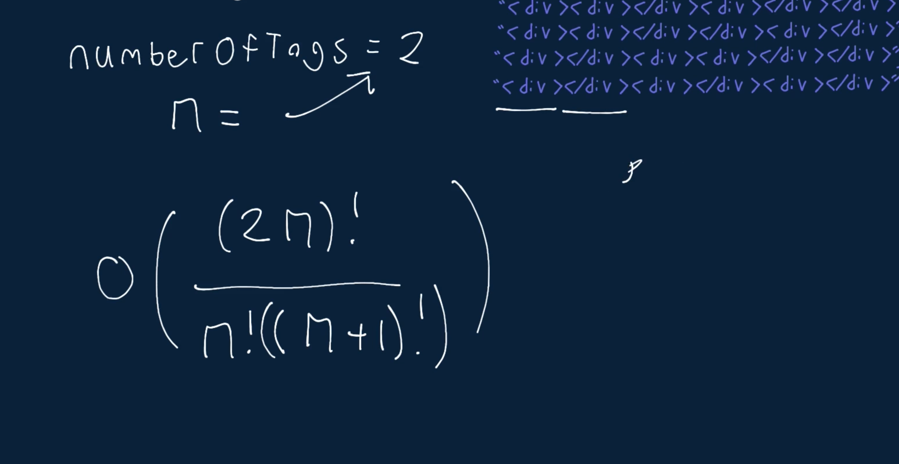

# Generate Div Tags

Write a function that takes in a positive integer numberOfTags and returns a list of all the valid strings that you can generate with that number of matched <div></div> tags.

A string is valid and contains matched <div></div> tags if for every opening tag <div>, there is a closing tag </div> that comes after the opening tag and that isn't used as a closing tag for another opening tag. Each output string should contain exactly numberOfTags opening tags and numberOfTags closing tags.

For example, given numberOfTags = 2, the valid strings to return would be: ["<div></div><div></div>",
```
"<div><div></div></div>"].
```

Note that the output strings don't need to be in any particular order.

## Sample Input

```
numberOfTags = 3
```

## Sample Output

```
[
    "<div><div><div></div></div></div>",
    "<div><div></div><div></div></div>",
    "<div><div></div></div><div></div>",
    "<div></div><div><div></div></div>",
    "<div></div><div></div><div></div>",
] 
// The strings could be ordered differently.
```

### Hints

Hint 1
> The brute-force approach to solve this problem is to generate every single possible string that contains numberOfTags tags and to then check all of those strings to see if they're valid. Can you think of a better way to do this?

Hint 2
> To solve this problem optimally, you'll have to incrementally build valid strings by adding <div> and </div> tags to already valid partial strings. While doing this, you can avoid creating strings that will never lead to a valid final string by following two rules:
>  - If a string has fewer opening tags than numberOfTags, it's valid to add an opening tag to the end of it.
>  - If a string has fewer closing tags than opening tags, it's valid to add a closing tag to the end of it.

Hint 3
> Using the rules defined in Hint #2, write a recursive algorithm that generates all possible valid strings. You'll need to keep track of how many opening and closing tags each partial string has available (at each recursive call), and you'll simply follow the rules outlined in Hint #2. Once a string has no more opening and closing tags available, you can add it to your final list of strings. Your first call to the function will start with an empty string as the partial string and with numberOfTags as the number of opening and closing tags available. For example, after you add an opening tag to a partial string, you'll recursively call the function like this: recursiveFunction(partialStringWithExtraOpeningTag, openingTags - 1,
closingTags)

```
Optimal Space & Time Complexity
O((2n)!/((n!((n + 1)!)))) time | O((2n)!/((n!((n + 1)!)))) space - where n is the input number
```


