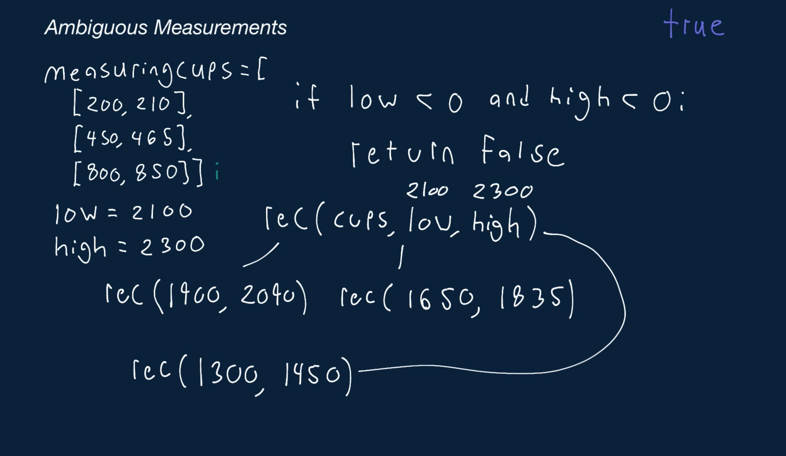

# Ambiguous Measurements

This problem deals with measuring cups that are missing important measuring labels. Specifically, a measuring cup only has two measuring lines, a Low (L) line and a High (H) line. This means that these cups can't precisely measure and can only guarantee that the substance poured into them will be between the L and H line. For example, you might have a measuring cup that has a Low line at 400ml and a high line at 435ml. This means that when you use this measuring cup, you can only be sure that what you're measuring is between 400ml and 435ml.

You're given a list of measuring cups containing their low and high lines as well as one low integer and one high integer representing a range for a target measurement. Write a function that returns a boolean representing whether you can use the cups to accurately measure a volume in the specified [low, high] range (the range is inclusive).

Note that:

   - Each measuring cup will be represented by a pair of positive integers [L, H], where 0 <= L <= H.
   - You'll always be given at least one measuring cup, and the low and high input parameters will always satisfy the following constraint: 0 <= low <= high.
   - Once you've measured some liquid, it will immediately be transferred to a larger bowl that will eventually (possibly) contain the target measurement.
   - You can't pour the contents of one measuring cup into another cup.

## Sample Input

``` 
measuringCups = [
  [200, 210],
  [450, 465],
  [800, 850],
] 
low = 2100
high = 2300
```

## Sample Output

``` 
true
// We use cup [450, 465] to measure four volumes:
// First measurement: Low = 450, High = 465
// Second measurement: Low = 450 + 450 = 900, High = 465 + 465 = 930
// Third measurement: Low = 900 + 450 = 1350, High = 930 + 465 = 1395
// Fourth measurement: Low = 1350 + 450 = 1800, High = 1395 + 465 = 1860

// Then we use cup [200, 210] to measure two volumes:
// Fifth measurement: Low = 1800 + 200 = 2000, High = 1860 + 210 = 2070
// Sixth measurement: Low = 2000 + 200 = 2200, High = 2070 + 210 = 2280

// We've measured a volume in the range [2200, 2280].
// This is within our target range, so we return `true`.

// Note: there are other ways to measure a volume in the target range.
```

### Hints

Hint 1
> Start by considering the last cup that you'll use in your sequence of measurements. If it isn't possible to use any of the cups as the last cup, then you can't measure the desired volume.

Hint 2
> If the cup that you're going to use last has a measuring range of [100, 110] and you want to measure in the range of [500, 550], then after you pick this cup as the last cup, you need to measure a range of [400, 440]. Now, you can simply pick the last cup you'll use to measure this new range. If you continue these steps, you'll eventually know if you're able to measure the entire range or not.

Hint 3
> Hint #2 should give you an idea of how to solve this problem recursively. Try every cup as the last cup for the starting range, then recursively try to measure the new ranges created after using the selected last cups. If you ever reach a point where one cup can measure the entire range, then you're finished and you can measure the target range. Try to think of a way to optimize this recursive approach, since it might involve a lot of repeated calculations.

```
Optimal Space & Time Complexity
O(low * high * n) time | O(low * high) space - where n is the number of measuring cups
```



### Notes

As we recursively call our canMeasureInRange function, we might realize that if the input low is ever less than or equal to 0, the outcome for that low is always the same.

In other words, checking if we can measure in the range [-10, 10] is equivalent to checking if we can measure in the range [-5, 10], which itself is equivalent to checking if we can measure in the range [0, 10].

The same logic applies to the high value.

Thus, we can optimize the solution described in the video explanation by capping the low and high values that we pass to our canMeasureInRange function to 0. This reduces the number of keys in our cache and maximizes cache hits, thereby optimizing our solution in practice (though not from a time-complexity point of view).

The two comments in the code snippet below highlight the changes that we've made to the code covered in the video explanation.

``` 
// Change `<` to `<=`.
if low <= 0 and high <= 0:
    return False

canMeasure = False
for cup in measuringCups:
    cupLow, cupHigh = cup
    if low <= cupLow and cupHigh <= high:
        canMeasure = True
        break

    // Cap the `newLow` and `newHigh` to 0.
    newLow = max(0, low - cupLow)
    newHigh = max(0, high - cupHigh)
    canMeasure = canMeasureInRange(measuringCups, newLow, newHigh, memoization)
    if canMeasure:
        break
```