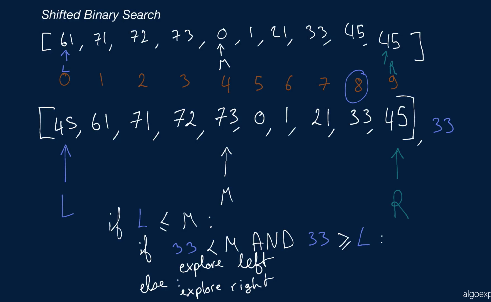

# Shifted Binary Search

Write a function that takes in a sorted array of distinct integers as well as a target integer. The caveat is that the integers in the array have been shifted by some amount; in other words, they've been moved to the left or to the right by one or more positions. For example, [1, 2, 3, 4] might have turned into [3, 4, 1, 2].

The function should use a variation of the Binary Search algorithm to determine if the target integer is contained in the array and should return its index if it is, otherwise -1.

If you're unfamiliar with Binary Search, we recommend watching the Conceptual Overview section of the Binary Search question's video explanation before starting to code.

## Sample Input

```
array = [45, 61, 71, 72, 73, 0, 1, 21, 33, 37]
target = 33
```

## Sample Output

```
8
```

### Hints

Hint 1
> The Binary Search algorithm involves a left pointer and a right pointer and using those pointers to find the middle number in an array. Unlike with a normal sorted array however, you cannot simply find the middle number of the array and compare it to the target here, because the shift could lead you in the wrong direction. Instead, realize that whenever you find the middle number in the array, the following two scenarios are possible (assuming the middle number is not equal to the target number, in which case you're done): either the left-pointer number is smaller than or equal to the middle number, or it is bigger. Figure out a way to eliminate half of the array depending on the scenario.

Hint 2
> In the scenario where the left-pointer number is smaller than or equal to the middle number, two other scenarios can arise: either the target number is smaller than the middle number and greater than or equal to the left-pointer number, or it's not. In the first scenario, the right half of the array can be eliminated; in the second scenario, the left half can be eliminated. Figure out the scenarios that can arise if the left-pointer number is greater than the middle number and apply whatever logic you come up with recursively until you find the target number or until you run out of numbers in the array.

Hint 3
> Can you implement this algorithm iteratively? Are there any advantages to doing so?

```
Optimal Space & Time Complexity
O(log(n)) time | O(1) space - where n is the length of the input array
```



### Notes

The numbers in the input array must be distinct in order for this algorithm to work all the time. The sample array in the video, which has a repeated 45, happens to work fine, but this is an exception—not the rule.

To understand why the numbers must be distinct, consider the following inputs:

```
array = [45, 33, 45, 45, 45]
target = 33
```

With these inputs, our first binary-search step would have the following indices:

```
leftIdx = 0 // 45
middleIdx = 2 // 45
rightIdx = 4 // 45
```

We would then compare the left 45 to the middle 45 and conclude that the left half of the array was sorted, since 45 <= 45.

This would be incorrect, since the left subarray [45, 33, 45] clearly isn't sorted.

This would lead our algorithm down the wrong path, and our function would end up returning -1, which would be incorrect.
