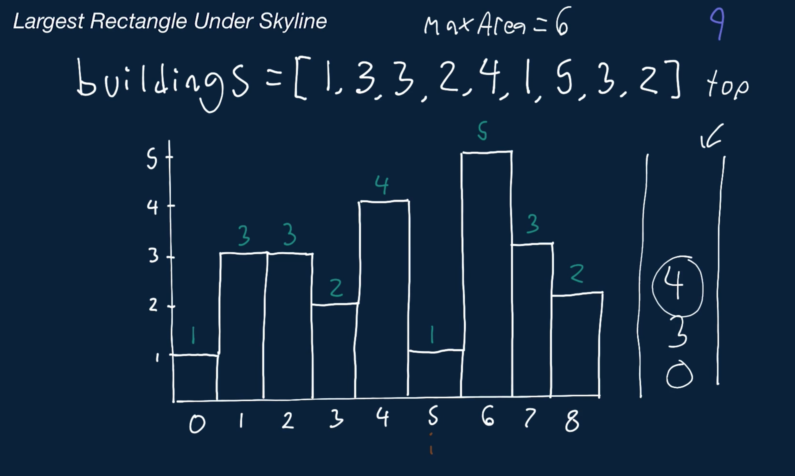
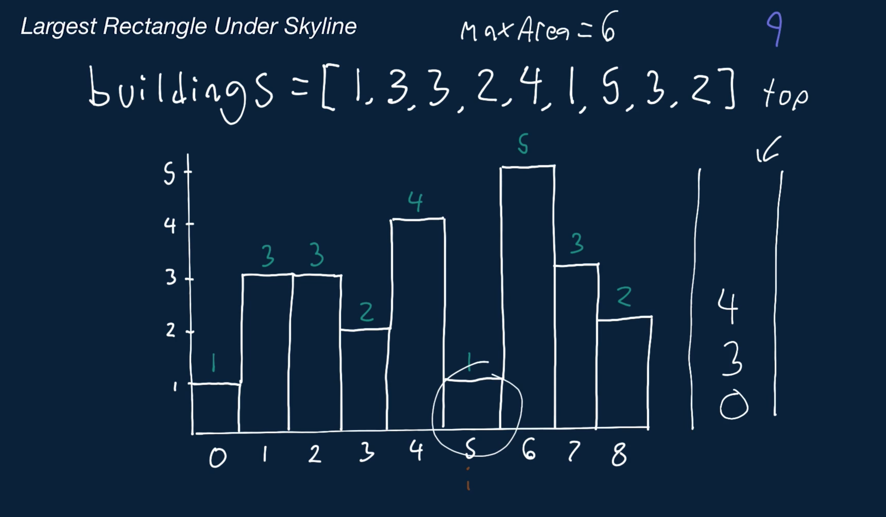
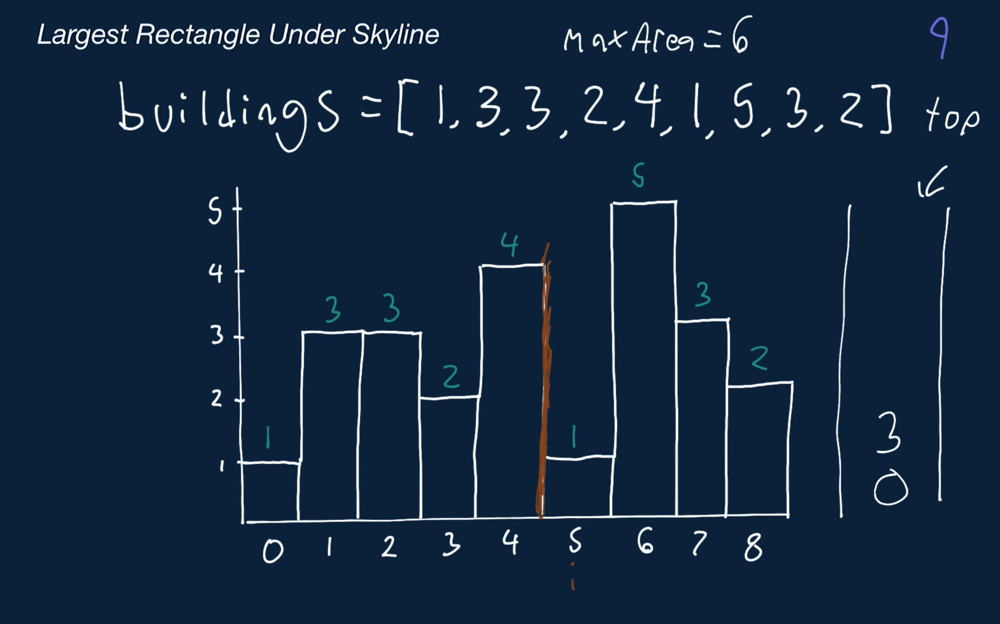
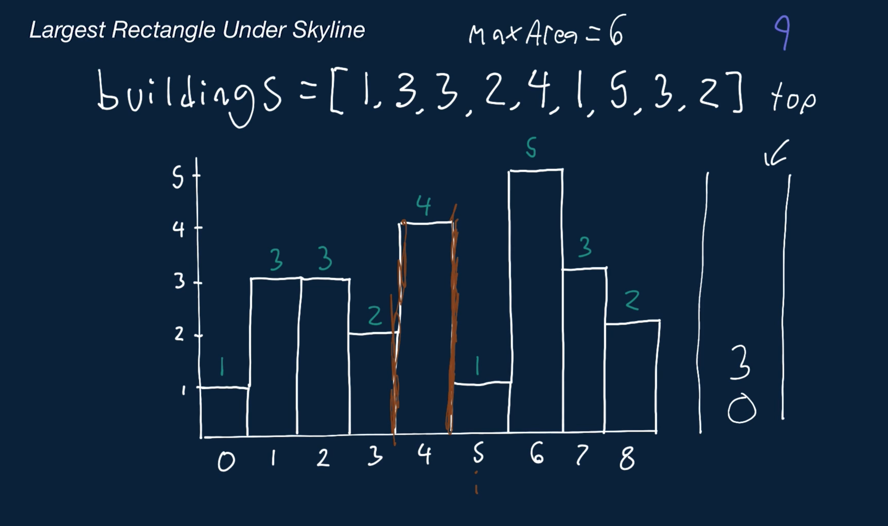
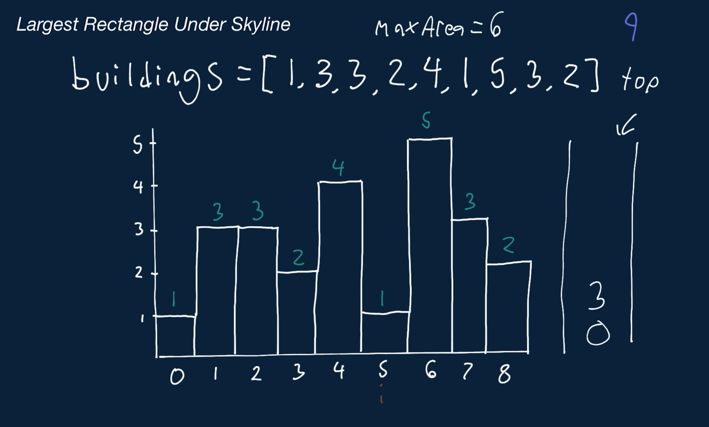
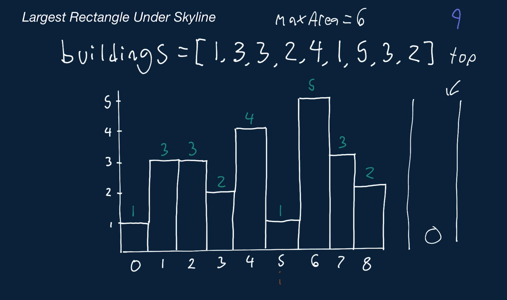
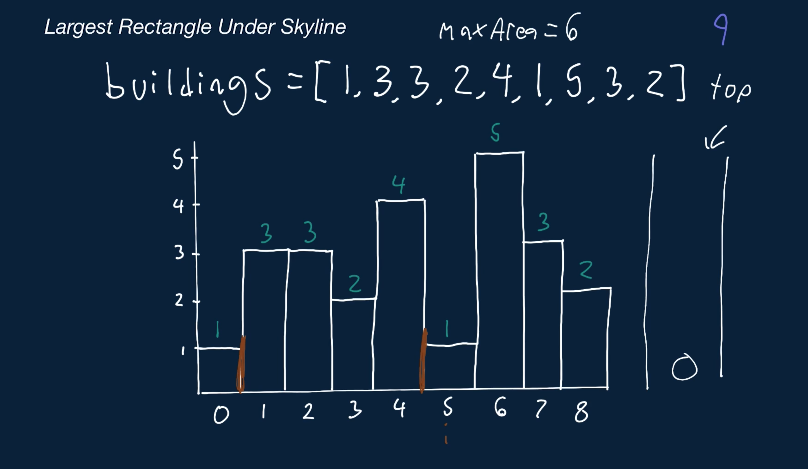
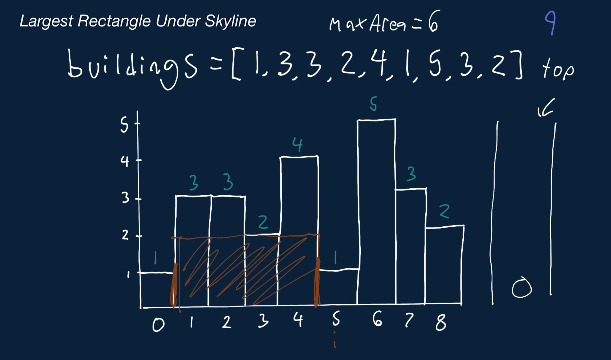
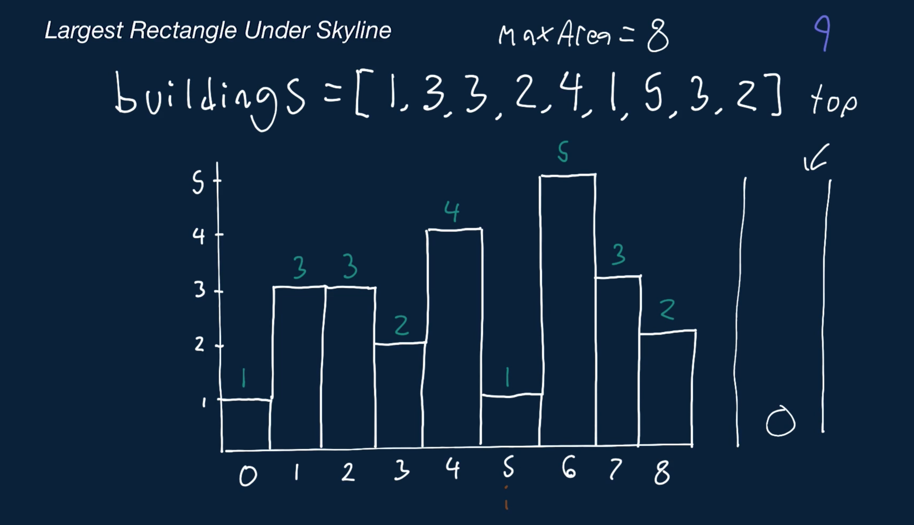

# Largest Rectangle Under Skyline

Write a function that takes in an array of positive integers representing the heights of adjacent buildings and returns the area of the largest rectangle that can be created by any number of adjacent buildings, including just one building. Note that all buildings have the same width of 1 unit.

For example, given buildings = [2, 1, 2], the area of the largest rectangle that can be created is 3, using all three buildings. Since the minimum height of the three buildings is 1, you can create a rectangle that has a height of 1 and a width of 3 (the number of buildings). You could also create rectangles of area 2 by using only the first building or the last building, but these clearly wouldn't be the largest rectangles. Similarly, you could create rectangles of area 2 by using the first and second building or the second and third building.

To clarify, the width of a created rectangle is the number of buildings used to create the rectangle, and its height is the height of the smallest building used to create it.

Note that if no rectangles can be created, your function should return 0.

## Sample Input

```
buildings = [1, 3, 3, 2, 4, 1, 5, 3, 2]
```

## Sample Output

``` 
9

// Below is a visual representation of the sample input.
//              _
//          _  | |
//    _ _  | | | |_
//   | | |_| | | | |_
//  _| | | | |_| | | |
// |_|_|_|_|_|_|_|_|_|
```

### Hints

Hint 1
> Try treating every building as a pillar of a rectangle that can be created with the height of the building in question.

Hint 2
> The brute-force approach to solve this problem involves treating every building as a part of a potential rectangle to be created. As you loop through all the buildings, simply expand to the left and right of the current building, and determine the width of the longest rectangle that you can create that has a height of the current building. Calculate the area of this longest rectangle, and update a variable to store the area of the largest rectangle that you've found so far. This approach has a time complexity of O(n^2); can you do better?

Hint 3
> There's a way to solve this problem in linear (O(n)) time by using a stack. When should you push and pop buildings on and off the stack if you were to loop through the buildings from left to right? Try to think of each building on the stack as a pillar of a potential rectangle.

Hint 4
> The stack mentioned in Hint #3 will be used to determine the length of a rectangle that has the height of a building that is currently on top of the stack. Loop through all the buildings, and at each building, compare its height to the height of the building on top of the stack. If the current building's height is smaller than or the same as the height of the building on top of the stack, pop the building off the stack. When you pop the building off the stack, you've determined the rightmost position (your current position) of a rectangle of that height (the height of the building you popped) that uses that building. Then, to determine the leftmost position of that rectangle, you look at the next building on top of the stack. This is the index of the closest building to the left that has a smaller height than that of the building that was just popped off. Now, you can calculate the area of the rectangle that uses this building and update a variable to store the max area. Continue popping buildings off the stack at each iteration until the current building is taller than the one on top of the stack, and don't forget to push each building on top of the stack at each iteration. See the Conceptual Overview section of this question's video explanation for a more in-depth explanation.

```
Optimal Space & Time Complexity
O(n) time | O(n) space - where n is the number of buildings
```


















