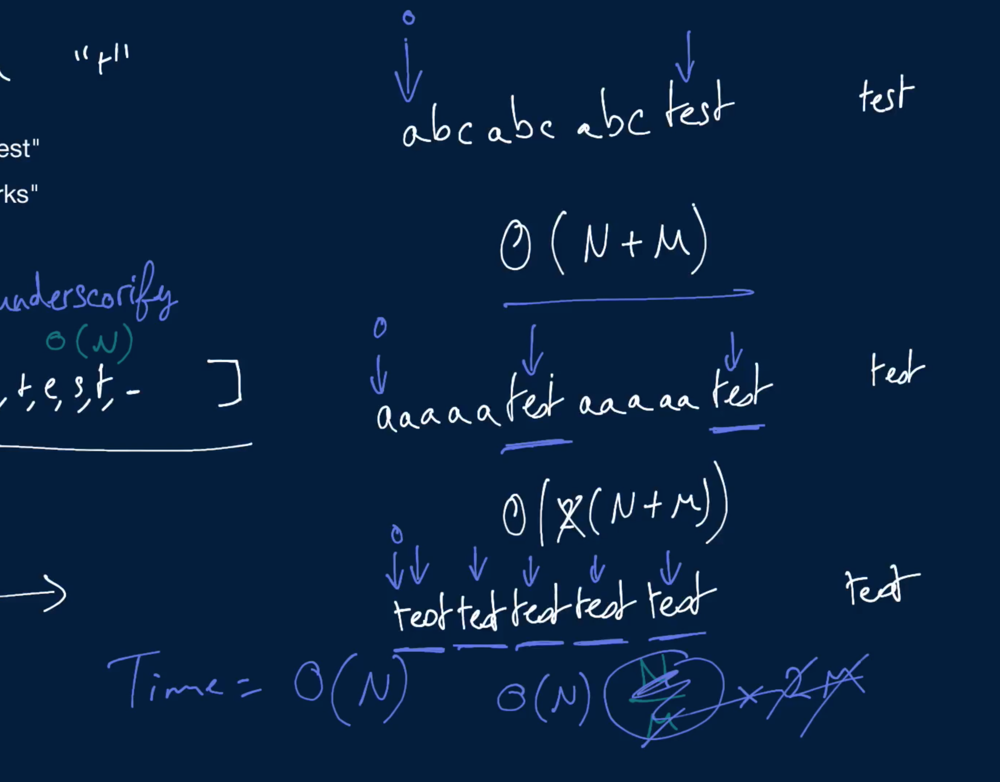

# Underscorify Substring

Write a function that takes in two strings: a main string and a potential substring of the main string. The function should return a version of the main string with every instance of the substring in it wrapped between underscores.

If two or more instances of the substring in the main string overlap each other or sit side by side, the underscores relevant to these substrings should only appear on the far left of the leftmost substring and on the far right of the rightmost substring. If the main string doesn't contain the other string at all, the function should return the main string intact.

## Sample Input

```
string = "testthis is a testtest to see if testestest it works"
substring = "test"
```

## Sample Output

```
"_test_this is a _testtest_ to see if _testestest_ it works"
```

### Hints

Hint 1
> The first thing you need to do to solve this question is to get the locations of all instances of the substring in the main string. Try traversing the main string one character at a time and calling whatever substring-matching function is built into the language you're working in. Store a 2D array of locations, where each subarray holds the starting and ending indices of a specific instance of the substring in the main string.

Hint 2
> The second thing you need to do is to "collapse" the 2D array mentioned in Hint #1. In essence, you need to merge the locations of substrings that overlap each other or sit next to each other. Traverse the 2D array mentioned in Hint #1 and build a new 2D array that holds these "collapsed" locations.

Hint 3
> Finally, you need to create a new string with underscores added in the correct positions. Construct this new string by traversing the main string and the 2D array mentioned in Hint #2 at the same time. You might have to keep track of when you are "in between" underscores in order to correctly traverse the 2D array.

```
Optimal Space & Time Complexity
Average case: O(n + m) | O(n) space - where n is the length of the main string and m is the length of the substring
```



