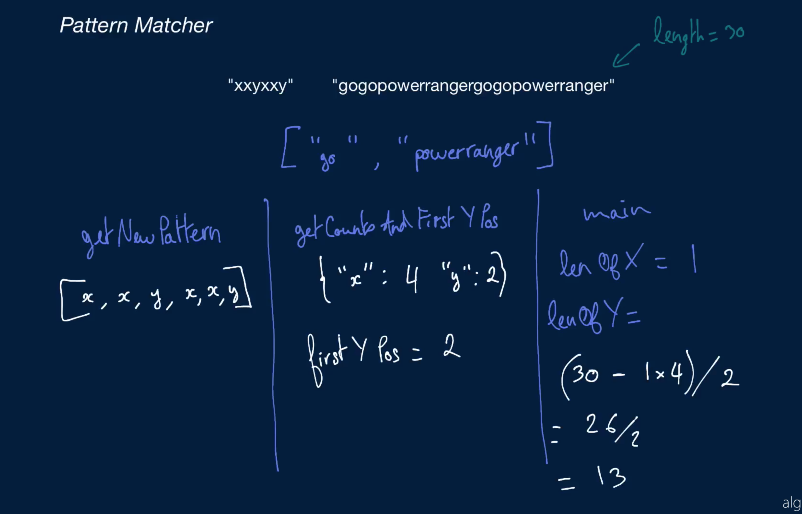
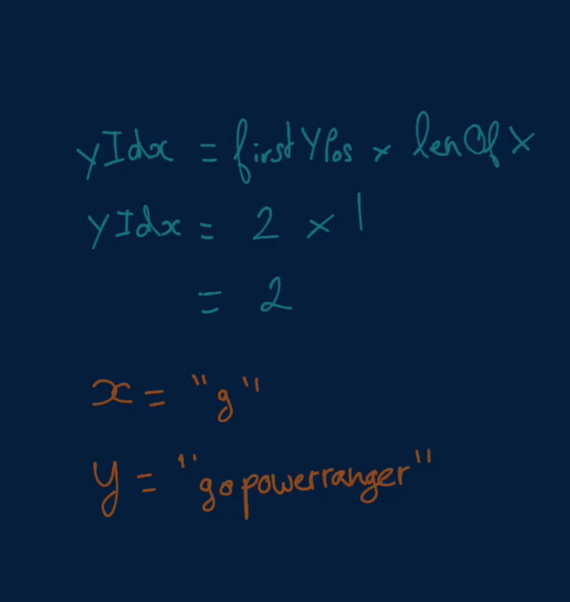
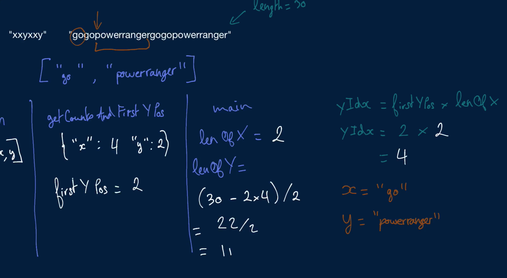

# Pattern Matcher

You're given two non-empty strings. The first one is a pattern consisting of only "x"s and / or "y"s; the other one is a normal string of alphanumeric characters. Write a function that checks whether the normal string matches the pattern.

A string S0 is said to match a pattern if replacing all "x"s in the pattern with some non-empty substring S1 of S0 and replacing all "y"s in the pattern with some non-empty substring S2 of S0 yields the same string S0.

If the input string doesn't match the input pattern, the function should return an empty array; otherwise, it should return an array holding the strings S1 and S2 that represent "x" and "y" in the normal string, in that order. If the pattern doesn't contain any "x"s or "y"s, the respective letter should be represented by an empty string in the final array that you return.

You can assume that there will never be more than one pair of strings S1 and S2 that appropriately represent "x" and "y" in the normal string.

## Sample Input

```
pattern = "xxyxxy"
string = "gogopowerrangergogopowerranger"
```

## Sample Output

```
["go", "powerranger"]
```

### Hints

Hint 1
> Start by checking if the pattern starts with an "x". If it doesn't, consider generating a new pattern that swaps all "x"s for "y"s and vice versa; this might greatly simplify the rest of your algorithm. Make sure to keep track of whether or not you do this swap, as your final answer will be affected by it.

Hint 2
> Use a hash table to store the number of "x"s and "y"s that appear in the pattern, and keep track of the position of the first "y". Knowing how many "x"s and "y"s appear in the pattern, paired with the length of the main string which you have access to, will allow you to quickly test out various possible lengths for "x" and "y". Knowing where the first "y" appears in the pattern will allow you to actually generate potential substrings.

Hint 3
> Traverse the main string and try different combinations of substrings that could represent "x" and "y". For each potential combination, map the new pattern mentioned in Hint #1 and see if it matches the main string.

```
Optimal Space & Time Complexity
O(n^2 + m) time | O(n + m) space - where n is the length of the main string and m is the length of the pattern
```






