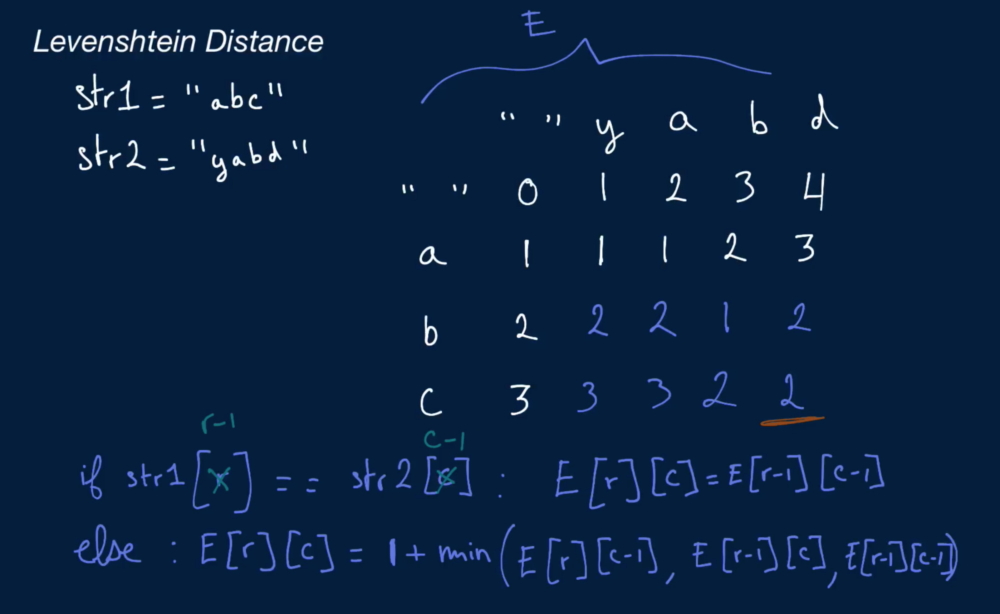

# Levenshtein Distance

Write a function that takes in two strings and returns the minimum number of edit operations that need to be performed on the first string to obtain the second string.

There are three edit operations: insertion of a character, deletion of a character, and substitution of a character for another.

## Sample Input

```
str1 = "abc"
str2 = "yabd"
```

## Sample Output

```
2 // insert "y"; substitute "c" for "d"
```

### Hints

```
Hint 1
Try building a two-dimensional array of the minimum numbers of edits for pairs of substrings of the input strings. Let the rows of the array represent substrings of the second input string str2. Let the first row represent the empty string. Let each row i thereafter represent the substrings of str2 from 0 to i, with i excluded. Let the columns similarly represent the first input string str1.
```

```
Hint 2
Build up the array mentioned in Hint #1 one row at a time. In other words, find the minimum numbers of edits between all the substrings of str1 represented by the columns and the empty string represented by the first row, then between all the substrings of str1 represented by the columns and the first letter of str2 represented by the second row, etc., until you compare both full strings. Find a formula that relates the minimum number of edits at any given point to previous numbers.
```

```
Hint 3
At any position (i, j) in the two-dimensional array, if str2[i] is equal to str1[j], then the edit distance at position (i, j) is equal to the one at position (i - 1, j - 1), since adding str2[i] and str1[j] to the substrings represented at position (i - 1, j - 1) does not require any additional edit operation. If str2[i] is not equal to str1[j] however, then the edit distance at position (i, j) is equal to 1 + the minimum of the edit distances at positions (i - 1, j), (i, j - 1), and (i - 1, j - 1). Why is that the case?
```

```
Hint 4
Do you really need to store the entire two-dimensional array mentioned in Hint #1? Identify what stored values you actually use throughout the process of building the array and come up with a way of storing only what you need and nothing more.
```

```
Optimal Space & Time Complexity
O(nm) time | O(min(n, m)) space - where n and m are the lengths of the two input strings
```


