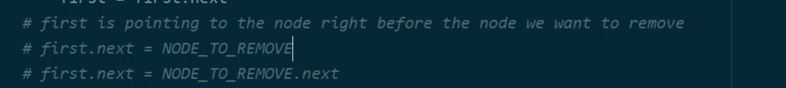

# Remove Kth Node From End

Write a function that takes in the head of a Singly Linked List and an integer k and removes the kth node from the end of the list.

The removal should be done in place, meaning that the original data structure should be mutated (no new structure should be created).

Furthermore, the input head of the linked list should remain the head of the linked list after the removal is done, even if the head is the node that's supposed to be removed. In other words, if the head is the node that's supposed to be removed, your function should simply mutate its value and next pointer.

Note that your function doesn't need to return anything.

You can assume that the input Linked List will always have at least two nodes and, more specifically, at least k nodes.

Each LinkedList node has an integer value as well as a next node pointing to the next node in the list or to None / null if it's the tail of the list.

## Sample Input

```
head = 0 -> 1 -> 2 -> 3 -> 4 -> 5 -> 6 -> 7 -> 8 -> 9 // the head node with value 0
k = 4
```

## Sample Output

```
// No output required.
// The 4th node from the end of the list (the node with value 6) is removed.
0 -> 1 -> 2 -> 3 -> 4 -> 5 -> 7 -> 8 -> 9
```

### Hints

```
Hint 1
Since you are given a Singly Linked List, you do not have access to any of the list's nodes' previous nodes. Thus, traversing the entire list and then counting k nodes back isn't an option. Is there a way for you to traverse the entire list and to know which node is the kth node from the end by the time you reach the final node in the list?
```

```
Hint 2
Can you accomplish the task mentioned in Hint #1 by traversing the list all the while keeping track of two nodes at a time. How could this work?
```

```
Hint 3
Initialize two variables pointing to the first node in the list. Traverse k nodes in the list, updating the second variable at every node (that is, take k steps with the second variable). Then, traverse the remainder of the list, this time updating both the second and the first variables (that is take as many steps with the first variable as the number of steps between the kth node from the start and the end of the list). Once you reach the end of the list, the first variable should point to the kth node from the end.
```

```
Optimal Space & Time Complexity
O(n) time | O(1) space - where n is the number of nodes in the Linked List
```


