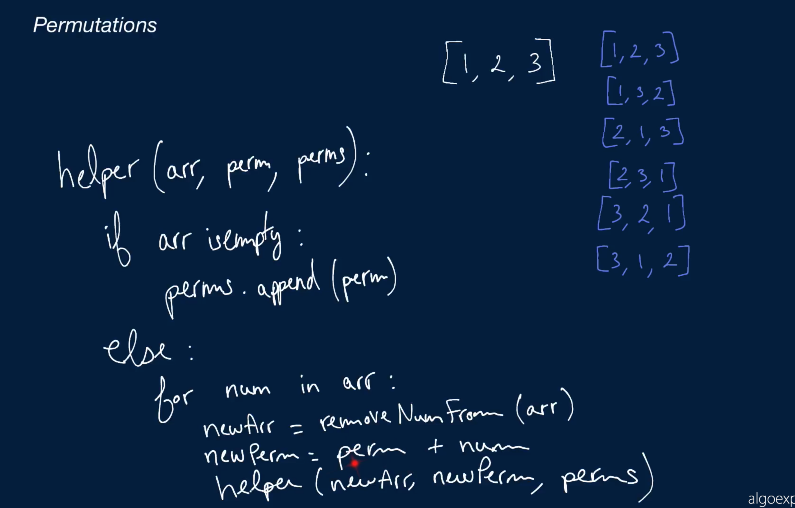
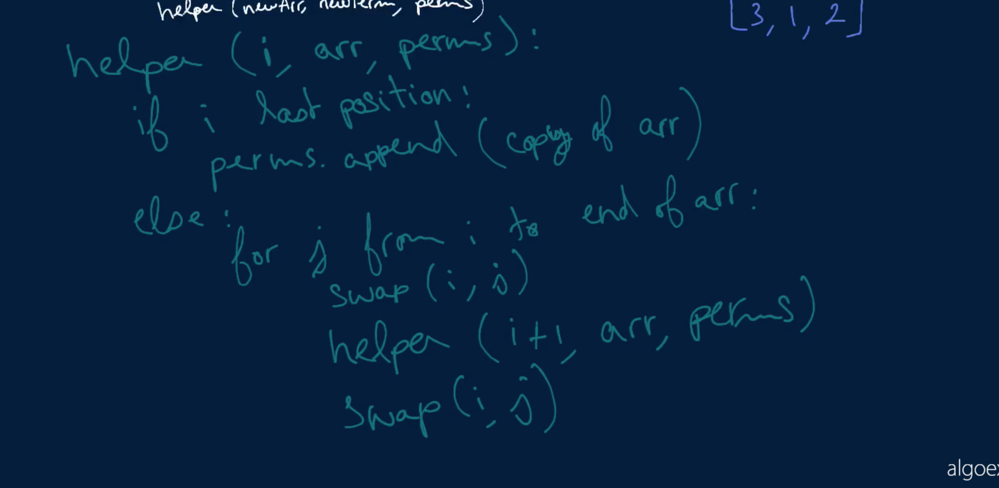

# package permutations

Permutations

Write a function that takes in an array of unique integers and returns an array of all permutations of those integers in no particular order.

If the input array is empty, the function should return an empty array.

## Sample Input
``` 
array = [1, 2, 3]
```

## Sample Output

```
[[1, 2, 3], [1, 3, 2], [2, 1, 3], [2, 3, 1], [3, 1, 2], [3, 2, 1]]
```

### Hints

Hint 1
> A permutation is defined as a way in which a set of things can be ordered. Thus, for the list [1, 2, 3], there exist some permutations starting with 1, some starting with 2, and some starting with 3. For the permutations starting with 1, there will be a permutation where 2 is the second number and one where 3 is the second number. For permutations starting with 3, there will be a permutation where 1 is the second number and one where 2 is the second number. The idea is that, in order to construct a permutation, we can pick a random number from our list to be the first number, then we can pick a random number from the remaining list (without the first number) to be the second number, then we can pick a random number from the remaining list (without the first and second numbers) to be the third number, and we can repeat the process until we exhaust all of our list of numbers. At that point, we will have constructed a valid permutation. How can we implement this construction algorithmically, without picking numbers at random?

Hint 2
> Iterate through the list of numbers, and begin constructing new permutations starting with each number. For each permutation that you've begun constructing, remove the number already used (the first number of each permutation) from the list of numbers - you'll likely have to make copies of the original list. Repeat this process by recursively iterating through the mutated lists of numbers, appending numbers to the corresponding permutations you've already begun constructing and then removing those numbers from the respective mutated lists; repeat this until your mutated lists are empty, at which point your constructed permutations will be as big as the original list and will be valid permutations.

Hint 3
> Do you have to create so many mutated lists of numbers? Can you come up with an alternative approach that would allow you to only rely on the original list of numbers, without ever copying it and without removing numbers from it?

```
Optimal Space & Time Complexity
O(n*n!) time | O(n*n!) space - where n is the length of the input array
```





