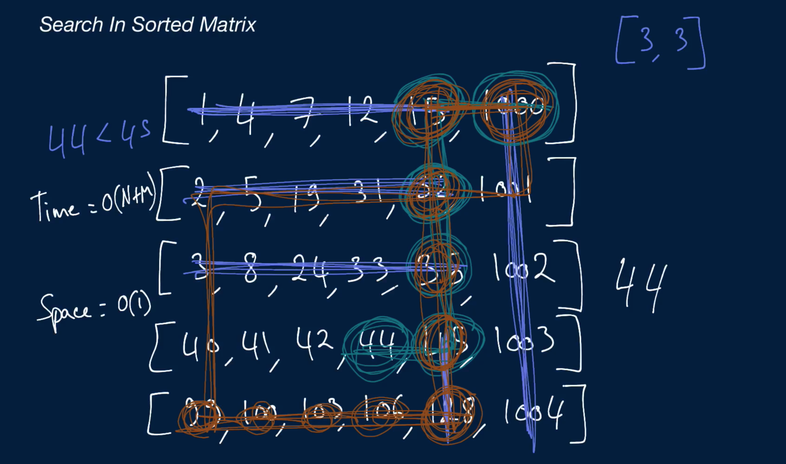

# Search In Sorted Matrix

You're given a two-dimensional array (a matrix) of distinct integers and a target integer. Each row in the matrix is sorted, and each column is also sorted; the matrix doesn't necessarily have the same height and width.

Write a function that returns an array of the row and column indices of the target integer if it's contained in the matrix, otherwise [-1, -1].

## Sample Input
```
matrix = [
            [1, 4, 7, 12, 15, 1000],
            [2, 5, 19, 31, 32, 1001],
            [3, 8, 24, 33, 35, 1002],
            [40, 41, 42, 44, 45, 1003],
            [99, 100, 103, 106, 128, 1004],
          ]
target = 44
```

## Sample Output

```
[3, 3]
```

### Hints
```
Hint 1
Pick any number in the matrix and compare it to the target number. If this number is bigger than the target number, what does that tell you about all of the other numbers in this number's row and this number's column? What about if this number is smaller than the target number?
```

```
Hint 2
Try starting at the top right corner of the matrix, comparing the number there to the target number, and using whatever you gathered from Hint #1 to figure out what number to compare next if the top right number isn't equal to the target number. Continue until you find the target number or until you get past the extremities of the matrix.
```

```
Optimal Space & Time Complexity
O(n + m) time | O(1) space - where n is the length of the matrix's rows and m is the length of the matrix's columns
```


