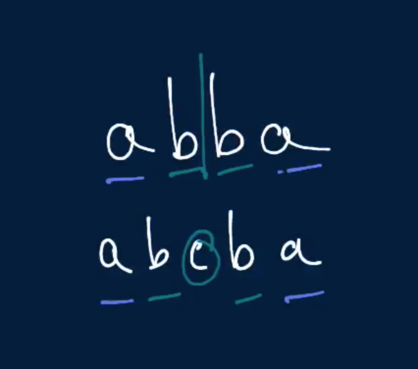

# Longest Palindromic Substring

Write a function that, given a string, returns its longest palindromic substring.

A palindrome is defined as a string that's written the same forward and backward. Note that single-character strings are palindromes.

You can assume that there will only be one longest palindromic substring.

## Sample Input

```
string = "abaxyzzyxf"
```

## Sample Output

```
"xyzzyx"
```

### Hints

Hint 1
> Try generating all possible substrings of the input string and checking for their palindromicity. What is the runtime of the isPalindrome check? What is the total runtime of this approach?

Hint 2
> Recognize that a palindrome is a string that is symmetrical with respect to its center, which can either be a character (in the case of odd-length palindromes) or an empty string (in the case of even-length palindromes). Thus, you can check the palindromicity of a string by simply expanding from its center and making sure that characters on both sides are indeed mirrored.

Hint 3
> Traverse the input string, and at each index, apply the logic mentioned in Hint #2. What does this accomplish? Is the runtime of this approach better?

```
Optimal Space & Time Complexity
O(n^2) time | O(n) space - where n is the length of the input string
```


