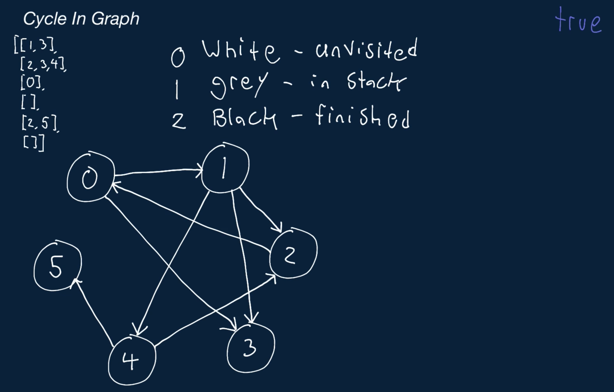

# Cycle In Graph

You're given a list of edges representing an unweighted, directed graph with at least one node. Write a function that returns a boolean representing whether the given graph contains a cycle.

For the purpose of this question, a cycle is defined as any number of vertices, including just one vertex, that are connected in a closed chain. A cycle can also be defined as a chain of at least one vertex in which the first vertex is the same as the last.

The given list is what's called an adjacency list, and it represents a graph. The number of vertices in the graph is equal to the length of edges, where each index i in edges contains vertex i's outbound edges, in no particular order. Each individual edge is represented by a positive integer that denotes an index (a destination vertex) in the list that this vertex is connected to. Note that these edges are directed, meaning that you can only travel from a particular vertex to its destination, not the other way around (unless the destination vertex itself has an outbound edge to the original vertex).

Also note that this graph may contain self-loops. A self-loop is an edge that has the same destination and origin; in other words, it's an edge that connects a vertex to itself. For the purpose of this question, a self-loop is considered a cycle.

For a more detailed explanation, please refer to the Conceptual Overview section of this question's video explanation.

## Sample Input

```
edges = [
    [1, 3],
    [2, 3, 4],
    [0],
    [],
    [2, 5],
    [],
]
```

## Sample Output

```
true
// There are multiple cycles in this graph:
// 1) 0 -> 1 -> 2 -> 0
// 2) 0 -> 1 -> 4 -> 2 -> 0
// 3) 1 -> 2 -> 0 -> 1
// These are just 3 examples; there are more.
```


### Hints

Hint 1
> There are multiple ways to solve this problem, and they all make use of a depth-first-search traversal.

Hint 2
> When traversing a graph using depth-first search, a back edge is an edge from a node to one of its ancestors in the depth-first-search tree, and a back edge denotes the presence of a cycle. How can you determine if a graph has any back edges?

Hint 3
> To find back edges, you'll need to keep track of which nodes you've already visited and which nodes are ancestors of the current node in the depth-first-search tree. There are a few ways to do this, but one approach is to recursively traverse the graph and to keep track of which nodes have been visited in general and which nodes have been visited in the current recursion stack; you can do so with two separate data structures. If you reach a node that has an edge to a node that's already in the recursion stack, then you've detected a back edge, and there's a cycle in the graph.

Hint 4
> Similar to the previous hint, you can also detect a back edge by performing a 3-color depth-first search. Each node is colored white to start; recursively traverse through the graph, coloring the current node grey and then calling the recursive traversal function on all of its neighbors. After traversing all the neighbors, color the current node black to signify that it's "done." If you ever find an edge to a node that's grey, you've found a back edge, and there's a cycle in the graph.

```
Optimal Space & Time Complexity
O(v + e) time | O(v) space - where v is the number of vertices and e is the number of edges in the graph
```




