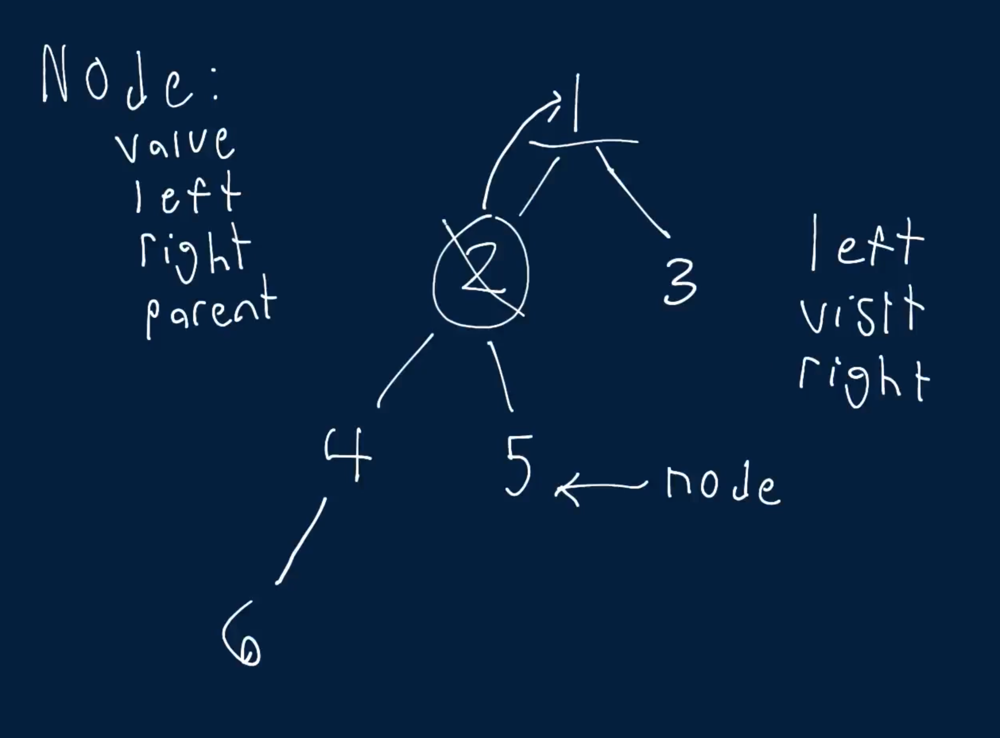

# Find Successor

Write a function that takes in a Binary Tree (where nodes have an additional pointer to their parent node) as well as a node contained in that tree and returns the given node's successor.

A node's successor is the next node to be visited (immediately after the given node) when traversing its tree using the in-order tree-traversal technique. A node has no successor if it's the last node to be visited in the in-order traversal.

If a node has no successor, your function should return None / null.

Each BinaryTree node has an integer value, a parent node, a left child node, and a right child node. Children nodes can either be BinaryTree nodes themselves or None / null.

## Sample Input

```
tree = 
              1
            /   \
           2     3
         /   \ 
        4     5
       /       
      6  
node = 5   
```

## Sample Output

```
1
// This tree's in-order traversal order is:
// 6 -> 4 -> 2 -> 5 -> 1 -> 3
// 1 comes immediately after 5.
```

### Hints

Hint 1
> Start by performing an in-order traversal of the tree and storing the nodes in an array as you go. Then, traverse the nodes that you've stored; once you find the input node, return the node immediately after it in the array.

Hint 2
> Can you think of a more time-efficient way to solve this problem without performing the entire in-order traversal?

Hint 3
> Use the fact that each node has a pointer to its parent to solve this problem in O(h) time, where h is the height of the tree.

Hint 4
> If the given node has a right subtree, then the next node in the in-order traversal is simply the leftmost node in that right subtree. If it doesn't have a right subtree, then we need to traverse up the tree looking for an ancestor of this node that contains the node in question in its left subtree. The first node that we find that contains the input node in its left subtree is the one that will be visited next in the in-order traversal. If we reach the root node, and the input node isn't in the root node's left subtree, then the input node has no successor, because it must be the rightmost node of entire tree.

```
Optimal Space & Time Complexity
O(h) time | O(1) space - where h is the height of the tree
```


