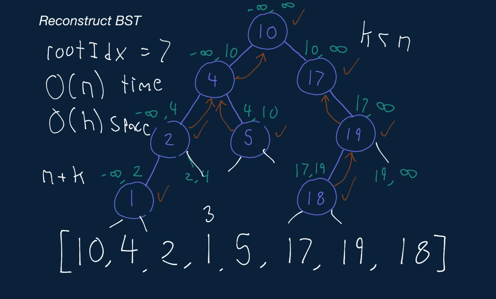

# Reconstruct BST

The pre-order traversal of a Binary Tree is a traversal technique that starts at the tree's root node and visits nodes in the following order:

  1. Current node 
  2. Left subtree 
  3. Right subtree

Given a non-empty array of integers representing the pre-order traversal of a Binary Search Tree (BST), write a function that creates the relevant BST and returns its root node.

The input array will contain the values of BST nodes in the order in which these nodes would be visited with a pre-order traversal.

Each BST node has an integer value, a left child node, and a right child node. A node is said to be a valid BST node if and only if it satisfies the BST property: its value is strictly greater than the values of every node to its left; its value is less than or equal to the values of every node to its right; and its children nodes are either valid BST nodes themselves or None / null.

## Sample Input

```
preOrderTraversalValues = [10, 4, 2, 1, 5, 17, 19, 18]
```

## Sample Output
```
        10 
      /    \
     4      17
   /   \      \
  2     5     19
 /           /
1           18 
```

### Hints

Hint 1
> Think about the properties of a BST. Looking at the pre-order-traversal nodes (values), how can you determine the right child of a particular node?

Hint 2
> The right child of any BST node is simply the first node in the pre-order traversal whose value is larger than or equal to the particular node's value. From this, we know that the nodes in the pre-order traversal that come before the right child of a node must be in the left subtree of that node.

Hint 3
> Once you determine the right child of any given node, you're able to generate the entire left and right subtrees of that node. You can do so by recursively creating the left and right child nodes of each subsequent node using the fact stated in Hint #2. A node that has no left and right children is naturally a leaf node.

Hint 4
> To solve this problem with an optimal time complexity, you need to realize that it's unnecessary to locate the right child of every node. You can simply keep track of the pre-order-traversal position of the current node that needs to be created and try to insert that node as the left or right child of the relevant previously visited node. Since this tree is a BST, every node must satisfy the BST property; by somehow keeping track of lower and upper bounds for node values, you should be able to determine if a node can be inserted as the left or right child of another node. With this approach, you can solve this problem in linear time. See this question's video explanation for a more detailed explanation of this approach.

```
Optimal Space & Time Complexity
O(n) time | O(n) space - where n is the length of the input array
```

