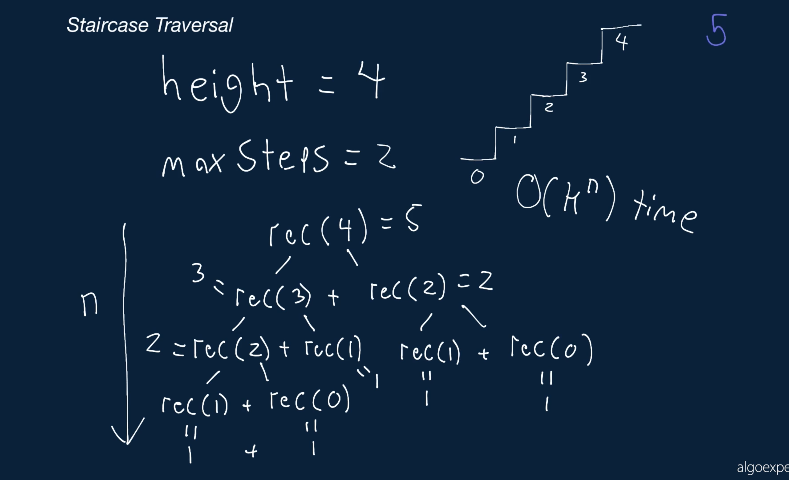
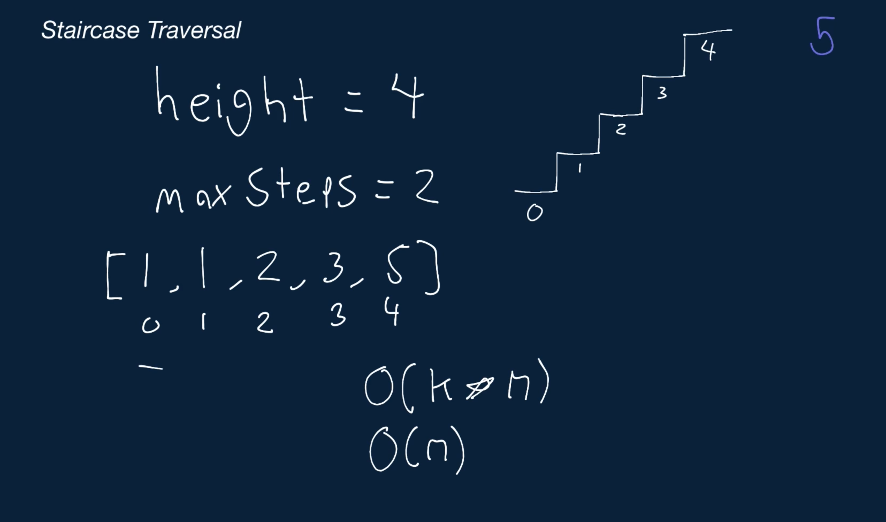
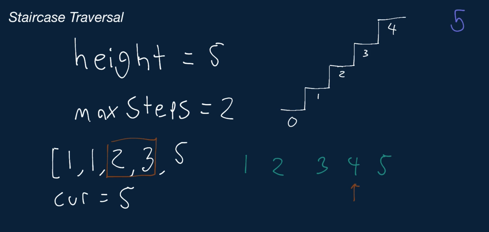

# Staircase Traversal

You're given two positive integers representing the height of a staircase and the maximum number of steps that you can advance up the staircase at a time. Write a function that returns the number of ways in which you can climb the staircase.

For example, if you were given a staircase of height = 3 and maxSteps = 2 you could climb the staircase in 3 ways. You could take 1 step, 1 step, then 1 step, you could also take 1 step, then 2 steps, and you could take 2 steps, then 1 step.

Note that maxSteps <= height will always be true.

## Sample Input

```
height = 4
maxSteps = 2
```

## Sample Output

```
5
// You can climb the staircase in the following ways:
// 1, 1, 1, 1
// 1, 1, 2
// 1, 2, 1
// 2, 1, 1
// 2, 2
```

### Hints

Hint 1
> If you can advance 2 steps at a time, how many ways can you reach a staircase of height 1 and of height 2? Think recursively.

Hint 2
> Continuing from Hint #1, if you know the number of ways to climb a staircase of height 1 and of height 2, how many ways are there to climb a staircase of height 3 (assuming the same max steps of 2)?

Hint 3
> The number of ways to climb a staircase of height k with a max number of steps s is: numWays[k - 1] + numWays[k - 2] + ... + numWays[k - s]. This is because if you can advance between 1 and s steps, then from each step k - 1, k - 2, ..., k - s, you can directly advance to the top of a staircase of height k. By adding the number of ways to reach all steps that you can directly advance to the top step from, you determine how many ways there are to reach the top step.

```
Optimal Space & Time Complexity
O(n) time | O(n) space - where n is the height of the staircase
```






