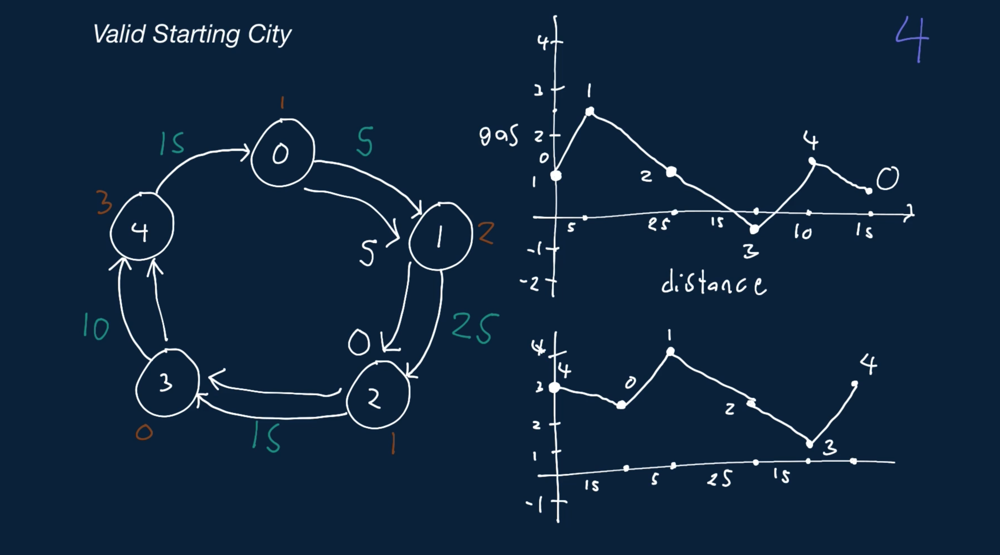
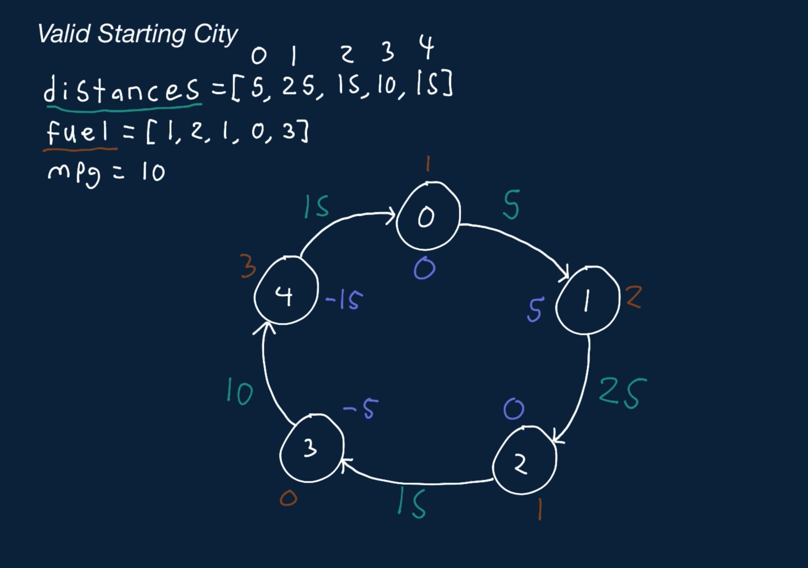

# Valid Starting City

Imagine you have a set of cities that are laid out in a circle, connected by a circular road that runs clockwise. Each city has a gas station that provides gallons of fuel, and each city is some distance away from the next city.

You have a car that can drive some number of miles per gallon of fuel, and your goal is to pick a starting city such that you can fill up your car with that city's fuel, drive to the next city, refill up your car with that city's fuel, drive to the next city, and so on and so forth until you return back to the starting city with 0 or more gallons of fuel left.

This city is called a valid starting city, and it's guaranteed that there will always be exactly one valid starting city.

For the actual problem, you'll be given an array of distances such that city i is distances[i] away from city i + 1. Since the cities are connected via a circular road, the last city is connected to the first city. In other words, the last distance in the distances array is equal to the distance from the last city to the first city. You'll also be given an array of fuel available at each city, where fuel[i] is equal to the fuel available at city i. The total amount of fuel available (from all cities combined) is exactly enough to travel to all cities. Your fuel tank always starts out empty, and you're given a positive integer value for the number of miles that your car can travel per gallon of fuel (miles per gallon, or MPG). You can assume that you will always be given at least two cities.

Write a function that returns the index of the valid starting city.

## Sample Input

```
distances = [5, 25, 15, 10, 15]
fuel = [1, 2, 1, 0, 3]
mpg = 10
```

## Sample Output

```
4
```

### Hints

Hint 1
> Try the brute-force approach to this problem by treating each city as the starting city and simulating traveling from it to all other cities.

Hint 2
> Start at each city, and see if you can return back to the city in question without running out of gas. If you find a city that you can return to after starting at it without running out of gas, then it must be the valid starting city, because there is always exactly one valid starting city.

Hint 3
> You can solve this problem in O(n) time. Try to use the fact that the amount of gas is exactly enough to travel around the road once to help you.

Hint 4
> Using the fact stated in Hint #3 and the knowledge that there is always exactly one valid starting city, you can solve this problem in a single pass of all cities. Keep track of how much gas you have as you enter a city (before you fill up at that city); you'll enter the first city with 0 gas. The city that you enter with the least amount of gas in your tank must be the valid starting city. This is because you'll never have less gas at another city than you do when you enter this city, no matter what city you start at. This means that that this is the valid starting city. See the Conceptual Overview section of this question's video explanation for a more in-depth explanation.

```
Optimal Space & Time Complexity
O(n) time | O(1) space - where n is the number of cities
```




