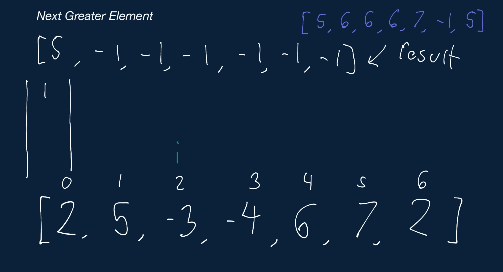
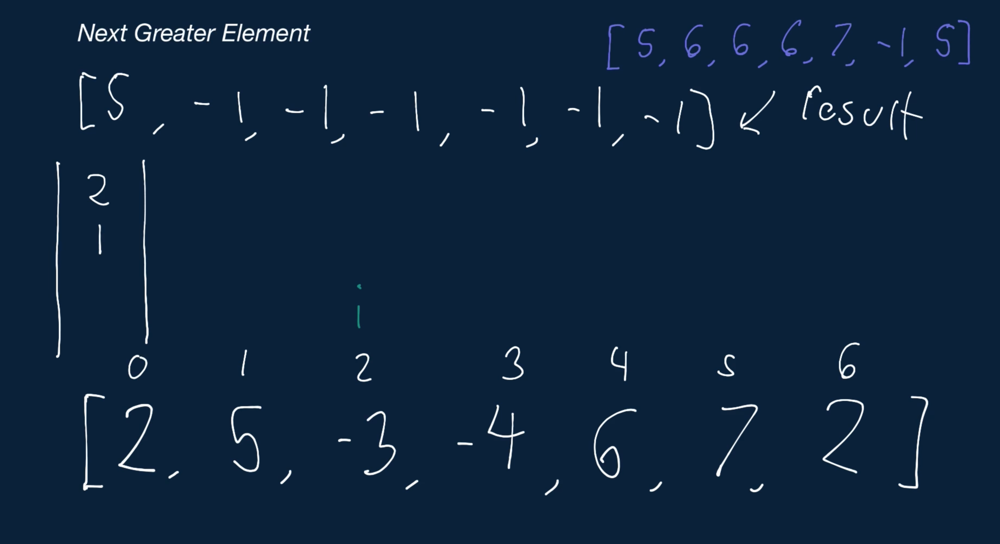
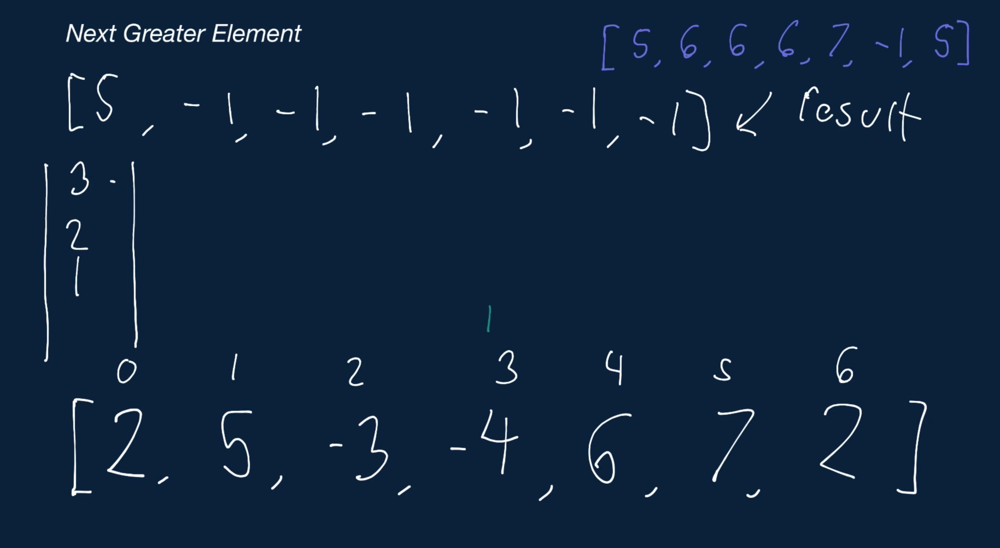
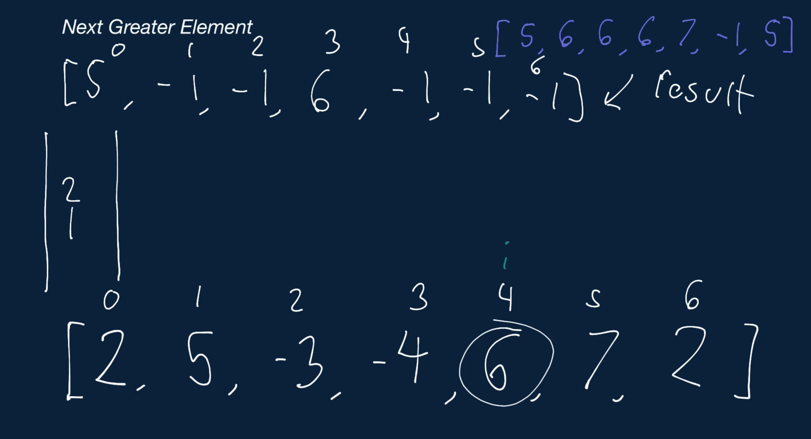
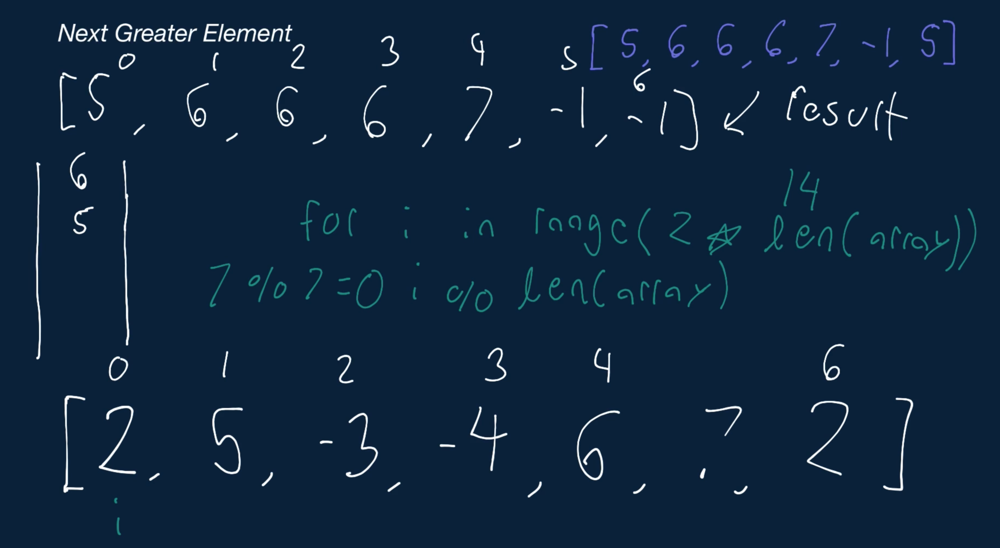

# Next Greater Element

Write a function that takes in an array of integers and returns a new array containing, at each index, the next element in the input array that's greater than the element at that index in the input array.

In other words, your function should return a new array where outputArray[i] is the next element in the input array that's greater than inputArray[i]. If there's no such next greater element for a particular index, the value at that index in the output array should be -1. For example, given array = [1, 2], your function should return [2, -1].

Additionally, your function should treat the input array as a circular array. A circular array wraps around itself as if it were connected end-to-end. So the next index after the last index in a circular array is the first index. This means that, for our problem, given array = [0, 0, 5, 0, 0, 3, 0 0], the next greater element after 3 is 5, since the array is circular.

## Sample Input

```
array = [2, 5, -3, -4, 6, 7, 2]
```
## Sample Output

```
[5, 6, 6, 6, 7, -1, 5]
```

### Hints

Hint 1
> Solving this problem in O(n^2) time, where n is the length of the array, is straightforward. Can you solve it with a better time complexity?

Hint 2
> How can a stack allow you to solve this problem in O(n) time?

Hint 3
> There are a couple of ways to solve this problem in linear time with a stack. One approach is to push onto the stack the indices of elements for which you haven't yet found the next greater element. If you go with this index approach, you need to loop through the array twice (since it's circular) and compare the value of the current element in the array to the one represented by the index on top of the stack. If the element on the top of the stack is smaller than the current element, then the current element is next greater element for the top-of-stack element, and you can pop the index off the top of the stack and use it to store the current element in the correct position in your result array. You then continue to pop elements off the top of the stack until the current element is no longer greater than the top-of-stack element. At this point, you add the index of the current element to the top of the stack, and you continue iterating through the array, repeating the same process.

Hint 4
> The approach discussed in Hint #3 assumes that you loop through the array from left to right. You could loop through the array backwards using a very similar approach, storing the actual values of elements on the stack rather than their indices. See the Conceptual Overview section of this question's video explanation for a more in-depth explanation.

```
Optimal Space & Time Complexity
O(n) time | O(n) space - where n is the length of the array
```










