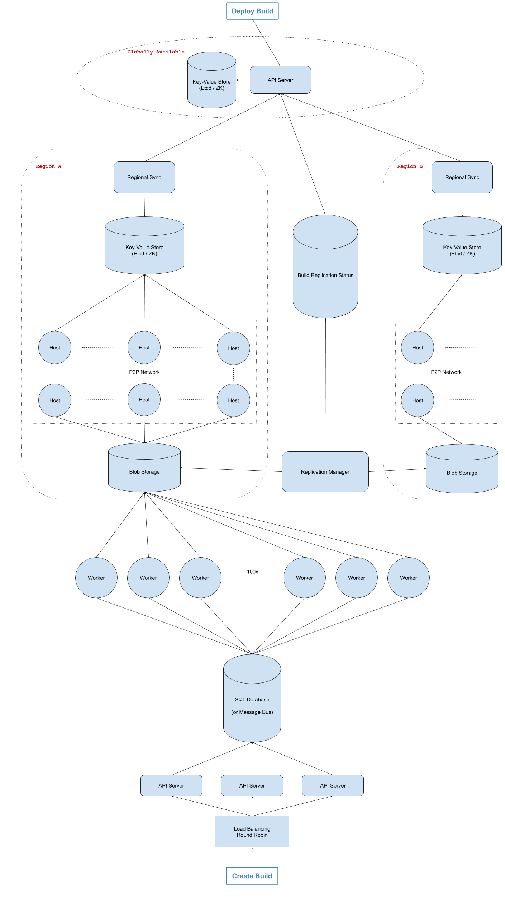

# Design A Code-Deployment System

Design a global and fast code-deployment system.

Many systems design questions are intentionally left very vague and are literally given in the form of `Design Foobar`. It's your job to ask clarifying questions to better understand the system that you have to build.

We've laid out some of these questions below; their answers should give you some guidance on the problem. Before looking at them, we encourage you to take few minutes to think about what questions you'd ask in a real interview.

## Clarifying Questions To Ask

1.  Q: What exactly do we mean by a code-deployment system? Are we talking about building, testing, and shipping code?  
- A: We want to design a system that takes code, builds it into a binary (an opaque blob of data—the compiled code), and deploys the result globally in an efficient and scalable way. We don't need to worry about testing code; let's assume that's already covered.  
---
2.  Q: What part of the software-development lifecycle, so to speak, are we designing this for? Is this process of building and deploying code happening when code is being submitted for code review, when code is being merged into a codebase, or when code is being shipped?  
- A: Once code is merged into the trunk or master branch of a central code repository, engineers should be able to trigger a build and deploy that build (through a UI, which we're not designing). At that point, the code has already been reviewed and is ready to ship. So to clarify, we're not designing the system that handles code being submitted for review or being merged into a master branch—just the system that takes merged code, builds it, and deploys it.  
---    
3.  Q: Are we essentially trying to ship code to production by sending it to, presumably, all of our application servers around the world?  
- A: Yes, exactly.  
---
4.  Q: How many machines are we deploying to? Are they located all over the world?  
- A: We want this system to scale massively to hundreds of thousands of machines spread across 5-10 regions throughout the world.  
---
5.  Q: This sounds like an internal system. Is there any sense of urgency in deploying this code? Can we afford failures in the deployment process? How fast do we want a single deployment to take?  
- A: This is an internal system, but we'll want to have decent availability, because many outages are resolved by rolling forward or rolling back buggy code, so this part of the infrastructure may be necessary to avoid certain terrible situations. In terms of failure tolerance, any build should eventually reach a SUCCESS or FAILURE state. Once a binary has been successfully built, it should be shippable to all machines globally within 30 minutes.  
---
6.  Q: So it sounds like we want our system to be available, but not necessarily highly available, we want a clear end-state for builds, and we want the entire process of building and deploying code to take roughly 30 minutes. Is that correct?  
- A: Yes, that's correct.  
---
7.  Q: How often will we be building and deploying code, how long does it take to build code, and how big can the binaries that we'll be deploying get?  
- A: Engineering teams deploy hundreds of services or web applications, thousands of times per day; building code can take up to 15 minutes; and the final binaries can reach sizes of up to 10 GB. The fact that we might be dealing with hundreds of different applications shouldn't matter though; you're just designing the build pipeline and deployment system, which are agnostic to the types of applications that are getting deployed.  
---
8.  Q: When building code, how do we have access to the actual code? Is there some sort of reference that we can use to grab code to build?  
- A: Yes; you can assume that you'll be building code from commits that have been merged into a master branch. These commits have SHA identifiers (effectively arbitrary strings) that you can use to download the code that needs to be built.  
---

### Solution

> 1.  Gathering System Requirements  
As with any systems design interview question, the first thing that we want to do is to gather system requirements; we need to figure out what system we're building exactly.  
From the answers we were given to our clarifying questions (see Prompt Box), we're building a system that involves repeatedly (in the order of thousands of times per day) building and deploying code to hundreds of thousands of machines spread out across 5-10 regions around the world.  
Building code will involve grabbing snapshots of source code using commit SHA identifiers; beyond that, we can assume that the actual implementation details of the building action are taken care of. In other words, we don't need to worry about how we would build JavaScript code or C++ code; we just need to design the system that enables the repeated building of code.  
Building code will take up to 15 minutes, it'll result in a binary file of up to 10GB, and we want to have the entire deployment process (building and deploying code to our target machines) take at most 30 minutes.  
Each build will need a clear end-state (SUCCESS or FAILURE), and though we care about availability (2 to 3 nines), we don't need to optimize too much on this dimension.  

> 2.  Coming Up With A Plan  
It's important to organize ourselves and to lay out a clear plan regarding how we're going to tackle our design. What are the major, distinguishable components of our how system?  
It seems like this system can actually very simply be divided into two clear subsystems:  
>   - the Build System that builds code into binaries  
>   - the Deployment System that deploys binaries to our machines across the world  
Note that these subsystems will of course have many components themselves, but this is a very straightforward initial way to approach our problem.  

> 3.  Build System -- General Overview  
From a high-level perspective, we can call the process of building code into a binary a job, and we can design our build system as a queue of jobs. Jobs get added to the queue, and each job has a commit identifier (the commit SHA) for what version of the code it should build and the name of the artifact that will be created (the name of the resulting binary). Since we're agnostic to the type of the code being built, we can assume that all languages are handled automatically here.  
We can have a pool of servers (workers) that are going to handle all of these jobs. Each worker will repeatedly take jobs off the queue (in a FIFO manner—no prioritization for now), build the relevant binaries (again, we're assuming that the actual implementation details of building code are given to us), and write the resulting binaries to blob storage (Google Cloud Storage or S3 for instance). Blob storage makes sense here, because binaries are literally blobs of data.  

> 4.  Build System -- Job Queue  
A naive design of the job queue would have us implement it in memory (just as we would implement a queue in coding interviews), but this implementation is very problematic; if there's a failure in our servers that hold this queue, we lose the entire state of our jobs: queued jobs and past jobs.  
It seems like we would be unnecessarily complicating matters by trying to optimize around this in-memory type of storage, so we're likely better off implementing the queue using a SQL database.  

> 5.  Build System -- SQL Job Queue  
We can have a jobs table in our SQL database where every record in the database represents a job, and we can use record-creation timestamps as the queue's ordering mechanism.  
Our table will be:  
>   - id: string, the ID of the job, auto-generated  
>   - created_at: timestamp  
>   - commit_sha: string  
>   - name: string, the pointer to the job's eventual binary in blob storage  
>   - status: string, QUEUED, RUNNING, SUCCEEDED, FAILED  
We can implement the actual dequeuing mechanism by looking at the oldest creation_timestamp with a QUEUED status. This means that we'll likely want to index our table on both created_at and status.  

> 6.  Build System -- Concurrency  
> ACID transactions will make it safe for potentially hundreds of workers to grab jobs off the queue without unintentionally running the same job twice (we'll avoid race conditions). Our actual transaction will look like this:  
> ```SQL  
>   BEGIN TRANSACTION;   
>   SELECT * FROM jobs_table WHERE status = 'QUEUED' ORDER BY created_at ASC LIMIT 1;  
>   // if there's none, we ROLLBACK;  
>   UPDATE jobs_table SET status = 'RUNNING' WHERE id = id from previous query;  
>   COMMIT;  
> ```  
>   All of the workers will be running this transaction every so often to dequeue the next job; let's say every 5 seconds. If we arbitrarily assume that we'll have 100 workers sharing the same queue, we'll have 100/5 = 20 reads per second, which is very easy to handle for a SQL database.  

> 7.  Build System -- Lost Jobs  
Since we're designing a large-scale system, we have to expect and handle edge cases. Here, what if there's a network partition with our workers or one of our workers dies mid-build? Since builds last around 15 minutes on average, this will very likely happen. In this case, we want to avoid having a "lost job" that we were never made aware of, and with our current design, the job will remain RUNNING forever. How do we handle this?  
We could have an extra column on our jobs table called last_heartbeat. This will be updated in a heartbeat fashion by the worker running a particular job, where that worker will update the relevant row in the table every 3-5 minutes to just let us know that it's still running the job.  
We can then have a completely separate service that polls the table every so often (say, every 5 minutes, depending on how responsive we want this build system to be), checks all of the RUNNING jobs, and if their last_heartbeat was last modified longer than 2 heartbeats ago (we need some margin of error here), then something's likely wrong, and this service can reset the status of the relevant jobs to QUEUED, which would effectively bring them back to the front of the queue.  
The transaction that this auxiliary service will perform will look something like this:
```SQL
    UPDATE jobs_table SET status = 'QUEUED' WHERE
    status = 'RUNNING' AND
    last_heartbeat < NOW() - 10 minutes;
```

> 8.  Build System -- Scale Estimation  
We previously arbitrarily assumed that we would have 100 workers, which made our SQL-database queue able to handle the expected load. We should try to estimate if this number of workers is actually realistic.  
With some back-of-the-envelope math, we can see that, since a build can take up to 15 minutes, a single worker can run 4 jobs per hour, or ~100 (96) jobs per day. Given thousands of builds per day (say, 5000-10000), this means that we would need 50-100 workers (5000 / 100). So our arbitrary figure was accurate.  
Even if the builds aren't uniformly spread out (in other words, they peak during work hours), our system scales horizontally very easily. We can automatically add or remove workers whenever the load warrants it. We can also scale our system vertically by making our workers more powerful, thereby reducing the build time.  
  
> 9.  Build System -- Storage  
We previously mentioned that we would store binaries in blob storage (GCS). Where does this storage fit into our queueing system exactly?  
When a worker completes a build, it can store the binary in GCS before updating the relevant row in the jobs table. This will ensure that a binary has been persisted before its relevant job is marked as SUCCEEDED.  
Since we're going to be deploying our binaries to machines spread across the world, it'll likely make sense to have regional storage rather than just a single global blob store.  
We can design our system based on regional clusters around the world (in our 5-10 global regions). Each region can have a blob store (a regional GCS bucket). Once a worker successfully stores a binary in our main blob store, the worker is released and can run another job, while the main blob store performs some asynchronous replication to store the binary in all of the regional GCS buckets. Given 5-10 regions and 10GB files, this step should take no more than 5-10 minutes, bringing our total build-and-deploy duration so far to roughly 20-25 minutes (15 minutes for a build and 5-10 minutes for global replication of the binary).  

> 10.  Deployment System -- General Overview  
From a high-level perspective, our actual deployment system will need to allow for the very fast distribution of 10GB binaries to hundreds of thousands of machines across all of our global regions. We're likely going to want some service that tells us when a binary has been replicated in all regions, another service that can serve as the source of truth for what binary should currently be run on all machines, and finally a peer-to-peer-network design for our actual machines across the world.  

> 11.  Deployment System -- Replication-Status Service  
We can have a global service that continuously checks all regional GCS buckets and aggregates the replication status for successful builds (in other words, checks that a given binary in the main blob store has been replicated across all regions). Once a binary has been replicated across all regions, this service updates a separate SQL database with rows containing the name of a binary and a replication_status. Once a binary has a "complete" replication_status, it's officially deployable.  

> 12.  Deployment System -- Blob Distribution  
Since we're going to deploy 10 GBs to hundreds of thousands of machines, even with our regional clusters, having each machine download a 10GB file one after the other from a regional blob store is going to be extremely slow. A peer-to-peer-network approach will be much faster and will allow us to hit our 30-minute time frame for deployments. All of our regional clusters will behave as peer-to-peer networks.  

> 13.  Deployment System -- Trigger  
Let's describe what happens when an engineer presses a button on some internal UI that says "Deploy build/binary B1 to every machine globally". This is the action that triggers the binary downloads on all the regional peer-to-peer networks.  
To simplify this process and to support having multiple builds getting deployed concurrently, we can design this in a goal-state oriented manner.  
The goal-state will be the desired build version at any point in time and will look something like: "current_build: B1", and this can be stored in some dynamic configuration service (a key-value store like Etcd or ZooKeeper). We'll have a global goal-state as well as regional goal-states.  
Each regional cluster will have a K-V store that holds configuration for that cluster about what builds should be running on that cluster, and we'll also have a global K-V store.  
When an engineer clicks the "Deploy build/binary B1" button, our global K-V store's build_version will get updated. Regional K-V stores will be continuously polling the global K-V store (say, every 10 seconds) for updates to the build_version and will update themselves accordingly.  
Machines in the clusters/regions will be polling the relevant regional K-V store, and when the build_version changes, they'll try to fetch that build from the P2P network and run the binary.  

> 14.  System Diagram  
> 
---


