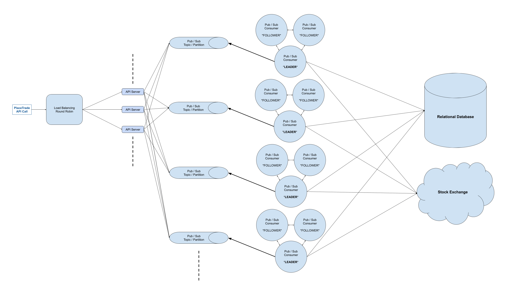

# Design A Stockbroker

Design a stockbroker: a platform that acts as the intermediary between end-customers and some central stock exchange.

Many systems design questions are intentionally left very vague and are literally given in the form of `Design Foobar`. It's your job to ask clarifying questions to better understand the system that you have to build.

We've laid out some of these questions below; their answers should give you some guidance on the problem. Before looking at them, we encourage you to take few minutes to think about what questions you'd ask in a real interview.

## Clarifying Questions To Ask

1.  Q: What do we mean exactly by a stock broker? Is this something like Robinhood or Etrade?
- A: Yes, exactly.
---
2.  Q: What is the platform supposed to support exactly? Are we just supporting the ability for customers to buy and sell stocks, or are we supporting more? For instance, are we allowing other types of securities like options and futures to be traded on our platform? Are we supporting special types of orders like limit orders and stop losses?
- A: We're only supporting market orders on stocks in this design. A market order means that, given a placed order to buy or sell a stock, we should try to execute the order as soon as possible regardless of the stock price. We also aren't designing any “margin” system, so the available balance is the source of truth for what can be bought.
---
3.  Q: Are we designing any of the auxiliary aspects of the stock brokerage, like depositing and withdrawing funds, downloading tax documents, etc.?
- A: No -- we're just designing the core trading aspect of the platform.
---
4.  Q: Are we just designing the system to place trades? Do we want to support other trade-related operations like getting trade statuses? In other words, how comprehensive should the API that's going to support this platform be?
- A: In essence, you're only designing a system around a PlaceTrade API call from the user, but you should define that API call (inputs, response, etc.).
---
5.  Q: Where does a customer's balance live? Is the platform pulling a customer's money directly from their bank account, or are we expecting that customers will have already deposited funds into the platform somehow? In other words, are we ever directly interacting with banks?
- A: No, you won't be interacting with banks. You can assume that customers have already deposited funds into the platform, and you can further assume that you have a SQL table with the balance for each customer who wants to make a trade.
---
6.  Q: How many customers are we building this for? And is our customer-base a global one?
- A: Millions of customers, millions of trades a day. Let's assume that our customers are only located in 1 region -- the U.S., for instance.
---
7.  Q: What kind of availability are we looking for?
- A: As high as possible, with this kind of service people can lose a lot of money if the system is down even for a few minutes.
---
8.  Q: Are we also designing the UI for this platform? What kinds of clients can we assume we have to support?
- A: You don't have to design the UI, but you should design the PlaceTrade API call that a UI would be making to your backend. Clients would be either a mobile app or a webapp.
---
9.  Q: So we want to design the API for the actual brokerage, that itself interacts with some central stock exchange on behalf of customers. Does this exchange have an API? If yes, do we know what it looks like, and do we have any guarantees about it?
- A: Yes, the exchange has an API, and your platform's API (the PlaceTrade call) will have to interact with the exchange's API. As far as that's concerned, you can assume that the call to the exchange to make an actual trade will take in a callback (in addition to the info about the trade) that will get executed when that trade completes at the exchange level (meaning, when the trade either gets FILLED or REJECTED, this callback will be executed). You can also assume that the exchange's system is highly available--your callback will always get executed at least once.
---

### Solution

> 1.  Gathering System Requirements  
> As with any systems design interview question, the first thing that we want to do is to gather system requirements; we need to figure out what system we're building exactly.  
> We're building a stock-brokerage platform like Robinhood that functions as the intermediary between end-customers and some central stock exchange. The idea is that the central stock exchange is the platform that actually executes stock trades, whereas the stockbroker is just the platform that customers talk to when they want to place a trade--the stock brokerage is "simpler" and more "human-readable", so to speak.  
> We only care about supporting market trades--trades that are executed at the current stock price--and we can assume that our system stores customer balances (i.e., funds that customers may have previously deposited) in a SQL table.  
> We need to design a PlaceTrade API call, and we know that the central exchange's equivalent API method will take in a callback that's guaranteed to be executed upon completion of a call to that API method.  
> We're designing this system to support millions of trades per day coming from millions of customers in a single region (the U.S., for example). We want the system to be highly available.  

> 2.  Coming Up With A Plan  
> It's important to organize ourselves and to lay out a clear plan regarding how we're going to tackle our design. What are the major, distinguishable components of our how system?  
> We'll approach the design front to back:  
> - the PlaceTrade API call that clients will make  
> - the API server(s) handling client API calls  
> - the system in charge of executing orders for each customer  
> We'll need to make sure that the following hold:  
> - trades can never be stuck forever without either succeeding or failing to be executed  
> - a single customer's trades have to be executed in the order in which they were placed  
> - balances can never go in the negatives

> 3.   API Call  
> The core API call that we have to implement is PlaceTrade.  
> We'll define its signature as:  
```
PlaceTrade(
    customerId: string,
    stockTicker: string,
    type: string (BUY/SELL),
    quantity: integer,
) => (
    tradeId: string,
    stockTicker: string,
    type: string (BUY/SELL),
    quantity: integer,
    createdAt: timestamp,
    status: string (PLACED),
    reason: string,
)
```
> The customer ID can be derived from an authentication token that's only known to the user and that's passed into the API call.  
> The status can be one of:  
> - PLACED  
> - IN PROGRESS  
> - FILLED  
> - REJECTED  
> That being said, PLACED will actually be the defacto status here, because the other statuses will be asynchronously set once the exchange executes our callback. In other words, the trade status will always be PLACED when the PlaceTrade API call returns, but we can imagine that a GetTrade API call could return statuses other than PLACED.  
> Potential reasons for a REJECTED trade might be:  
> insufficient funds   
> random error  
> past market hours  

> 4.  API Server(s)  
> We'll need multiple API servers to handle all of the incoming requests. Since we don't need any caching when making trades, we don't need any server stickiness, and we can just use some round-robin load balancing to distribute incoming requests between our API servers.  
> Once API servers receive a PlaceTrade call, they'll store the trade in a SQL table. This table needs to be in the same SQL database as the one that the balances table is in, because we'll need to use ACID transactions to alter both tables in an atomic way.  
> The SQL table for trades will look like this:  
> - id: string, a random, auto-generated string  
> - customer_id: string, the id of the customer making the trade  
> - stockTicker: string, the ticker symbol of the stock being traded  
> - type: string, either BUY or SELL  
> - quantity: integer (no fractional shares), the number of shares to trade  
> - status: string, the status of the trade; starts as PLACED  
> - created_at: timestamp, the time when the trade was created  
> - reason: string, the human-readable justification of the trade's status  
> The SQL table for balances will look like this:  
> - id: string, a random, auto-generated string  
> - customer_id: string, the id of the customer related to the balance  
> - amount: float, the amount of money that the customer has in USD  
> - last_modified: timestamp, the time when the balance was last modified  

> 5.  Trade-Execution Queue  
> With hundreds of orders placed every second, the trades table will be pretty massive. We'll need to figure out a robust way to actually execute our trades and to update our table, all the while making sure of a couple of things:  
> - We want to make sure that for a single customer, we only process a single BUY trade at any time, because we need to prevent the customer's balance from ever reaching negative values.  
> - Given the nature of market orders, we never know the exact dollar value that a trade will get executed at in the exchange until we get a response from the exchange, so we have to speak to the exchange in order to know whether the trade can go through.  
> We can design this part of our system with a Publish/Subscribe pattern. The idea is to use a message queue like Apache Kafka or Google Cloud Pub/Sub and to have a set of topics that customer ids map to. This gives us at-least-once delivery semantics to make sure that we don't miss new trades. When a customer makes a trade, the API server writes a row to the database and also creates a message that gets routed to a topic for that customer (using hashing), notifying the topic's subscriber that there's a new trade.  
> This gives us a guarantee that for a single customer, we only have a single thread trying to execute their trades at any time.  
> Subscribers of topics can be rings of 3 workers (clusters of servers, essentially) that use leader election to have 1 master worker do the work for the cluster (this is for our system's high availability)--the leader grabs messages as they get pushed to the topic and executes the trades for the customers contained in the messages by calling the exchange. As mentioned above, a single customer's trades are only ever handled by the same cluster of workers, which makes our logic and our SQL queries cleaner.  
> As far as how many topics and clusters of workers we'll need, we can do some rough estimation. If we plan to execute millions of trades per day, that comes down to about 10-100 trades per second given open trading hours during a third of a day and non-uniform trading patterns. If we assume that the core execution logic lasts about a second, then we should have roughly 10-100 topics and clusters of workers to process trades in parallel.
``` 
  ~100,000 seconds per day (3600 * 24)
  ~1,000,000 trades per day
  trades bunched in 1/3rd of the day
  --> (1,000,000 / 100,000) * 3 = ~30 trades per second
```

> 6. Trade-Execution Logic  
> The subscribers (our workers) are streaming / waiting for messages. Imagine the following message were to arrive in the topic queue:
```  
    {"customerId": "c1"}
```
> The following would be pseudo-code for the worker logic:

```
    // We get the oldest trade that isn't in a terminal state.
    trade = SELECT * FROM trades WHERE
        customer_id = 'c1' AND
        (status = 'PLACED' OR status = 'IN PROGRESS')
        ORDER BY created_at ASC LIMIT 1;

    // If the trade is PLACED, we know that it's effectively
    // ready to be executed. We set it as IN PROGRESS.
    if trade.status == "PLACED" {
        UPDATE trades SET status = 'IN PROGRESS' WHERE id = trade.id;
    }

    // In the event that the trade somehow already exists in the
    // exchange, the callback will do the work for us.
    if exchange.TradeExists(trade.id) {
        return;
    }

    // We get the balance for the customer.
    balance = SELECT amount FROM balances WHERE
        customer_id = 'c1';

    // This is the callback that the exchange will execute once
    // the trade actually completes. We'll define it further down
    // in the walkthrough.
    callback = ...

    exchange.Execute(
        trade.stockTicker,
        trade.type,
        trade.quantity,
        max_price = balance,
        callback,
    )
```

> 7.  Exchange Callback  
> Below is some pseudo code for the exchange callback:
```
    function exchange_callback(exchange_trade) {
        if exchange_trade.status == 'FILLED' {
            BEGIN TRANSACTION;
            trade = SELECT * FROM trades WHERE id = database_trade.id;
            if trade.status <> 'IN PROGRESS' {
                ROLLBACK;
                pubsub.send({customer_id: database_trade.customer_id});
                return;
            }
            UPDATE balances SET amount -= exchange_trade.amount WHERE customer_id = database_trade.customer_id;
            UPDATE trades SET status = 'FILLED' WHERE id = database_trade.id;
            COMMIT;
        } else if exchange_trade.status == 'REJECTED' {
            BEGIN TRANSACTION;
            UPDATE trades SET status = 'REJECTED' WHERE id = database_trade.id;
            UPDATE trades SET reason = exchange_trade.reason WHERE id = database_trade.id;
            COMMIT;
        }
        pubsub.send({customer_id: database_trade.customer_id});
        return http.status(200);
    }
```

> 8.  System Diagram  
> 


