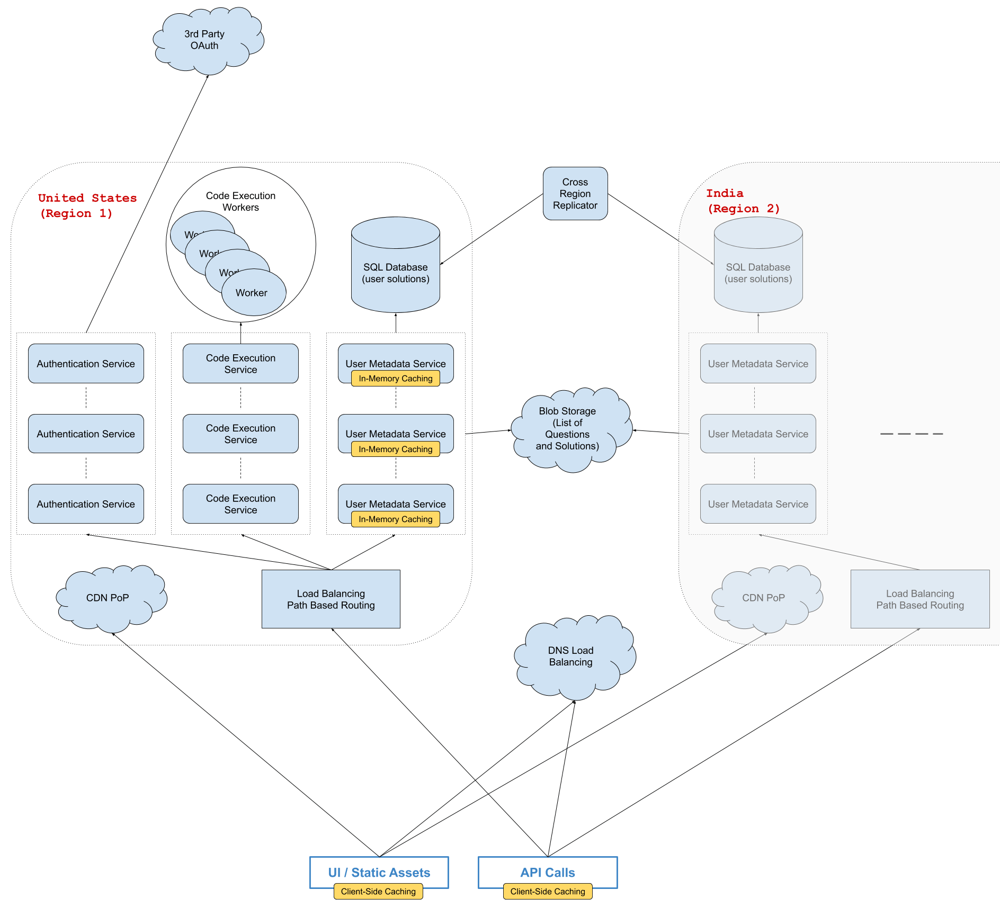

# Design AlgoExpert

Many systems design questions are intentionally left very vague and are literally given in the form of `Design Foobar`. It's your job to ask clarifying questions to better understand the system that you have to build.  

We've laid out some of these questions below; their answers should give you some guidance on the problem. Before looking at them, we encourage you to take few minutes to think about what questions you'd ask in a real interview.  

## Clarifying Questions To Ask

1.  Q: Are we designing the entire AlgoExpert platform or just a specific part of it, like the coding workspace?  
- A: Since we only have about 45 minutes, you should just design the core user flow of the AlgoExpert platform. The core user flow includes users landing on the home page of the website, going to the questions list, marking questions as complete or in progress, and then writing and running code in various languages for each language. Don't worry about payments or authentication; you can just assume that you have these services working already (by the way, we mainly rely on third-party services here, like Stripe, PayPal, and OAuth2).  
---
2.  Q: AlgoExpert doesn't seem like a system of utmost criticality (like a hospital system or airplane software); are we okay with 2 to 3 nines of availability for the system?  
- A: Yes, this seems fine--no need to focus too much on making the system highly available.  
---
3.  Q: How many customers should we be building this for? Is AlgoExpert's audience global or limited to one country?  
- A: AlgoExpert’s website receives hundreds of thousands of users every month, and tens of thousands of users may be on the website at any point in time. We want the website to feel very responsive to people everywhere in the world, and the U.S. and India are the platform's top 2 markets that we especially want to cater to.  
---
4.  Q: Does AlgoExpert make changes to its content (questions list and question solutions) often?  
- A: Yes--every couple of days on average. And we like to have our changes reflected in production globallywithin the hour.  
---
5.  Q: How much of the code-execution engine behind the coding workspace should we be designing? Do we have to worry about the security aspect of running random user code on our servers?  
- A: You can disregard the security aspects of the code-execution engine and just focus on its core functionality--the ability to run code in various languages at any given time with acceptable latency.  
---
6.  Q: While we'll care about latency across the entire system, the code-execution engine seems like the place where we'll care about it most, since it's very interactive, and it also seems like the toughest part of our system to support low latencies; are we okay with anywhere between 1 and 3 seconds for the average run-code latency?  
- A: Yes--this seems reasonable and acceptable from a product point of view.  
---

### Solution

> 1.  Gathering System Requirements  
> As with any systems design interview question, the first thing that we want to do is to gather system requirements; we need to figure out what system we're building exactly.  
> From the answers we were given to our clarifying questions (see Prompt Box), we're building the core AlgoExpert user flow, which includes users landing on the website, accessing questions, marking them as complete, writing code, running code, and having their code saved.  
> We don't need to worry about payments or authentication, and we don't need to go too deep into the code-execution engine.  
> We're building this platform for a global audience, with an emphasis on U.S. and India users, and we don't need to overly optimize our system's availability. We probably don't need more than two or three nines, because we're not building a health or security system, and this gets us somewhere between 8 hours and 3 days of downtime per year, which is reasonable. All in all, this means that we don't need to worry too much about availability.  
> We care about latency and throughput within reason, but apart from the code-execution engine, this doesn't seem like a particularly difficult aspect of our system.  

> 2.  Coming Up With A Plan  
> It's important to organize ourselves and to lay out a clear plan regarding how we're going to tackle our design. What are the major, distinguishable components of our how system?  
> On the one hand, AlgoExpert has a lot of static content; the entire home page, for instance, is static, and it has a lot of images. On the other hand, AlgoExpert isn't just a static website; it clearly has a lot of dynamic content that users themselves can generate (code that they can write, for example). So we'll need to have a robust API backing our UI, and given that user content gets saved on the website, we'll also need a database backing our API.  
> We can divide our system into 3 core components:  
> Static UI content  
> Accessing and interacting with questions (question completion status, saving solutions, etc.)  
> Ability to run code  
> Note that the second bullet point will likely get further divided.  

> 3.  Static UI Content  
> For the UI static content, we can put public assets like images and JavaScript bundles in a blob store: S3 or Google Cloud Storage. Since we're catering to a global audience and we care about having a responsive website (especially the home page of the website), we might want to use a Content Delivery Network (CDN) to serve that content. This is especially important for a better mobile experience because of the slow connections that phones use.  

> 4.  Main Clusters And Load Balancing  
> For our main backend servers, we can have 2 primary clusters in the 2 important regions: U.S. and India.  
> We can have some DNS load balancing to route API requests to the cluster closest to the user issuing the requests, and within a region, we can have some path-based load balancing to separate our services (payments, authentication, code execution, etc.), especially since the code execution platform will probably need to run on different kinds of servers compared to those of the rest of the API. Each service can probably have a set of servers, and we can do some round-robin load balancing at that level (this is probably handled directly at the path-based load balancing layer).  

> 5.  Static API Content  
> There's a lot of static API content on AlgoExpert: namely, the list of questions and all of their solutions. We can store all of this data in a blob store for simplicity.  

> 6.  Caching  
> We can implement 2 layers of caching for this static API content.  
> We can have client-side caching; this will improve the user experience on the platform (users will only need to load questions once per session), and this will reduce the load on our backend servers (this will probably save 2-3 network calls per session).  
> We can also have some in-memory caching on our servers. If we approximate 100 questions with 10 languages and 5KB per solution, this should be less than 100 * 10 * 5000 bytes = 5MB of total data to keep in memory, which is perfectly fine.  
> Since we were told that we want to make changes to static API content every couple of days and that we want those changes to be reflected in production as soon as possible, we can invalidate, evict and replace the data in our server-side caches every 30 minutes or so.  

> 7.  Access Control  
> Whenever you're designing a system, it's important to think about any potential access control that needs to be implemented. In the case of AlgoExpert, there's straightforward access control with regards to question content: users who haven't purchased AlgoExpert can't access individual questions. We can implement this fairly easily by just making some internal API call whenever a user requests our static API content to figure out if the user owns the product before returning the full content for questions.  

> 8.  User Data Storage  
> For user data, we have to design the storage of question completion status and of user solutions to questions. Since this data will have to be queried a lot, a SQL database like Postgres or MySQL seems like a good choice.  
> We can have 2 tables. The first table might be question_completion_status, which would probably have the following columns:  
> id: integer, primary key (an auto-incremented integer for instance)  
> user_id: string, references the id of the user (can be obtained from auth)  
> question_id: string, references the id of the question  
> completion_status: string, enum to represent the completion status of the question  
> We could have a uniqueness constraint on (user_id, question_id) and an index on user_id for fast querying.  
> The second table might be user_solutions:  
> id: integer, primary key (an auto-incremented integer for instance)  
> user_id: string, references the id of the user (can be obtained from auth)  
> question_id: string,references the id of the question  
> language: string, references the language of the solution  
> solution: string, contains the user's solution  
> We could have a uniqueness constraint on (user_id, question_id, language) and an index on user_id as well as one on question_id. If the number of languages goes up significantly, we might also want to index on language to allow for fast per-language querying so that the UI doesn't fetch all of a user's solutions at the same time (this might be a lot of data for slow connections).  

> 9.  Storage Performance  
> Marking questions as complete and typing code in the coding workspace (with a 1-3 second debounce for performance reasons) will issue API calls that write to the database. We likely won't get more than 1000 writes per second given our user numbers (assuming roughly 10,000 users on the platform at any given point in time), which SQL databases can definitely handle.  
> We can have 2 major database servers, each serving our 2 main regions: 1 in North America and 1 in India (perhaps serving Southeast Asia). If need be, we can add a 3rd cluster serving Europe exclusively (or other parts of the world, as our platform grows).  

> 10.  Inter-Region Replication  
> Since we'll have 2 primary database servers, we'll need to keep them up to date with each other. Fortunately, users on AlgoExpert don't share user-generated content; this means that we don't need data that's written to 1 database server to immediately be written to the other database server (this would likely have eliminated the latency improvements we got by having regional databases).  
> That being said, we do need to keep our databases up to date with each other, since users might travel around the world and hit a different database server than their typical one.  
> For this, we can have some async replication between our database servers. The replication can occur every 12 hours, and we can adjust this according to behavior in the system and amount of data that gets replicated across continents.  

> 11.  Code Execution  
> First of all, we should implement some rate limiting. A service like code execution lends itself perfectly to rate limiting, and we can implement some tier-based rate limiting using a K-V Store like Redis to easily prevent DoS attacks. We can limit the number of code runs to once every second, 3 times per 5 seconds, and 5 times per minute. This will prevent DoS attacks through the code-execution API, but it'll still allow for a good user experience when running code.  
> Since we want 1-3 seconds of latency for running code, we need to keep a set of special servers--our "workers"-- ready to run code at all times. They can each clean up after running user code (remove extra generated files as a result of compilation, for example) so that they don’t need to be killed at any point. Our backend servers can contact a free worker and get the response from that worker when it's done running code (or if the code timed out), and our servers can return that to the UI in the same request.  
> Given that certain languages need to be compiled, we can estimate that it would take on average 1 second to compile and run the code for each language. People don’t run code that often, so we can expect 10 run-codes per second in total given roughly 10,000 users on the website at once, so we'll probably need 10-100 machines to satisfy our original latency requirement of 1-3 seconds per run-code (10 machines if 10 run-codes per second is accurate, more if we experience higher load).  
> This design scales horizontally with our number of users, and it can scale vertically to make running code even faster (more CPU == faster runs).  
> Lastly, we can have some logging and monitoring in our system, especially for running code (tracking run-code events per language, per user, per question, average response time, etc.). This will help us automatically scale our clusters when user demand goes up or down. This can also be useful to know if any malicious behavior is happening with the code-execution engine.  

> 12.  System Diagram  
> 

