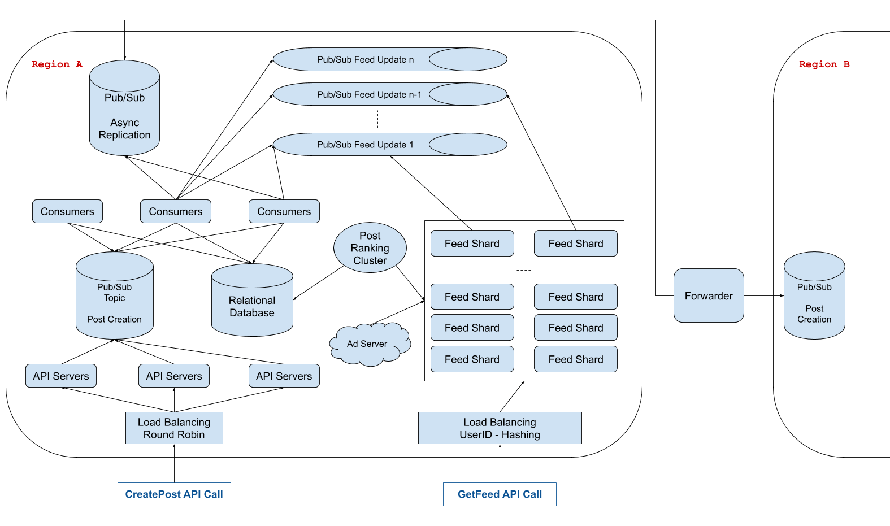

# Design Facebook News Feed

Many systems design questions are intentionally left very vague and are literally given in the form of `Design Foobar`. It's your job to ask clarifying questions to better understand the system that you have to build.  

We've laid out some of these questions below; their answers should give you some guidance on the problem. Before looking at them, we encourage you to take few minutes to think about what questions you'd ask in a real interview.  

## Clarifying Questions To Ask

1.  Q: Facebook News Feed consists of multiple major features, like loading a user's news feed, interacting with it (i.e., posting status updates, liking posts, etc.), and updating it in real time (i.e., adding new status updates that are being posted to the top of the feed, in real time). What part of Facebook News Feed are we designing exactly?  
- A: We're designing the core functionality of the feed itself, which we'll define as follows: loading a user's news feed and updating it in real time, as well as posting status updates. But for posting status updates, we don't need to worry about the actual API or the type of information that a user can post; we just want to design what happens once an API call to post a status update has been made. Ultimately, we primarily want to design the feed generation/refreshing piece of the data pipeline (i.e, how/when does it get constructed, and how/when does it get updated with new posts).  
---

2.  Q: To clarify, posts on Facebook can be pretty complicated, with pictures, videos, special types of status updates, etc.. Are you saying that we're not concerned with this aspect of the system? For example, should we not focus on how we'll be storing this type of information?  
- A: That's correct. For the purpose of this question, we can treat posts as opaque entities that we'll certainly want to store, but without worrying about the details of the storage, the ramifications of storing and serving large files like videos, etc..  
---

3.  Q: Are we designing the relevant-post curation system (i.e., the system that decides what posts will show up on a user's news feed)?  
- A: No. We're not designing this system or any ranking algorithms; you can assume that you have access to a ranking algorithm that you can simply feed a list of relevant posts to in order to generate an actual news feed to display.  
---

4.  Q: Are we concerned with showing ads in a user's news feed at all? Ads seem like they would behave a little bit differently than posts, since they probably rely on a different ranking algorithm.  
- A: You can treat ads as a bonus part of the design; if you find a way to incorporate them in, great (and yes, you'd have some other ads-serving algorithm to determine what ads need to be shown to a user at any point in time). But don't focus on ads to start.  
---

5.  Q: Are we serving a global audience, and how big is our audience?  
- A: Yes -- we're serving a global audience, and let's say that the news feed will be loaded in the order of 100 million times a day, by 100 million different users, with 1 million new status updates posted every day.  
---

6.  Q: How many friends does a user have on average? This is important to know, since a user's status updates could theoretically have to show up on all of the user's friends' news feeds at once.  
- A: You can expect each user to have, on average, 500 friends on the social network. You can treat the number of friends per user as a bell-shaped distribution, with some users who have very few friends, and some users who have a lot more than 500 friends.  
---

7.  Q: How quickly does a status update have to appear on a news feed once it's posted, and is it okay if this varies depending on user locations with respect to the location of the user submitting a post?  
A: When a user posts something, you probably want it to show up on other news feeds fairly quickly. This speed can indeed vary depending on user locations. For instance, we'd probably want a local friend within the same region to see the new post within a few seconds, but we'd likely be okay with a user on the other side of the world seeing the same post within a minute.  
---

8.  Q: What kind of availability are we aiming for?  
A: Your design shouldn't be completely unavailable from a single machine failure, but this isn't a high availability requirement. However, posts shouldn't ever just disappear. Once the user’s client gets confirmation that the post was created, you cannot lose it.  
---

### Solution

> 1.  Gathering System Requirements  
> As with any systems design interview question, the first thing that we want to do is to gather system requirements; we need to figure out what system we're building exactly.  
> We're designing the core user flow of the Facebook News Feed. This consists of loading a user's news feed, scrolling through the list of posts that are relevant to them, posting status updates, and having their friends' news feeds get updated in real time. We're Specifically designing the pipeline that generates and serves news feeds and the system that handles what happens when a user posts and news feeds have to be updated.  
> We're dealing with about 1 billion users, each with 500 friends on average.  
> Getting a news feed should feel fairly instant, and creating a post should update all of a user's friends' news feeds within a minute. We can have some variance with regards to feed updates depending on user locations.  
> Additionally, we can't be satisfied with a single cluster serving everyone on earth because of large latencies that would occur between that cluster and the user in some parts of the world, so we need a mechanism to make sure the feed gets updated within a minute in the regions other than the one the post was created in.  
> We can assume that the ranking algorithms used to generate news feeds with the most relevant posts is taken care of for us by some other system that we have access to.  

> 2.  Coming Up With A Plan  
> We'll start with the extremities of our system and work inward, first talking about the two API calls, CreatePost and GetNewsFeed, then, getting into the feed creation and storage strategy, our cross-region design, and finally tying everything together in a fast and scalable way.  

> 3.  CreatePost API  
> For the purpose of this design, the CreatePost API call will be very simple and look something like this:
```
    CreatePost(
        user_id: string,
        post: data
    )
```
> When a user creates a post, the API call goes through some load balancing before landing on one of many API servers (which are stateless). Those API servers then create a message on a Pub/Sub topic, notifying its subscribers of the new post that was just created. Those subscribers will do a few things, so let's call them S1 for future reference. Each of the subscribers S1 reads from the topic and is responsible for creating the facebook post inside a relational database.  

> 4.  Post Storage  
> We can have one main relational database to store most of our system's data, including posts and users. This database will have very large tables.  

> 5.  GetNewsFeed API  
> The GetNewsFeed API call will most likely look like this:  
```
   GetNewsFeed(
        user_id: string,
        pageSize: integer,
        nextPageToken: integer,
    ) => (
        posts: []{
            user_id: string,
            post_id: string,
            post: data,
        },
        nextPageToken: string,
    )
```
> The pageSize and nextPageToken fields are used to paginate the newsfeed; pagination is necessary when dealing with large amounts of listed data, and since we'll likely want each news feed to have up to 1000 posts, pagination is very appropriate here.  

> 6.  Feed Creation And Storage  
> Since our databases tables are going to be so large, with billions of millions of users and tens of millions of posts every week, fetching news feeds from our main database every time a GetNewsFeed call is made isn't going to be ideal. We can't expect low latencies when building news feeds from scratch because querying our huge tables takes time, and sharding the main database holding the posts wouldn't be particularly helpful since news feeds would likely need to aggregate posts across shards, which would require us to perform cross-shard joins when generating news feeds; we want to avoid this.  
> Instead, we can store news feeds separately from our main database across an array of shards. We can have a separate cluster of machines that can act as a proxy to the relational database and be in charge of aggregating posts, ranking them via the ranking algorithm that we're given, generating news feeds, and sending them to our shards every so often (every 5, 10, 60 minutes, depending on how often we want news feeds to be updated).  
> If we average each post at 10kB, and a newsfeed comprises of the top 1000 posts that are relevant to a user, that's 10MB per user, or 10 000TB of data total. We assume that it's loaded 10 times per day per user, which averages at 10k QPS for the newsfeed fetching.  
> Assuming 1 billion news feeds (for 1 billion users) containing 1000 posts of up to 10 KB each, we can estimate that we'll need 10 PB (petabytes) of storage to store all of our users' news feeds. We can use 1000 machines of 10 TB each as our news-feed shards.  
```
  ~10 KB per post
  ~1000 posts per news feed
  ~1 billion news feeds
  ~10 KB * 1000 * 1000^3 = 10 PB = 1000 * 10 TB
```
> To distribute the newsfeeds roughly evenly, we can shard based on the user id.  
> When a GetNewsFeed request comes in, it gets load balanced to the right news feed machine, which returns it by reading on local disk. If the newsfeed doesn't exist locally, we then go to the source of truth (the main database, but going through the proxy ranking service) to gather the relevant posts. This will lead to increased latency but shouldn't happen frequently.  

>  7. Wiring Updates Into Feed Creation  
> We now need to have a notification mechanism that lets the feed shards know that a new relevant post was just created and that they should incorporate it into the feeds of impacted users.  
> We can once again use a Pub/Sub service for this. Each one of the shards will subscribe to its own topic--we'll call these topics the Feed Notification Topics (FNT)--and the original subscribers S1 will be the publishers for the FNT. When S1 gets a new message about a post creation, it searches the main database for all of the users for whom this post is relevant (i.e., it searches for all of the friends of the user who created the post), it filters out users from other regions who will be taken care of asynchronously, and it maps the remaining users to the FNT using the same hashing function that our GetNewsFeed load balancers rely on.  
> For posts that impact too many people, we can cap the number of FNT topics that get messaged to reduce the amount of internal traffic that gets generated from a single post. For those big users we can rely on the asynchronous feed creation to eventually kick in and let the post appear in feeds of users whom we've skipped when the feeds get refreshed manually.

> 8.  Cross-Region Strategy  
> When CreatePost gets called and reaches our Pub/Sub subscribers, they'll send a message to another Pub/Sub topic that some forwarder service in between regions will subscribe to. The forwarder's job will be, as its name implies, to forward messages to other regions so as to replicate all of the CreatePost logic in other regions. Once the forwarder receives the message, it'll essentially mimic what would happen if that same CreatePost were called in another region, which will start the entire feed-update logic in those other regions. We can have some additional logic passed to the forwarder to prevent other regions being replicated to from notifying other regions about the CreatePost call in question, which would lead to an infinite chain of replications; in other words, we can make it such that only the region where the post originated from is in charge of notifying other regions.  
> Several open-source technologies from big companies like Uber and Confluent are designed in part for this kind of operation.  

> 9.  System Diagram
> 


