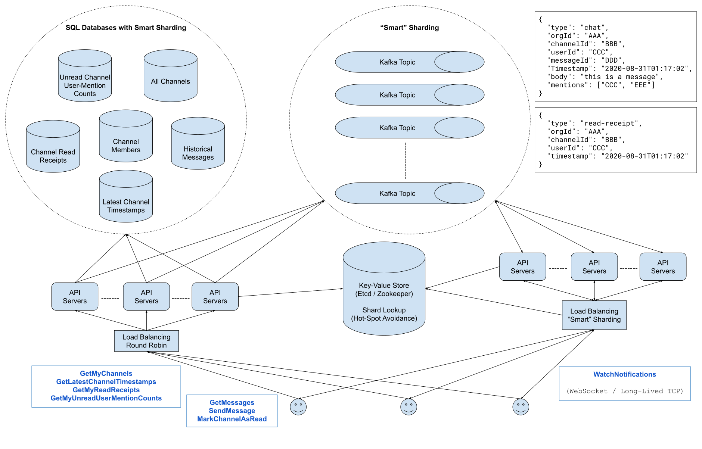

# Design Slack

Many systems design questions are intentionally left very vague and are literally given in the form of `Design Foobar`. It's your job to ask clarifying questions to better understand the system that you have to build.

We've laid out some of these questions below; their answers should give you some guidance on the problem. Before looking at them, we encourage you to take few minutes to think about what questions you'd ask in a real interview.

1.  Q: There are a lot of things that you can do on Slack. Primarily, you use Slack to communicate with people in one-on-one channels, private channels, or public channels, all within an organization. But you can also do a bunch of other things on Slack, like create and delete channels, change channel settings, change Slack settings, invite people to channels, etc.. What exactly are we designing here?  
- A: We're designing the core messaging functionality, which involves communicating in both one-on-one channels and group channels in an organization. You don't have to worry about channel settings and all of those extra functionalities.  
---

2.  Q: Okay. Do you want me to take care of the concept of private channels at all?  
- A: Let's just focus on users in a channel as far as access control is concerned; we can forget about the concept of a private channel.  
---

3.  Q: Okay. And regarding communication, from my knowledge of Slack, when you load the web app or the desktop / mobile apps, you can obviously access all the messages of channels that you're in (including one-on-one channels), but you're also notified of channels that have unread messages for you and of the number of unread mentions that you have in each channel. Channels with unread messages are bold, if I remember correctly, and the number of unread mentions is simply visible next to channel names. Should we design our system to accommodate this?  
- A: Yes, we should take care of this. And on that note, one thing we'll want to handle is cross-device synchronization. In other words, if you have both the Slack desktop app and the Slack mobile app open, and both apps are showing that one channel is unread, and you read that channel on one of the apps, the other app should immediately get updated and should mark the channel as read. You'll have to handle this.  
---

4.  Q: Hmm, okay. Speaking of different applications, by the way, are we designing the various device / software apps, or just the backend systems that the frontends / clients communicate with?  
- A: You'll only really focus on the backend systems for this question.  
---

5.  Q: Okay. Also, there are a lot of different features in actual Slack messages. For example, adding custom emojis, pinning messages, saving messages, writing code snippets or text-blocks, etc.. Do you want me to handle all of this?  
- A: No, you can just treat messages as pure text for now. Of course, what you'll design will likely be extensible to different types of messages and will eventually be able to handle things like pinning or saving messages, but for this design, don't worry about that.  
---

6.  Q: How many users do we expect to be building this for? And how large is the largest organization on slack? How many users does it have?  
- A: Slack has about 10 to 20 million users, so let's go with 20 million. And as for organizations, let's say that the largest single Slack customer has 50,000 people in the same organization. We can also approximate that the largest channel will be of that same size if all of an organization's employees are in the same channel (the typical #general channel, for example).  
---

7.  Q: Since this is a chat application, I'm assuming that low latency is one of our top priorities, and also, since this service impacts millions of users, I'm assuming that we should design with high availability in mind. Are these correct assumptions?  
- A: Yes to both of those things, but for the sake of being a little more focused, don't worry about optimizing for availability. Let's focus primarily on latency and core functionality.  

8.  Q: Okay. And are we building this for a global audience, or should we focus on a single region?  
- A: Let's handle a single region for this question, but just like with availability, don't focus too much on this aspect of the design.  
---


> 1.  Gathering System Requirements  
> As with any systems design interview question, the first thing that we want to do is to gather system requirements; we need to figure out what system we're building exactly.  
> We're designing the core communication system behind Slack, which allows users to send instant messages in Slack channels.  
> Specifically, we'll want to support:  
> -   Loading the most recent messages in a Slack channel when a user clicks on the channel.
> -   Immediately seeing which channels have unread messages for a particular user when that user loads Slack.
> -   Immediately seeing which channels have unread mentions of a particular user, for that particular user, when that user loads Slack, and more specifically, the number of these unread mentions in each relevant channel.
> -   Sending and receiving Slack messages instantly, in real time.
> -   Cross-device synchronization: if a user has both the Slack desktop app and the Slack mobile app open, with an unread channel in both, and if they read this channel on one device, the second device should immediately be updated and no longer display the channel as unread.
> The system should have low latencies and high availability, catering to a single region of roughly 20 million users. The largest Slack organizations will have as many as 50,000 users, with channels of the same size within them.  
> That being said, for the purpose of this design, we should primarily focus on latency and core functionality; availability and regionality can be disregarded, within reason.  

> 2.  Coming Up With A Plan  
> We'll tackle this system by dividing it into two main sections:  
> -   Handling what happens when a Slack app loads.  
> -   Handling real-time messaging as well as cross-device synchronization.  
> We can further divide the first section as follows:  
> -   Seeing all of the channels that a user is a part of.
> -   Seeing messages in a particular channel.
> -   Seeing which channels have unread messages.
> -   Seeing which channels have unread mentions and how many they have.

> 3.  Persistent Storage Solution & App Load  
> While a large component of our design involves real-time communication, another large part of it involves retrieving data (channels, messages, etc.) at any given time when the Slack app loads. To support this, we'll need a persistent storage solution.  
> Specifically, we'll opt for a SQL database since we can expect this data to be structured and to be queried frequently.  
> We can start with a simple table that'll store every Slack channel.  
> Channels
> 
> |id (channelId): uuid |	orgId: uuid	name: string | description: string |
> |---|---|----|
> |...|...|...|
> Then, we can have another simple table representing channel-member pairs: each row in this table will correspond to a particular user who is in a particular channel. We'll use this table, along with the one above, to fetch a user's relevant when the app loads.  
> Channel Members  
> 
> |id: uuid | orgId: uuid | channelId: uuid | userId: uuid |
> |---|---|---|---|
> |...|...|...|...|
>
> We'll naturally need a table to store all historical messages sent on Slack. This will be our largest table, and it'll be queried every time a user fetches messages in a particular channel. The API endpoint that'll interact with this table will return a paginated response, since we'll typically only want the 50 or 100 most recent messages per channel.  
> Also, this table will only be queried when a user clicks on a channel; we don't want to fetch messages for all of a user's channels on app load, since users will likely never look at most of their channels.  
> Historical Messages  
> 
> |id: uuid	| orgId: uuid | channelId: uuid	| senderId: uuid | sentAt: timestamp | body: string	| mentions: List<uuid> |
> |---|---|---|---|---|---|---|
> |...|...|...|...|...|...|...|
> 
> In order not to fetch recent messages for every channel on app load, all the while supporting the feature of showing which channels have unread messages, we'll need to store two extra tables: one for the latest activity in each channel (this table will be updated whenever a user sends a message in a channel), and one for the last time a particular user has read a channel (this table will be updated whenever a user opens a channel).  
> Latest Channel Timestamps  
>
> |id: uuid	| orgId: uuid | channelId: uuid	| lastActive: timestamp |
> |---|---|---|---|
> |...|...|...|...|
>
> Channel Read Receipts
>
> |id: uuid | orgId: uuid | channelId: uuid	| userId: uuid | lastSeen: timestamp |
> |---|---|---|---|---|
> |...|...|...|...|...|
> 
> For the number of unread user mentions that we want to display next to channel names, we'll have another table similar to the read-receipts one, except this one will have a count of unread user mentions instead of a timestamp. This count will be updated (incremented) whenever a user tags another user in a channel message, and it'll also be updated (reset to 0) whenever a user opens a channel with unread mentions of themself.  
> Unread Channel-User-Mention Counts  
>
> | id: uuid | orgId: uuid | channelId: uuid | userId: uuid | count: int |
> |---|---|---|---|---|
> |...|...|...|...|...|

> 4.  Load Balancing  
> For all of the API calls that clients will issue on app load, including writes to our database (when sending a message or marking a channel as read), we're going to want to load balance.  
> We can have a simple round-robin load balancer, forwarding requests to a set of server clusters that will then handle passing requests to our database.

> 5.  "Smart" Sharding  
> Since our tables will be very large, especially the messages table, we'll need to have some sharding in place.  
> The natural approach is to shard based on organization size: we can have the biggest organizations (with the biggest channels) in their individual shards, and we can have smaller organizations grouped together in other shards.  
> An important point to note here is that, over time, organization sizes and Slack activity within organizations will change. Some organizations might double in size overnight, others might experience seemingly random surges of activity, etc.. This means that, despite our relatively sound sharding strategy, we might still run into hot spots, which is very bad considering the fact that we care about latency so much.  
> To handle this, we can add a "smart" sharding solution: a subsystem of our system that'll asynchronously measure organization activity and "rebalance" shards accordingly. This service can be a strongly consistent key-value store like Etcd or ZooKeeper, mapping orgIds to shards. Our API servers will communicate with this service to know which shard to route requests to.  

> 6.  Pub/Sub System for Real-Time Behavior
> There are two types of real-time behavior that we want to support:  
> -   Sending and receiving messages in real time.
> -   Cross-device synchronization (instantly marking a channel as read if you have Slack open on two devices and read the channel on one of them).
> For both of these functionalities, we can rely on a Pub/Sub messaging system, which itself will rely on our previously described "smart" sharding strategy.  
> Every Slack organization or group of organizations will be assigned to a Kafka topic, and whenever a user sends a message in a channel or marks a channel as read, our previously mentioned API servers, which handle speaking to our database, will also send a Pub/Sub message to the appropriate Kafka topic.  
> The Pub/Sub messages will look like:  
>```
>      {
>           "type": "chat",
>           "orgId": "AAA",
>           "channelId": "BBB",
>           "userId": "CCC",
>           "messageId": "DDD",
>           "timestamp": "2020-08-31T01:17:02",
>           "body": "this is a message",
>           "mentions": ["CCC", "EEE"]
>      },
>      {
>           "type": "read-receipt",
>           "orgId": "AAA",
>           "channelId": "BBB",
>           "userId": "CCC",
>           "timestamp": "2020-08-31T01:17:02"
>      }
>```
> We'll then have a different set of API servers who subscribe to the various Kakfa topics (probably one API server cluster per topic), and our clients (Slack users) will establish long-lived TCP connections with these API server clusters to receive Pub/Sub messages in real time.  
> We'll want a load balancer in between the clients and these API servers, which will also use the "smart" sharding strategy to match clients with the appropriate API servers, which will be listening to the appropriate Kafka topics.  
> When clients receive Pub/Sub messages, they'll handle them accordingly (mark a channel as unread, for example), and if the clients refresh their browser or their mobile app, they'll go through the entire "on app load" system that we described earlier.  
> Since each Pub/Sub message comes with a timestamp, and since reading a channel and sending Slack messages involve writing to our persistent storage, the Pub/Sub messages will effectively be idempotent operations.  

> 7.  System Diagram
> 
