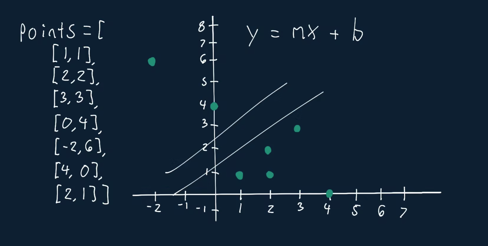

# Line Through Points

You're given an array of points plotted on a 2D graph (the xy-plane). Write a function that returns the maximum number of points that a single line (or potentially multiple lines) on the graph passes through.

The input array will contain points represented by an array of two integers [x, y]. The input array will never contain duplicate points and will always contain at least one point.

## Sample Input

```
points = [
    [1, 1],
    [2, 2],
    [3, 3],
    [0, 4],
    [-2, 6],
    [4, 0],
    [2, 1],
]
```

## Sample Output

```
4 // A line passes through points: [-2, -6], [0, 4], [2, 2], [4, 0].
```

Hints

Hint 1
> The brute-force approach to solve this problem is to consider every single pair of points and to form a line using them. Then, for each line, you determine how many points lie on that line by using the equation of the line you formed and checking if each point's coordinates solve the equation. This solution runs in O(n^3) time; can you come up with a better approach?

Hint 2
> What does it mean if two lines have the same slope and share a point?

Hint 3
> If two lines have the same slope and share a point, they're the same line. Try using a hash table to store the slopes of lines that pass through certain points. How does this help you write an algorithm that runs in O(n^2) time?

Hint 4
> Loop through every single pair of points, picking a p2 for every p1 in order to form a line. For every pair (p1, p2), store the slope of the formed line in a hash table, and map it to the number of points on that line. If you ever find two identical slopes for lines that both use the same point p1, you can consider these lines to be one and the same, meaning that points p1, p2a, and p2b are all on the same line; in those cases, update the number of points on the slope (the line) in the hash table accordingly. You'll need to reset the hash table at each change of p1. See the Conceptual Overview section of this question's video explanation for a more in-depth explanation.

```
Optimal Space & Time Complexity
O(n^2) time | O(n) space - where n is the number of points
```

