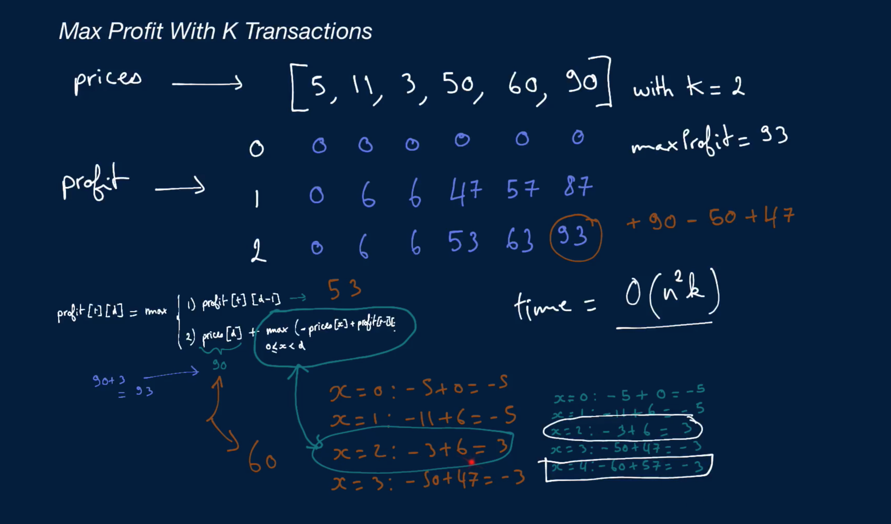

# Max Profit With K Transactions

You're given an array of positive integers representing the prices of a single stock on various days (each index in the array represents a different day). You're also given an integer k, which represents the number of transactions you're allowed to make. One transaction consists of buying the stock on a given day and selling it on another, later day.

Write a function that returns the maximum profit that you can make by buying and selling the stock, given k transactions.

Note that you can only hold one share of the stock at a time; in other words, you can't buy more than one share of the stock on any given day, and you can't buy a share of the stock if you're still holding another share. Also, you don't need to use all k transactions that you're allowed.

## Sample Input

```
prices = [5, 11, 3, 50, 60, 90]
k = 2
```

## Sample Output

```
93 // Buy: 5, Sell: 11; Buy: 3, Sell: 90
```

### Hints

Hint 1
> Try building a two-dimensional array of the maximum profits you can make on each day with zero, one, two, etc., k transactions. Let columns represent days and rows represent the number of transactions.

Hint 2
> Build up the array mentioned in Hint #1 one row at a time. In other words, find the maximum profits that you can make on each day with zero transactions first, then with one transaction, etc., until you reach k transactions. Find a formula that relates the maximum profit at any given point to previous profits. Once you find that formula, identify certain values that you repeatedly need and that you can temporarily store to optimize your algorithm.

Hint 3
> Do you really need to store the entire two-dimensional array mentioned in Hint #1? Identify what stored values you actually use throughout the process of building the array and come up with a way of storing only what you need and nothing more.

```
Optimal Space & Time Complexity
O(nk) time | O(n) space - where n is the number of prices and k is the number of transactions
```

