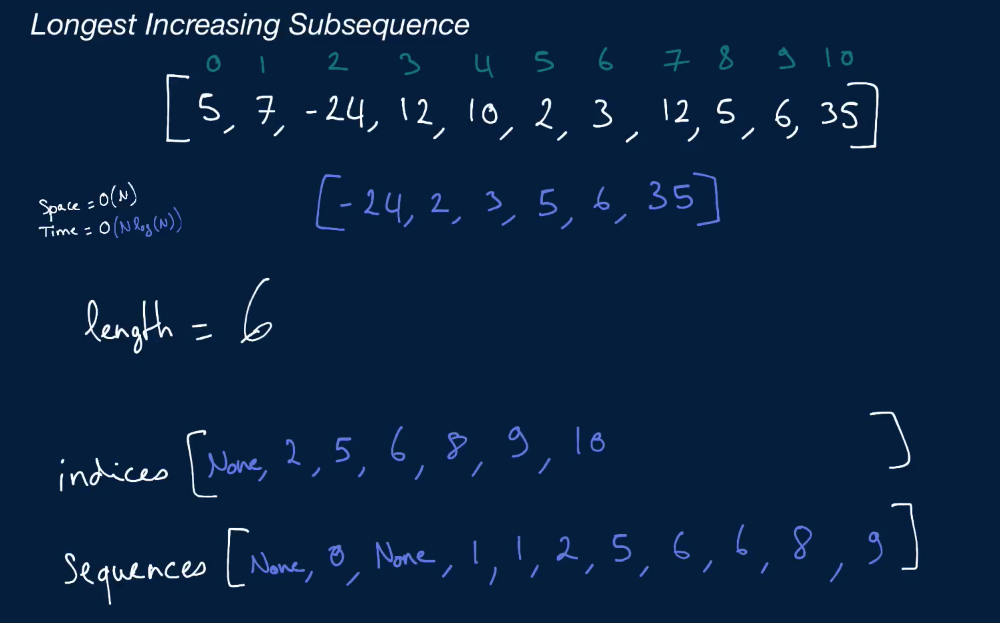

# Longest Increasing Subsequence

Given a non-empty array of integers, write a function that returns the longest strictly-increasing subsequence in the array.

A subsequence of an array is a set of numbers that aren't necessarily adjacent in the array but that are in the same order as they appear in the array. For instance, the numbers [1, 3, 4] form a subsequence of the array [1, 2, 3, 4], and so do the numbers [2, 4]. Note that a single number in an array and the array itself are both valid subsequences of the array.

You can assume that there will only be one longest increasing subsequence.

## Sample Input

```
array = [5, 7, -24, 12, 10, 2, 3, 12, 5, 6, 35]
```

## Sample Output

```
[-24, 2, 3, 5, 6, 35]
```

## Hints

Hint 1
> Try building an array of the same length as the input array. At each index in this new array, store the length of the longest increasing subsequence ending with the number found at that index in the input array.

Hint 2
> Can you efficiently keep track of potential sequences in another array? Instead of storing entire sequences, try storing the indices of previous numbers. For example, at index 3 in this other array, store the index of the before-last number in the longest increasing subsequence ending with the number at index 3.

Hint 3
> You can optimize your algorithm by taking a slightly different approach. Instead of building the array mentioned in Hint #1, try building an array whose indices represent lengths of subsequences and whose values represent the smallest numbers in the input array that can end a subsequence of a given length. Traverse the input array, and for each number determine what the length L of the longest increasing subsequence ending with that number is; store the position of that number at index L in the new array that you're building. Find a way to use binary search to build this array.

```
Optimal Space & Time Complexity
O(nlogn) time | O(n) space - where n is the length of the input array
```


