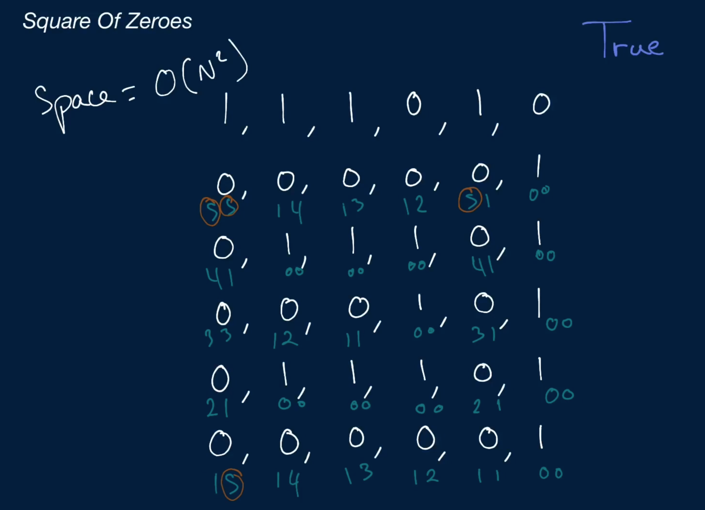
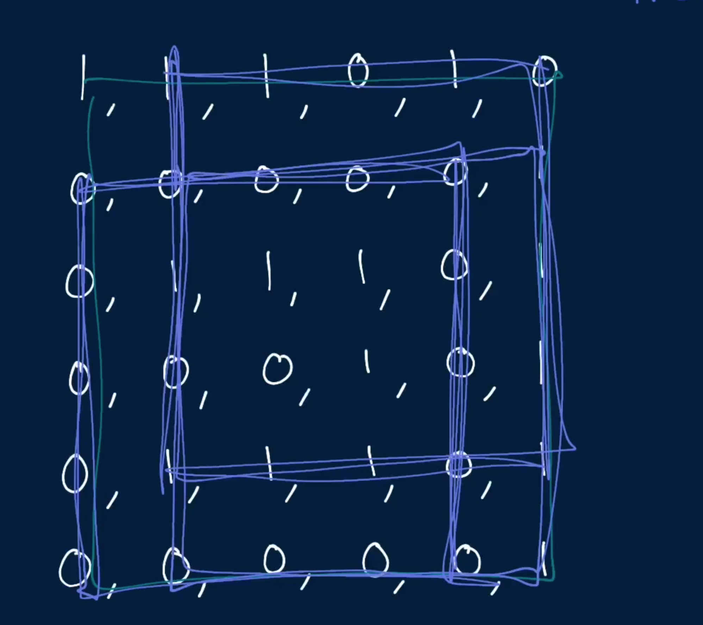
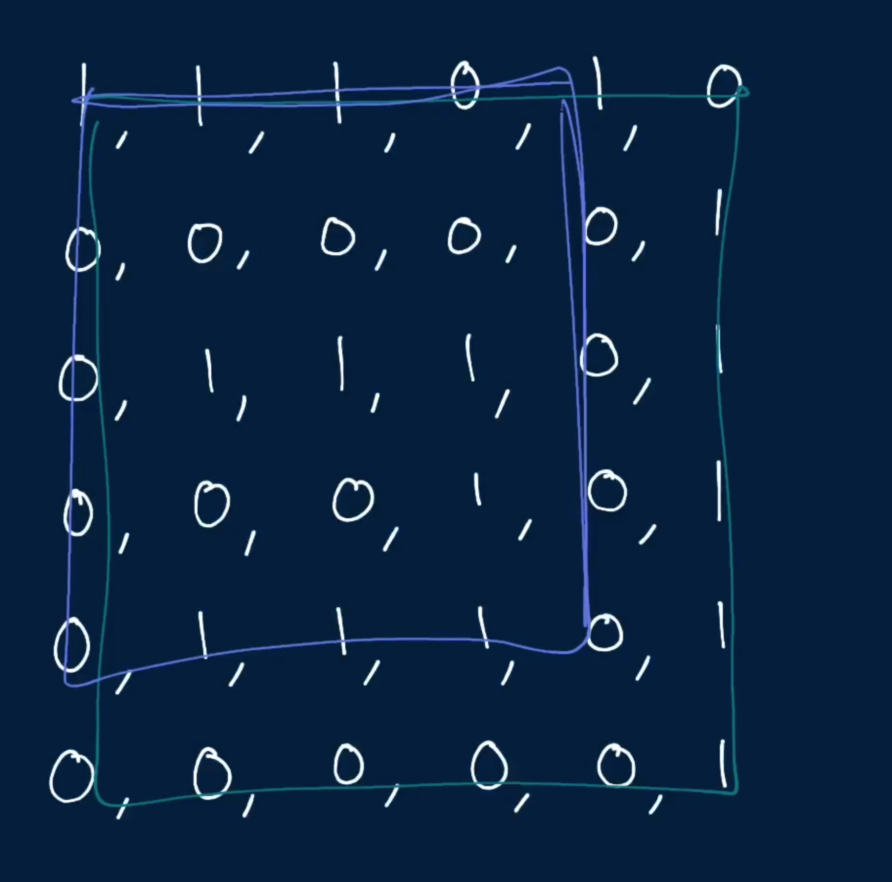
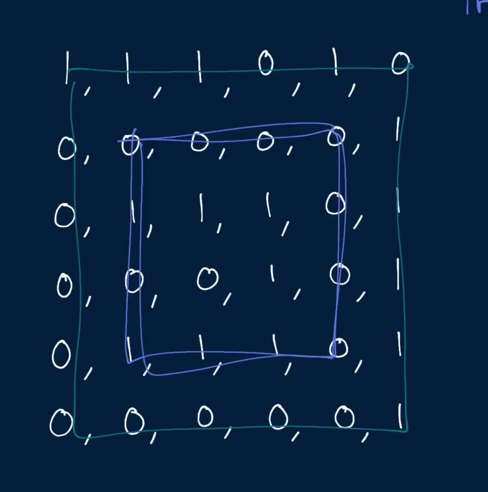

# Square of Zeroes

Write a function that takes in a square-shaped n x n two-dimensional array of only 1s and 0s and returns a boolean representing whether the input matrix contains a square whose borders are made up of only 0s.

Note that a 1 x 1 square doesn't count as a valid square for the purpose of this question. In other words, a singular 0 in the input matrix doesn't constitute a square whose borders are made up of only 0s; a square of zeroes has to be at least 2 x 2.

## Sample Input

``` 
matrix = [
  [1, 1, 1, 0, 1, 0],
  [0, 0, 0, 0, 0, 1],
  [0, 1, 1, 1, 0, 1],
  [0, 0, 0, 1, 0, 1],
  [0, 1, 1, 1, 0, 1],
  [0, 0, 0, 0, 0, 1],
]
```
## Sample Output

```
true
[
  [ ,  ,  ,  ,  ,  ],
  [0, 0, 0, 0, 0,  ],
  [0,  ,  ,  , 0,  ],
  [0,  ,  ,  , 0,  ],
  [0,  ,  ,  , 0,  ],
  [0, 0, 0, 0, 0,  ],
]
```

# Hints

Hint 1
> For the purpose of this question, a square is defined by its topmost and bottommost rows and by its leftmost and rightmost columns. Given a pair of rows and a pair of columns that form a valid square, you can easily determine if the relevant square is a square of zeroes with two for loops.

Hint 2
> You can apply the logic described in Hint #1 on every valid square in the input matrix in order to solve this problem. To find every valid square, you can either traverse the matrix iteratively with three nested loops, or you can start out at the outtermost square and recursively go inwards in the matrix, checking the squares obtained by moving each corner of a square inwards. If you go with this recursive approach, you'll need to use a cache to avoid doing many duplicate computations.

Hint 3
> The operation described in Hint #1 is a computationally expensive one to have to repeat for every single square in the matrix. Can you precompute certain values to make this operation a constant-time operation?

Hint 4
> You can make the operation described in Hint #1 a constant-time operation by precomputing some values in the matrix. Specifically, you can precompute two values for every element in the matrix: the number of 0s to the right of each element (including the element itself) and the number of 0s below each element (including the element itself). You can compute these values by iterating through the matrix starting at the bottom right corner and moving your way up by traversing each row from right to left; applying some simple dynamic programming techniques will allow you to build up these values trivially. Once you have these values precomputed, you can perform the operation described in Hint #1 in constant time just by looking at the number of 0s below any square's two top corners and the number of 0s to the right of the same square's two left corners.

```
Optimal Space & Time Complexity
O(n^3) time | O(n^2) space - where n is the height and width of the matrix
```








