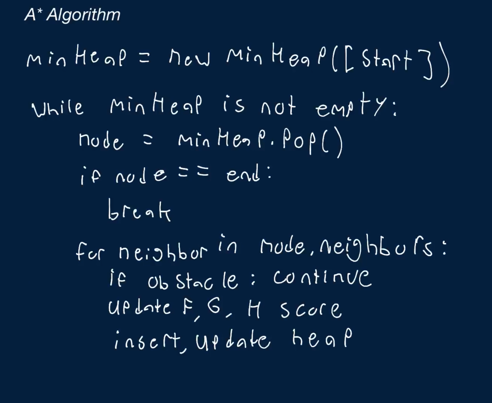

# A* Algorithm

You're given a two-dimensional array containing 0s and 1s, where each 0 represents a free space and each 1 represents an obstacle (a space that cannot be passed through). You can think of this array as a grid-shaped graph. You're also given four integers startRow, startCol, endRow, and endCol, representing the positions of a start node and an end node in the graph.

Write a function that finds the shortest path between the start node and the end node using the A* search algorithm and returns it.

The shortest path should be returned as an array of node positions, where each node position is an array of two elements: the [row, col] of the respective node in the graph. The output array should contain the start node's position, the end node's position, and all of the positions of the remaining nodes in the shortest path, and these node positions should be ordered from start node to end node.

If there is no path from the start node to the end node, your function should return an empty array.

Note that:

   - From each node in the graph, you can only travel in four directions: up, left, down and right; you can't travel diagonally.
   - The distance between all neighboring nodes in the graph is the same; you can treat it as a distance of 1.
   - The start node and end node are guaranteed to be located in empty spaces (cells containing 0).
   - The start node and end node will never be out of bounds and will never overlap.
   - There will be at most one shortest path from the start node to the end node.

If you're unfamiliar with A*, we recommend watching the Conceptual Overview section of this question's video explanation before starting to code.


## Sample Input

``` 
startRow = 0
startCol = 1
endRow = 4
endCol = 3
graph = [
  [0, 0, 0, 0, 0],
  [0, 1, 1, 1, 0],
  [0, 0, 0, 0, 0],
  [1, 0, 1, 1, 1],
  [0, 0, 0, 0, 0],
]
```

## Sample Output

```
[[0, 1], [0, 0], [1, 0], [2, 0], [2, 1], [3, 1], [4, 1], [4, 2], [4, 3]]

// The shortest path can be clearly seen here:
// [
//   [., ., 0, 0, 0],
//   [., 1, 1, 1, 0],
//   [., ., 0, 0, 0],
//   [1, ., 1, 1, 1],
//   [0, ., ., ., 0],
// ]
```

### Hints

Hint 1
> A* works by visiting nodes in the graph, one by one, all the while keeping track of their shortest estimated distance to the end node and continuously updating these distances. More specifically, the algorithm keeps track of unvisited nodes and visits the unvisited node with the shortest estimated distance to the end node at any point in time, naturally starting with the start node. Whenever the algorithm visits an unvisited node, it looks at all of its neighboring nodes and tries to update their shortest estimated distance to the end node, using the current shortest distance to the current node as a base and using a special heuristic to estimate the remaining distance to the end node. In a grid-shaped graph, the heuristic used is often the Manhattan Distance (i.e., the number of naive vertical and horizontal steps between the current node and the end node). Once the algorithm has reached the end node, it is guaranteed to have found the shortest path to it. How can you implement this algorithm?

Hint 2
> The most challenging part of A* is determining how to efficiently find the node with the current shortest estimated distance to the end. Can you think of a data structure that could be used to keep track of the distances and to efficiently retrieve the node with the current shortest estimated distance to the end at each step?

Hint 3
> Create a min-heap that will hold all of the unvisited nodes and their current shortest estimated distance to the end node. Initialize all nodes except for the start node as having a shortest estimated distance to the end node of infinity and also a shortest distance from the start node to themselves of infinity; the start node will have a distance to itself of 0 and an estimated distance to the end node of its Manhattan Distance to the end node. Next, write a while loop that will run until the min-heap is empty or until the end node is reached. At every iteration in the loop, remove the node from the top of the heap (the node with the shortest estimated distance to the end node), loop through all of its neighboring nodes, and for each neighbor, update its two distances if reaching the neighbor from the current node yields a shorter distance than whatever's already stored on the neighbor. Once you reach the end node, you'll have found the shortest path to it from the start node. Note that you'll have to keep track of which node each node came from whenever you update node distances; this is so that you can reconstruct the shortest path once you reach the end node.

```
Optimal Space & Time Complexity
O(w * h * log(w * h)) time | O(w * h) space - where w is the width of the graph and h is the height
```




