# Detect Arbitrage

You're given a two-dimensional array (a matrix) of equal height and width that represents the exchange rates of arbitrary currencies. The length of the array is the number of currencies, and every currency can be converted to every other currency. Each currency is represented by a row in the array, where values in that row are the floating-point exchange rates between the row's currency and all other currencies, as in the example below.

```
         0:USD 1:CAD  2:GBP 
0:USD [  1.0, 1.27, 0.718]
1:CAD [ 0.74,  1.0,  0.56]
2:GBP [ 1.39, 1.77,   1.0]
```

In the matrix above, you can see that row 0 represents USD, which means that row 0 contains the exchange rates for 1 USD to all other currencies. Since row 1 represents CAD, index 1 in the USD row contains the exchange for 1 USD to CAD. The currency labels are listed above to help you visualize the problem, but they won't actually be included in any inputs and aren't relevant to solving this problem.

Write a function that returns a boolean representing whether an arbitrage opportunity exists with the given exchange rates. An arbitrage occurs if you can start with C units of one currency and execute a series of exchanges that lead you to having more than C units of the same currency you started with.

Note: currency exchange rates won't represent real-world exchange rates, and there might be multiple ways to generate an arbitrage.

## Sample Input
```
exchangeRates = [
    [   1.0, 0.8631, 0.5903],
    [1.1586,    1.0, 0.6849],
    [1.6939,   1.46,    1.0],
]
```

## Sample Output
```
true
```

### Hints

Hint 1
> Try treating this problem like a graph problem, where the currencies are the vertices and the exchange rates are the edges. Think about what properties of this graph would determine if there's an arbitrage opportunity.

Hint 2
> If you're able to find a cycle in the graph whose edges multiply to more than 1, then you've found an arbitrage. If a cycle that fits this criteria exists, there must be an arbitrage, because it means that you can start at a certain currency in the cycle and return back to that original currency with more units than you started with.

Hint 3
> Finding a cycle whose edges multiply to more than 1 isn't a very common problem in Computer Science. However, finding a cycle whose edges add up to a negative value (a negative weight cycle) is much more common. Is there a way that you can mutate the edge weights in your graph such that finding a negative weight cycle in this mutated graph indicates an arbitrage? Hint: think about logarithms and how log(a * b) = log(a) + log(b).

Hint 4
> Change all of the edge weights in the graph to be their negative logarithm. In other words, create a new matrix of exchange rates, where every value is the negative logarithm of the original exchange rate. Once this is done, you can use the Bellman-Ford algorithm to detect the presence of a negative weight cycle in the graph. If you detect a negative weight cycle, then an arbitrage exists. See the Conceptual Overview section of this question's video explanation for a more in-depth explanation.

```
Optimal Space & Time Complexity
O(n^3) time | O(n^2) space - where n is the number of currencies
```

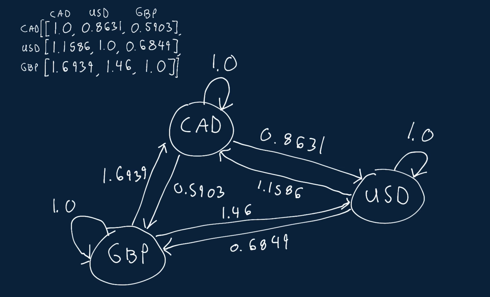

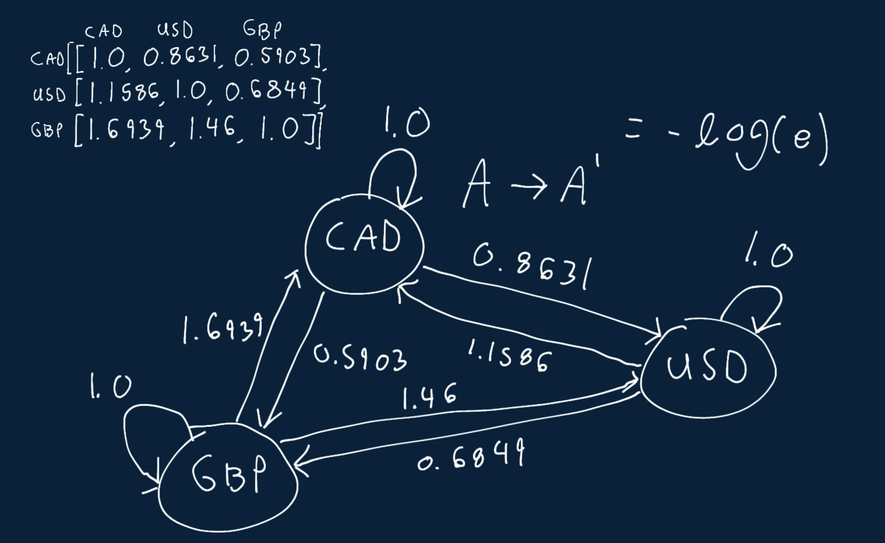

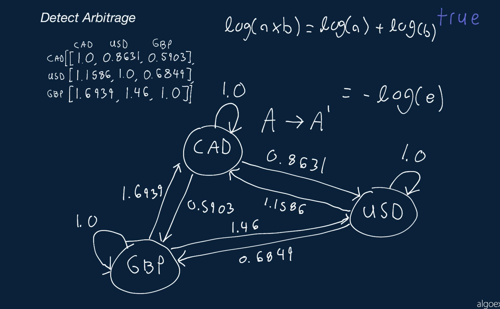

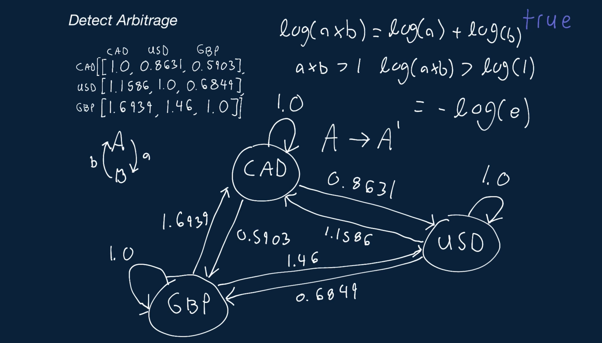

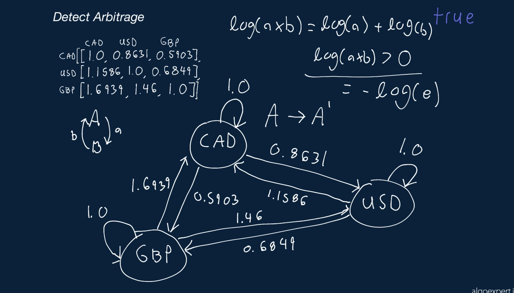

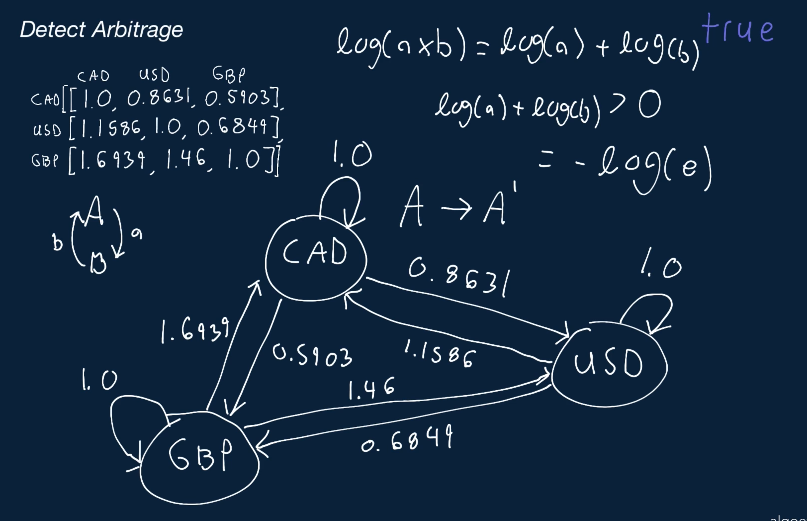

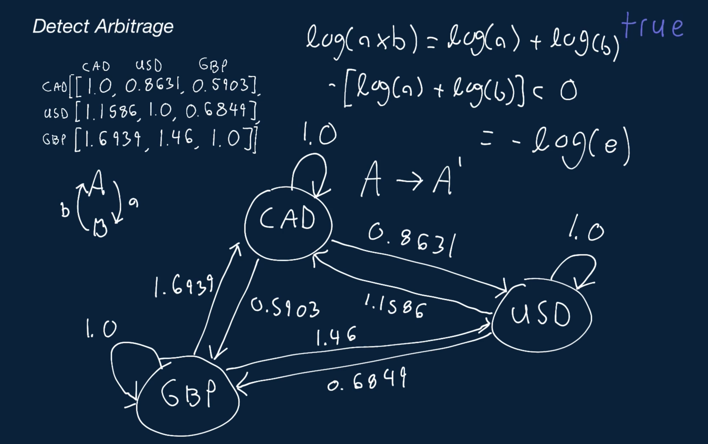

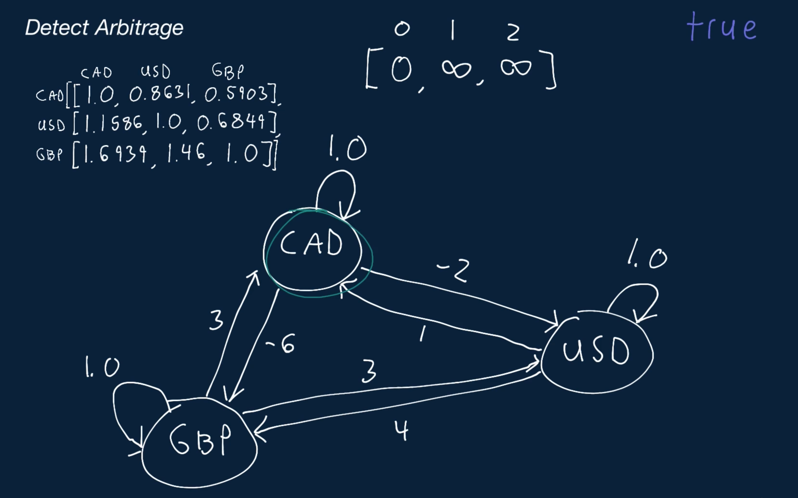

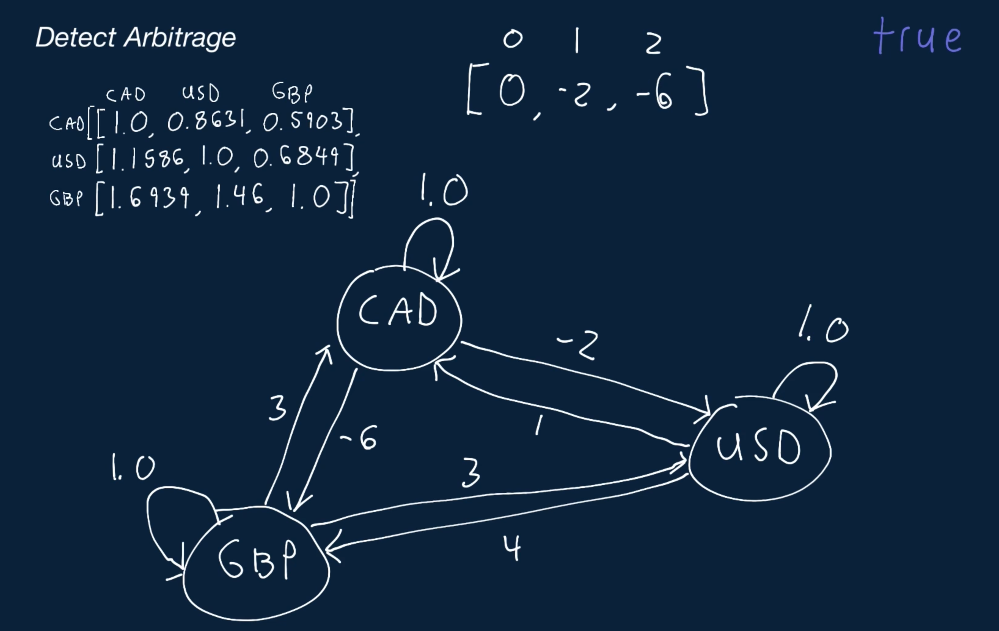


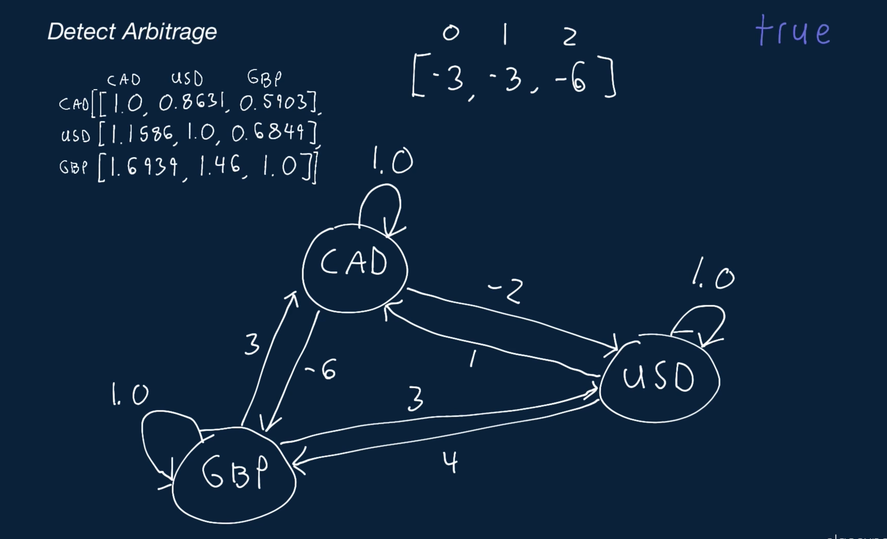

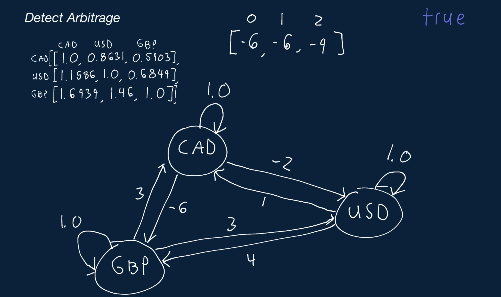

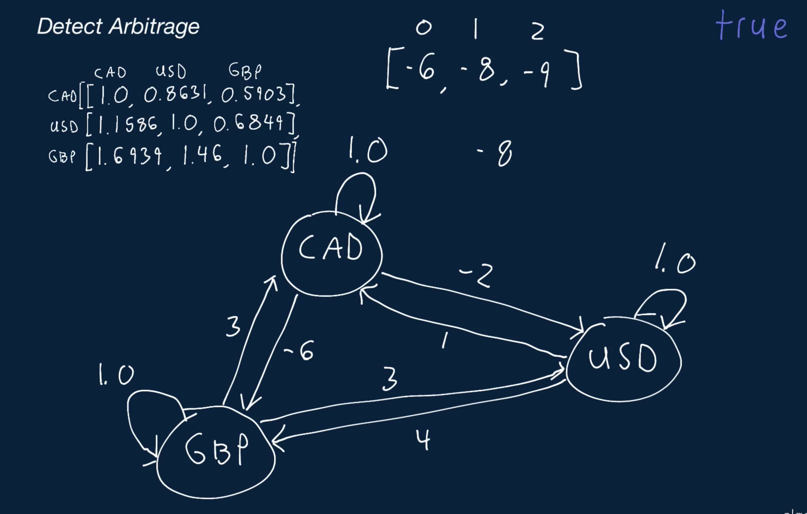

### Notes

The optimal solution to this problem seems very difficult. Would I be expected to come up with this in a 45-minute interview?

Realistically, no. Since the optimal solution to this problem is admittedly very hard (harder than most other solutions on AlgoExpert), in a real coding interview, you would likely be given a lot of guidance and hints by your interviewer.

For example, it's possible that they would first see you struggle with the problem for about 5 minutes and then point you in the direction of using negative logarithms, telling you why exactly that would be useful.

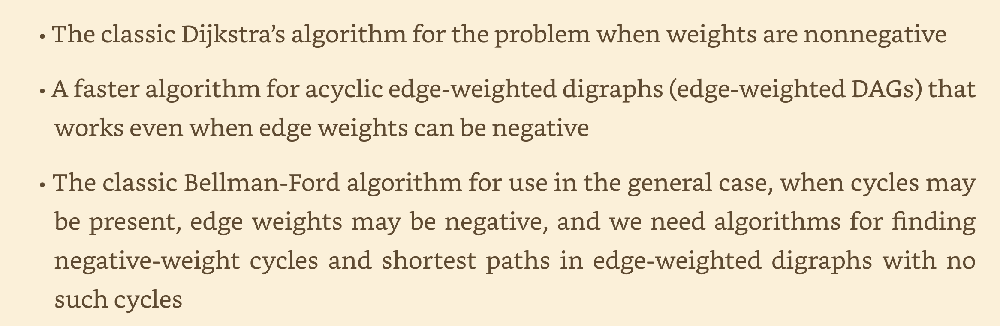
