# Two-Edge-Connected Graph

You're given a list of edges representing an unweighted and undirected graph. Write a function that returns a boolean representing whether the given graph is two-edge-connected.

A graph is connected if, for every pair of vertices in the graph, there's a path of one or more edges connecting the given vertices. A graph that isn't connected is said to be disconnected.

A graph is two-edge-connected if, for every one of its edges, the edge's removal from the graph doesn't cause the graph to become disconnected. If the removal of any single edge disconnects the graph, then it isn't two-edge-connected. If the given graph is already disconnected, then it also isn't two-edge-connected. An empty graph is considered two-edge-connected.

The input list is what's called an adjacency list, and it represents a graph. The number of vertices in the graph is equal to the length of edges, where each index i in edges contains vertex i's outbound edges, in no particular order. Each outbound edge is represented by a positive integer that denotes an index (a destination vertex) in the list that this vertex is connected to. Note that these edges are undirected, meaning that you can travel from a particular vertex to its destination and from the destination back to that vertex. Since these edges are undirected, if vertex i has an outbound edge to vertex j, then vertex j is guaranteed to have an outbound edge to vertex i. For example, an undirected graph with two vertices and one edge would be represented by the following adjacency list edges = [[1], [0]].

Note that the input graph will never contain parallel edges (edges that share the same source and destination vertices). In other words, there will never be more than one edge that connects the same two vertices to each other.

## Sample Input

``` 
edges = [
  [1, 2, 5],
  [0, 2],
  [0, 1, 3],
  [2, 4, 5],
  [3, 5],
  [0, 3, 4],
]
```

## Sample Output

```
true 
```

### Hints

Hint 1
> The brute-force approach to solving this problem is to simply remove one edge from the graph at a time and to then check if the resulting graph is disconnected. This approach works, but is isn't optimal. Can you think of a better approach?

Hint 2
> It's easy to see that, if there's only one edge that connects a vertex or a group of vertices to the rest of the graph, then this graph isn't two-edge-connected. This is because, after the removal of that particular edge, the graph would become disconnected. This type of edge is what's known as a bridge; if you discover a bridge in the graph, the graph isn't two-edge-connected.

Hint 3
> In order for a graph to be two-edge-connected, it must be connected before the removal of any edges, and it must not contain any bridges. To determine if a graph is connected, you can simply run a depth-first search from any vertex and see if you're able to visit every other vertex. To determine if a graph contains any bridges is a little bit more difficult, but it can be done with a modified depth-first search that considers the different types of edges in the graph.

Hint 4
> To confirm that no bridges exist in the graph, you need to see if there's an edge from every vertex in the graph to a vertex that is visited before it in a depth-first search (this is known as a back edge). A back edge indicates that there's a way to reach a vertex other than from the original edge that reached it. This means that if you remove the original edge that reached a vertex, it can still be visited, and the original edge you've just removed isn't a bridge. If every vertex in the graph (with the exception of the starting vertex in a given depth-first search) has a back edge, then the graph is two-edge-connected. See the Conceptual Overview section of this question's video explanation for a more in-depth explanation.

``` 
Optimal Space & Time Complexity
O(v + e) time | O(v) space - where v is the number of vertices and e is the number of edges in the graph
```

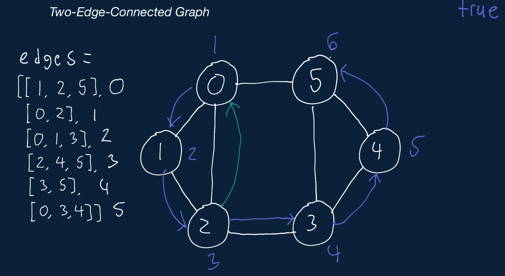

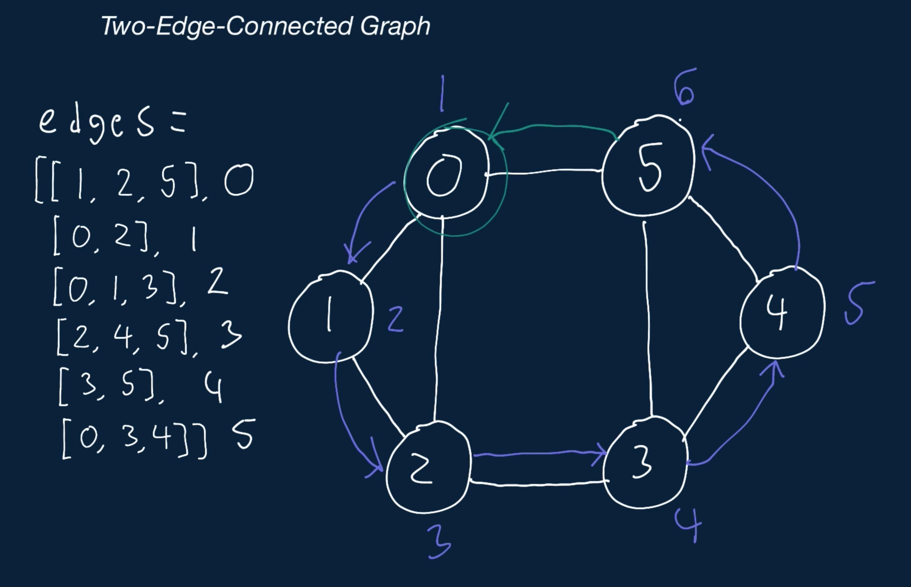

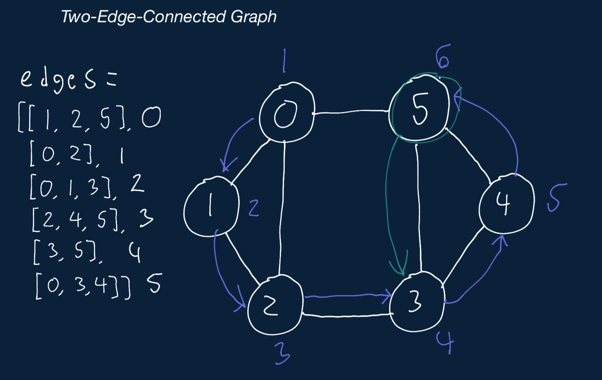

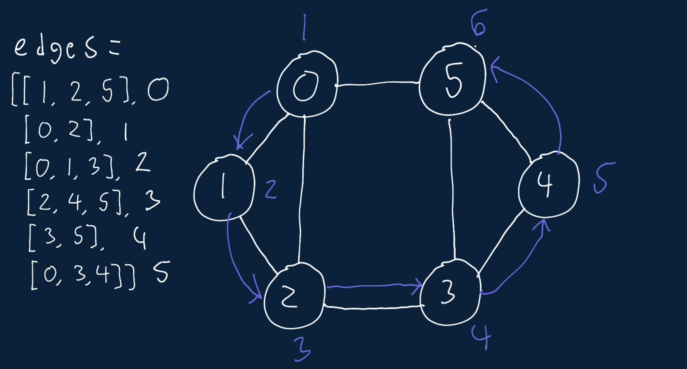

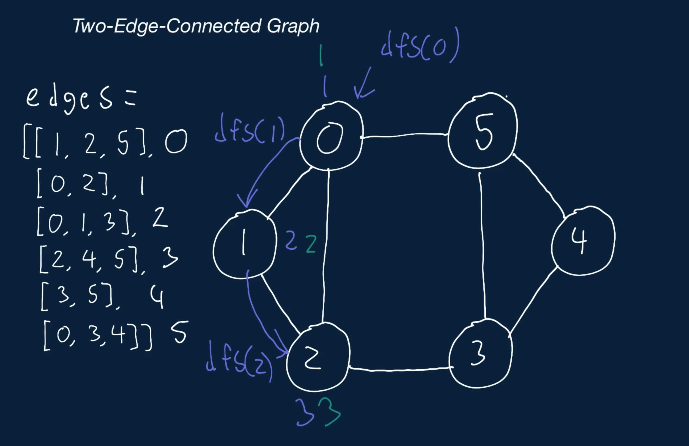

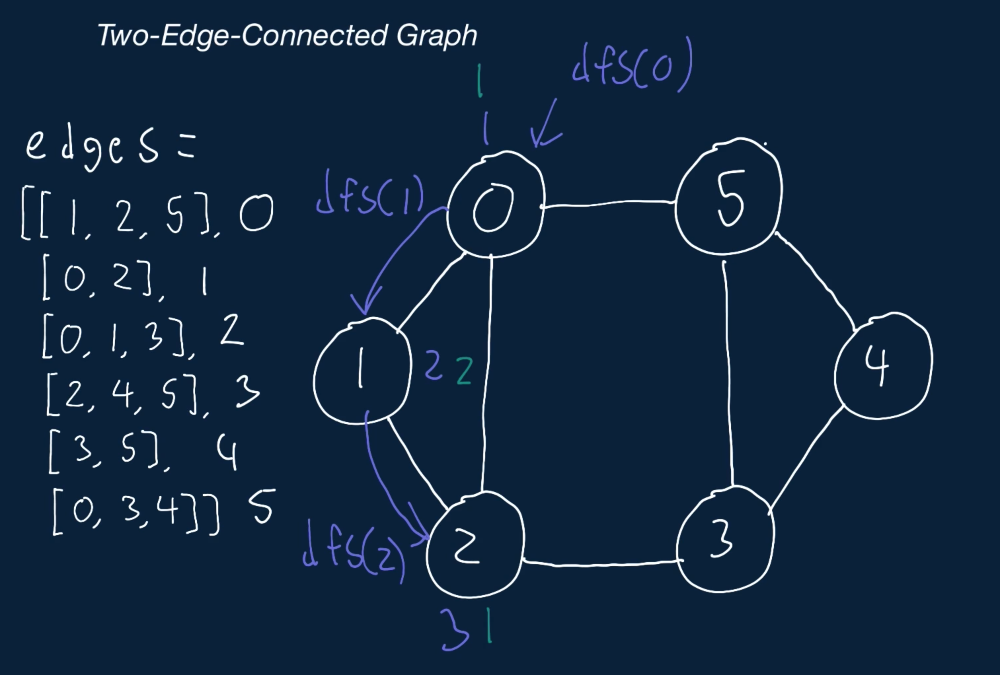

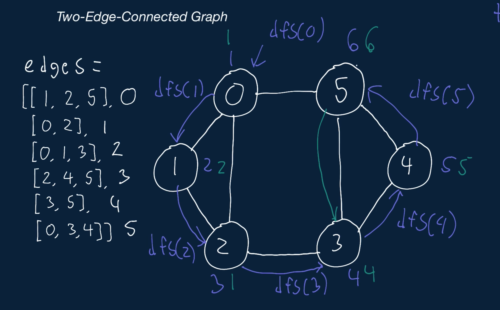

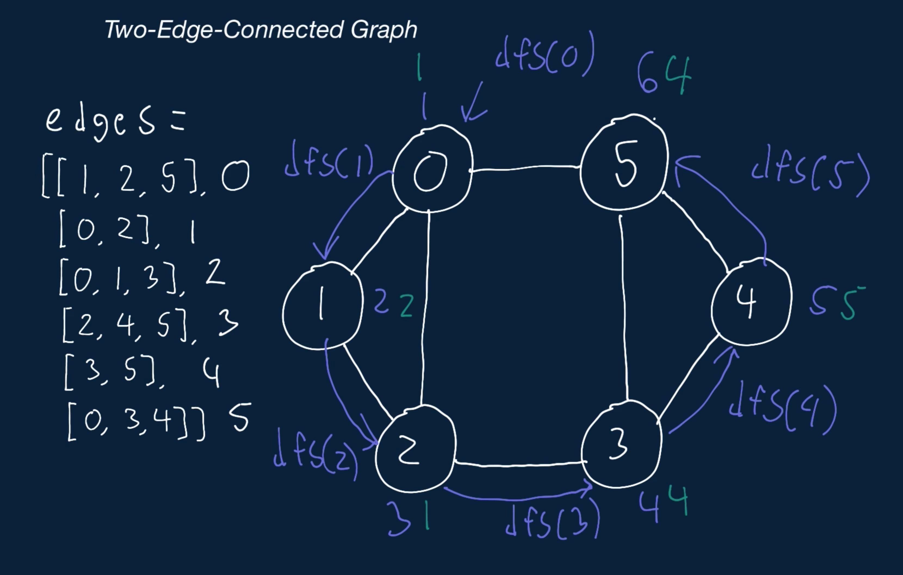

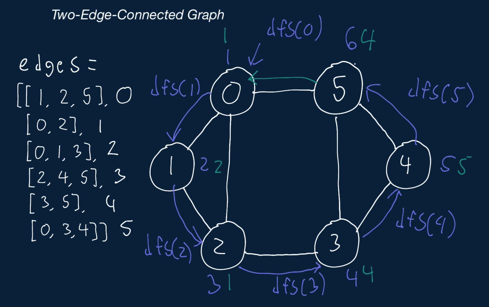

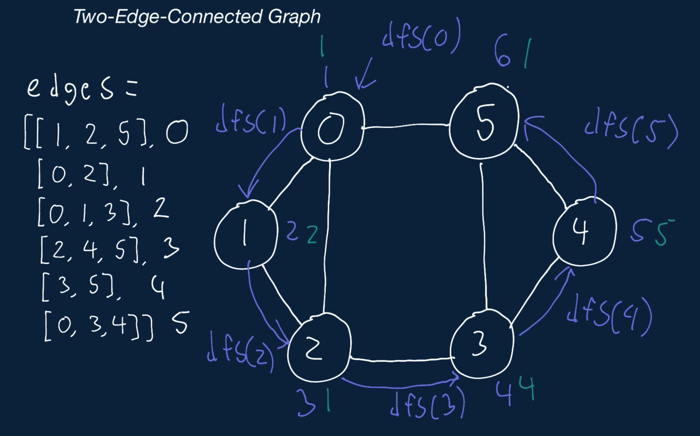

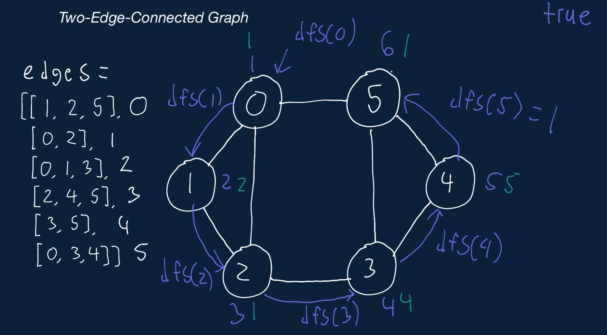

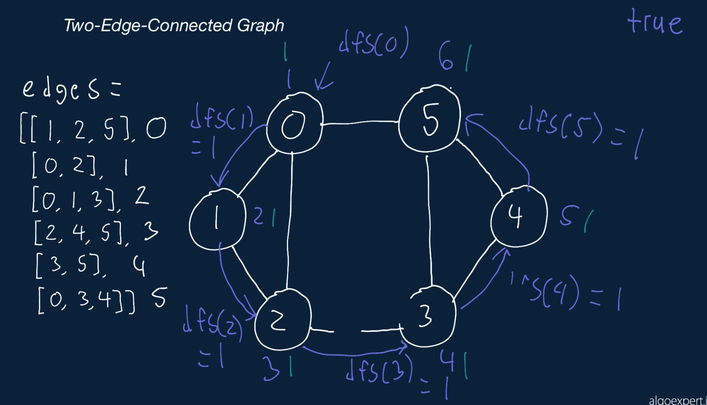


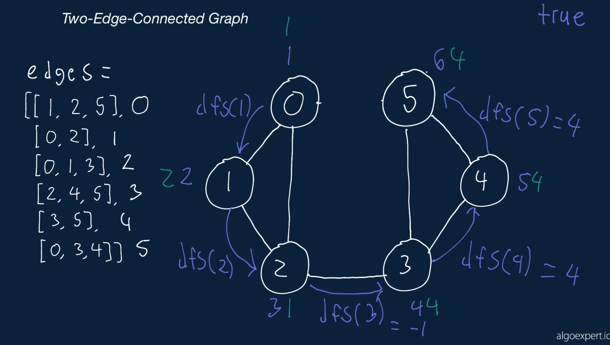


