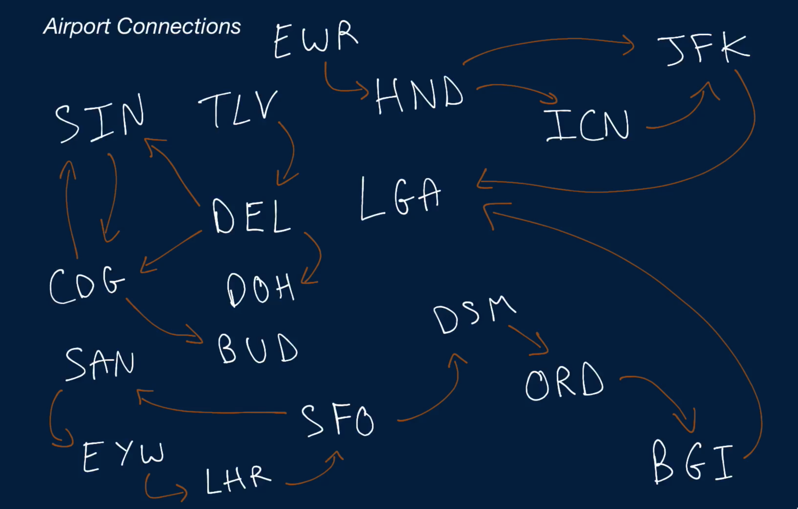
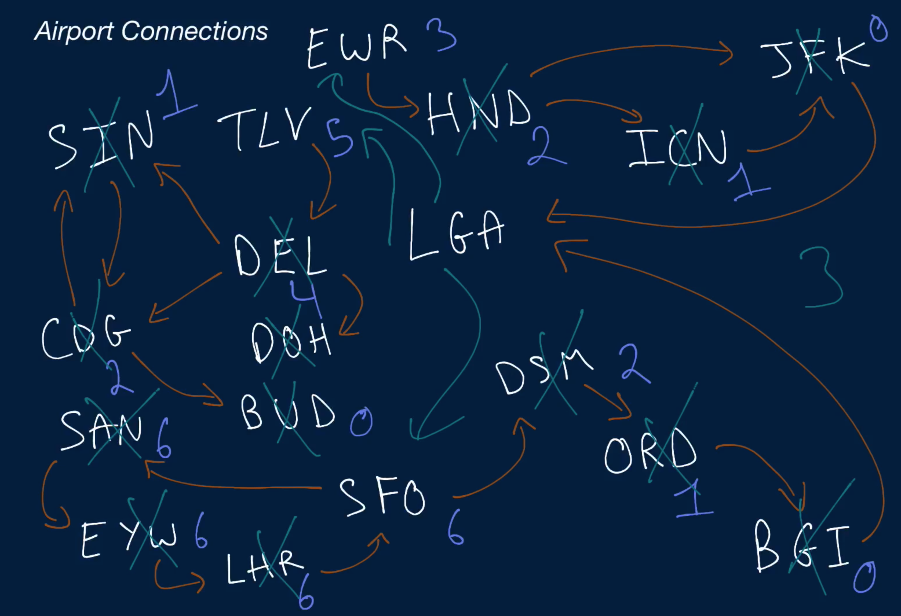

# Airport Connections

For the purpose of this question, the phrases "airport route" and "airport connection" are used interchangeably.

You're given a list of airports (three-letter codes like "JFK"), a list of routes (one-way flights from one airport to another like ["JFK", "SFO"]), and a starting airport.

Write a function that returns the minimum number of airport connections (one-way flights) that need to be added in order for someone to be able to reach any airport in the list, starting at the starting airport.

Note that routes only allow you to fly in one direction; for instance, the route ["JFK", "SFO"] only allows you to fly from "JFK" to "SFO".

Also note that the connections don't have to be direct; it's okay if an airport can only be reached from the starting airport by stopping at other airports first.

## Sample Input
```
airports = [
    "BGI", "CDG", "DEL", "DOH", "DSM", "EWR", "EYW", "HND", "ICN",
    "JFK", "LGA", "LHR", "ORD", "SAN", "SFO", "SIN", "TLV", "BUD",
]

routes = [
    ["DSM", "ORD"],
    ["ORD", "BGI"],
    ["BGI", "LGA"],
    ["SIN", "CDG"],
    ["CDG", "SIN"],
    ["CDG", "BUD"],
    ["DEL", "DOH"],
    ["DEL", "CDG"],
    ["TLV", "DEL"],
    ["EWR", "HND"],
    ["HND", "ICN"],
    ["HND", "JFK"],
    ["ICN", "JFK"],
    ["JFK", "LGA"],
    ["EYW", "LHR"],
    ["LHR", "SFO"],
    ["SFO", "SAN"],
    ["SFO", "DSM"],
    ["SAN", "EYW"],
]

startingAirport = "LGA"
```

## Sample Output

```
3 // ["LGA", "TLV"], ["LGA", "SFO"], and ["LGA", "EWR"]
```

### Hints

Hint 1
> Start by creating a graph out of the inputs. Each airport should be a vertex in the graph, and each route should be an edge. The graph should be directed with potential cycles, since it's possible for there to be round-trip flights between airports or for some series of flights to eventually lead back to an arbitrary starting point. How can this graph be useful?

Hint 2
> Using the graph mentioned in Hint #1, try getting all of the airports that are unreachable from the starting airport. This can be done using depth-first search. Is the number of unreachable airports the answer? If not, what extra information do you need to get to the answer?

Hint 3
> A single unreachable airport could have connections to a bunch of other unreachable airports, potentially making it more "valuable", since adding one connection to it would make many other airports reachable.

Hint 4
> Calculate the number of unreachable airports that are reachable from each unreachable airport (this can be done using depth-first search), sort them in descending order according to this number, and count the minimum number of connections that need to be added by iterating through this sorted list of unreachable airports, removing every unreachable airport's unreachable connections as you go through the list.

```
Optimal Space & Time Complexity
O(a * (a + r) + a + r + alog(a)) time | O(a + r) space - where a is the number of airports and r is the number of routes
```





