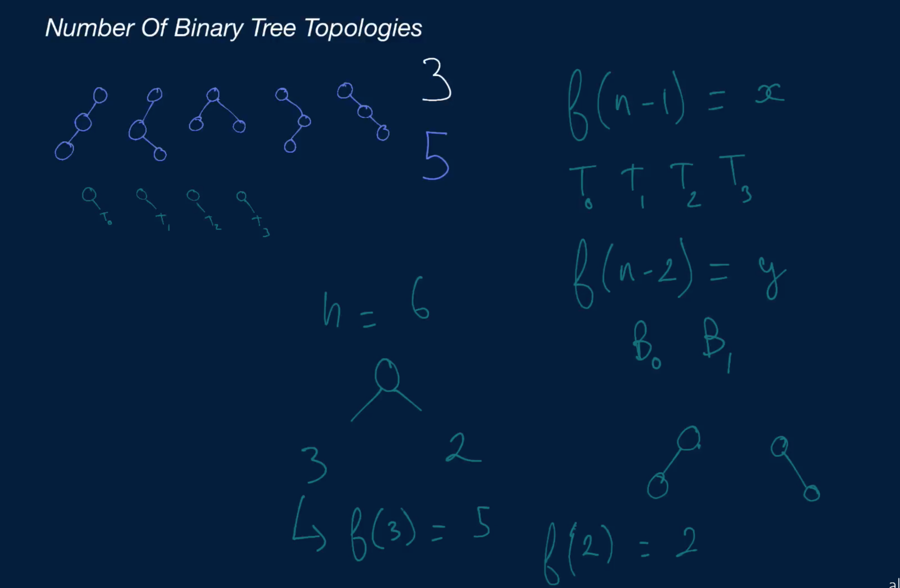
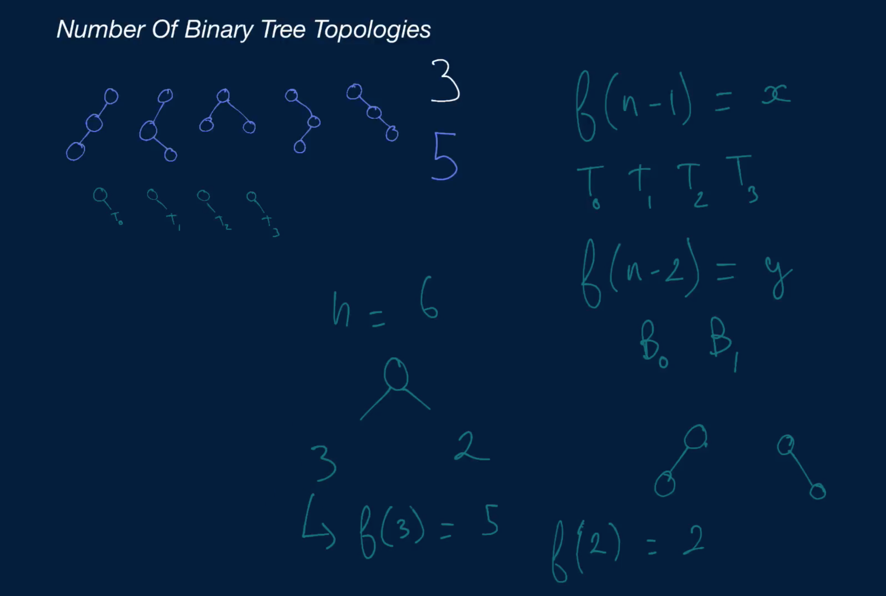
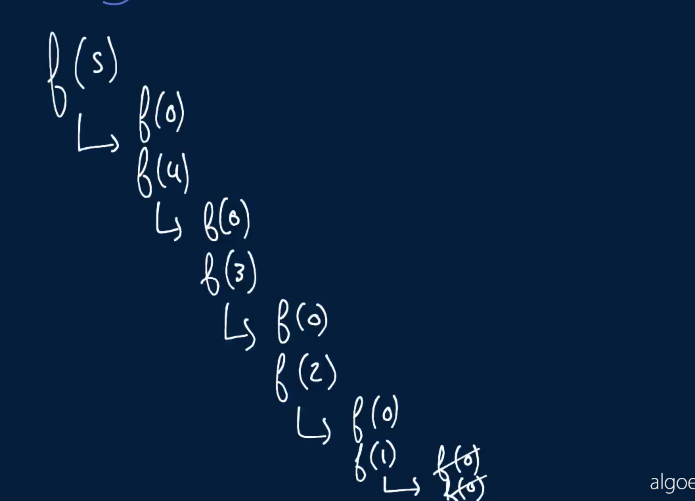
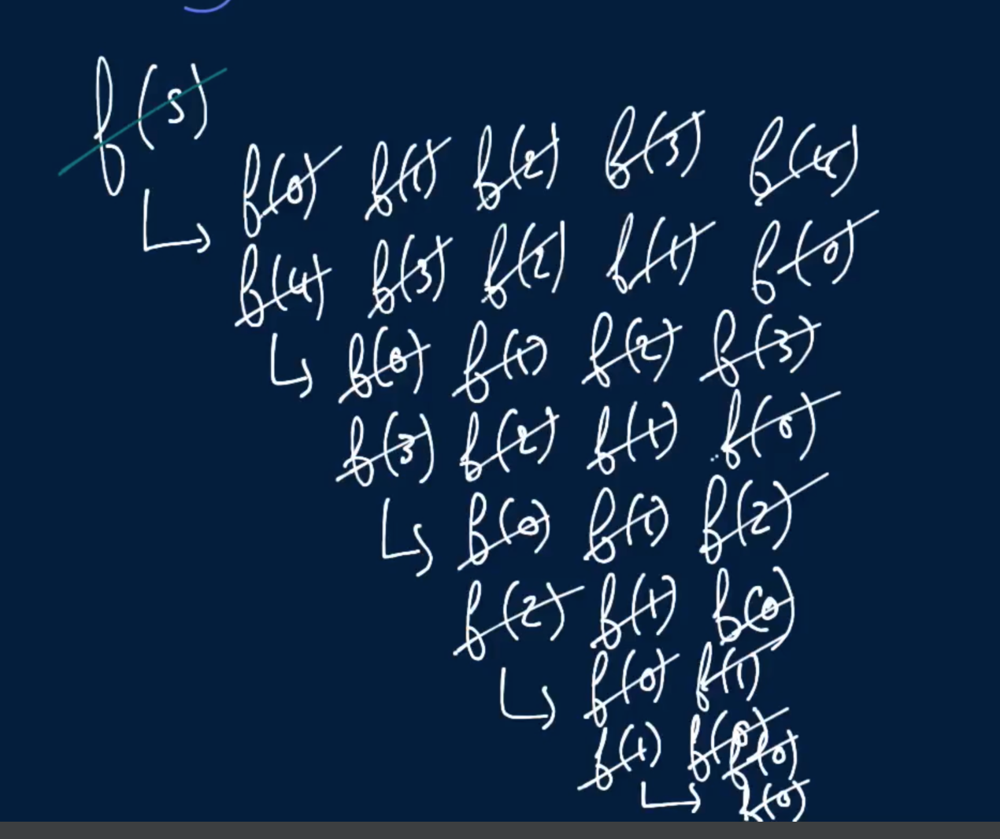
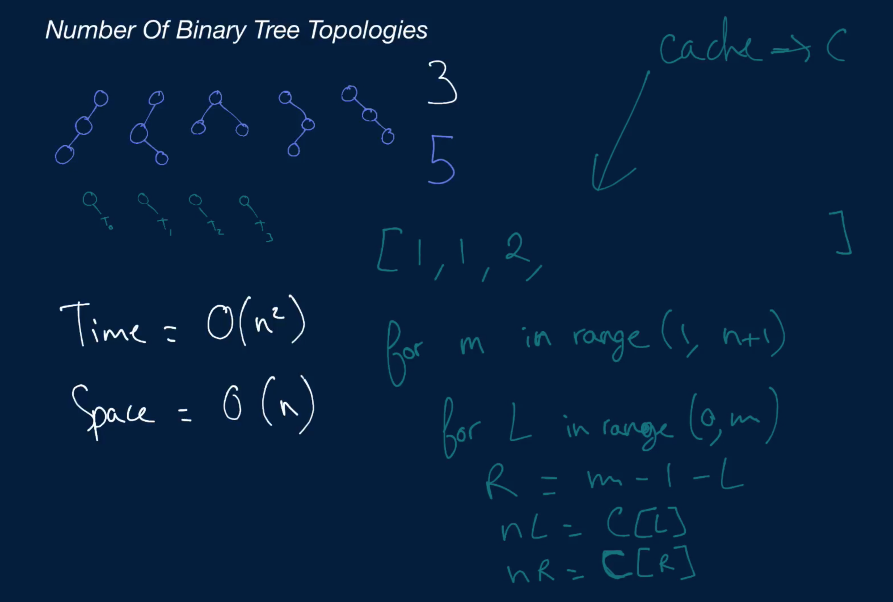

# Number Of Binary Tree Topologies

Write a function that takes in a non-negative integer n and returns the number of possible Binary Tree topologies that can be created with exactly n nodes.

A Binary Tree topology is defined as any Binary Tree configuration, irrespective of node values. For instance, there exist only two Binary Tree topologies when n is equal to 2: a root node with a left node, and a root node with a right node.

Note that when n is equal to 0, there's one topology that can be created: the None / null node.

## Sample Input

```
n = 3
```

## Sample Output
```
5
```

### Hints

Hint 1
> Every Binary Tree topology of n nodes where n is greater than 0 must have a root node and an amount of nodes on both of its sides totaling n - 1. For instance, one such topology could have a root node, n - 3 nodes in its left subtree, and 2 nodes in its right subtree. Another one could have a root node, 4 nodes in its left subtree, and n - 3 nodes in its right subtree. How many distinct Binary Tree topologies with a root node, a left subtree of x nodes, and a right subtree of n - 1 - x nodes are there?

Hint 2
> Consider a Binary Tree topology of n nodes with a root node, x nodes in its left subtree, and n - 1 - x nodes in its right subtree, and call this topology T1. This is one of possibly many topologies of n nodes. Realize that for every distinct topology T-Lk of x nodes (i.e. for every distinct topology of T1's left subtree) there is a corresponding, distinct topology of as many nodes as T1. Similarly, for every distinct topology T-Rk of n - 1 - x nodes (i.e. for every distinct topology of T1's right subtree) there is a corresponding, distinct topology of as many nodes as T1. In fact, every unique combination of left and right topologies T-Lk and T-Rk forms a distinct topology of as many nodes as T1, and this is true for every x between 0 and n - 1. Realizing this, can you implement a recursive algorithm that solves this problem?

Hint 3
> Iterate through every number x between 0 and n - 1 inclusive; at every number x, recursively calculate the number of distinct topologies of x nodes and multiply that by the number of distinct topologies of n - 1 - x nodes. Sum all of the products that you calculate to find the total number of distinct topologies of n nodes.

Hint 4
> Can you improve the recursive algorithm mentioned in Hints #2 and #3 by using a caching system (memoization)? Can you implement the algorithm iteratively? Is there any advantage to doing so?

```
Optimal Space & Time Complexity
O(n^2) time | O(n) space - where n is the input number
```









