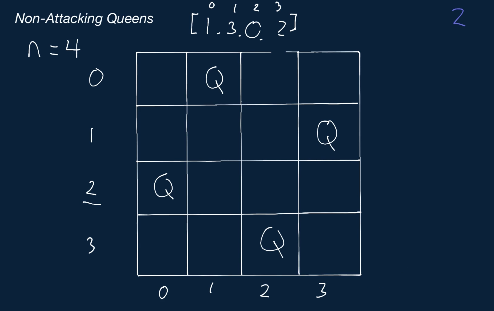
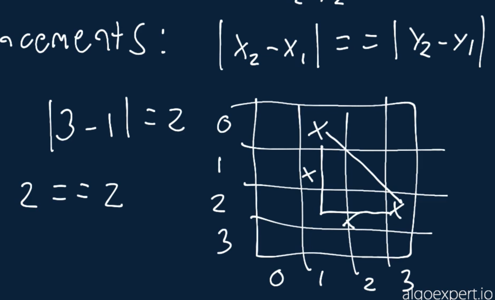

# Non-Attacking Queens

Write a function that takes in a positive integer n and returns the number of non-attacking placements of n queens on an n x n chessboard.

A non-attacking placement is one where no queen can attack another queen in a single turn. In other words, it's a placement where no queen can move to the same position as another queen in a single turn.

In chess, queens can move any number of squares horizontally, vertically, or diagonally in a single turn.

``` 
+--+--+--+--+  
|  |Q |  |  |
+--+--+--+--+
|  |  |  |Q |
+--+--+--+--+
|Q |  |  |  |
+--+--+--+--+
|  |  |Q |  |
+--+--+--+--+
The chessboard above is an example of a non-attacking placement of 4 queens on a 4x4 chessboard. For reference, there are only 2 non-attacking placements of 4 queens on a 4x4 chessboard.
```

## Sample Input

```
n = 4
```

## Sample Output
```
2
```

### Hints

Hint 1
> As soon as the input gets relatively large, this problem can no longer be solved with a brute-force approach. For example, there are 16,777,216 possible placements of 8 queens on an 8x8 chessboard. To consider all of these placements and to check if they're non-attacking isn't viable. Can you come up with an approach that limits the number of placements to consider?

Hint 2
> In order to generate a placement of n queens, you naturally have to place queens one at a time. Try only placing queens such that they're in a non-attacking position, given where you've previously placed queens. This should drastically limit the total number of placements that you consider. For example, if you place the first queen in the first row and in the first column, then don't consider a placement where any other queen is in the first row, in the first column, or in the down diagonal that starts at the first queen.

Hint 3
> When placing a queen in order to generate a full placement of n queens, you'll have to check if the position that you're considering is non-attacking. This can be done in linear time or in constant time, depending on if and how you store what columns and diagonals are blocked by previously placed queens. See the Conceptual Overview section of this question's video explanation for a more in-depth explanation.

```
Optimal Space & Time Complexity
Upper Bound: O(n!) time | O(n) space - where n is the input number
```




