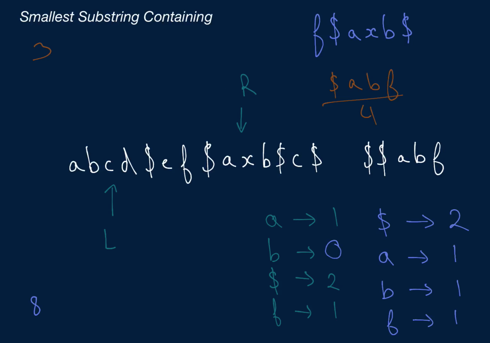
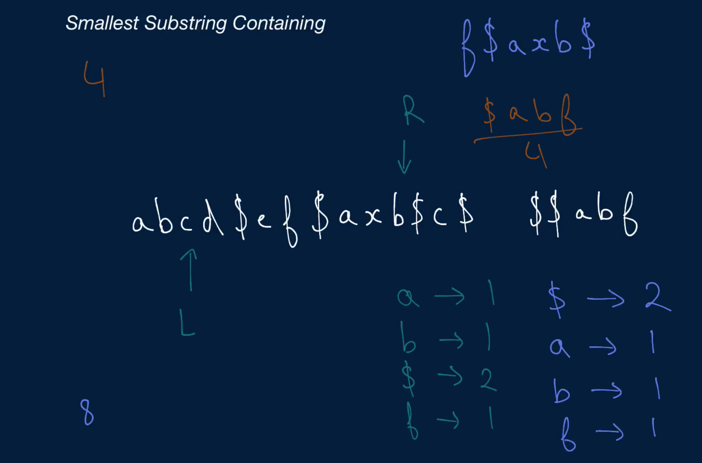
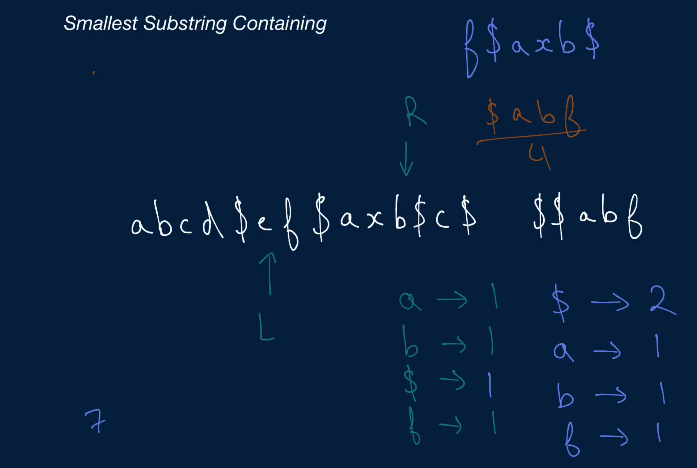
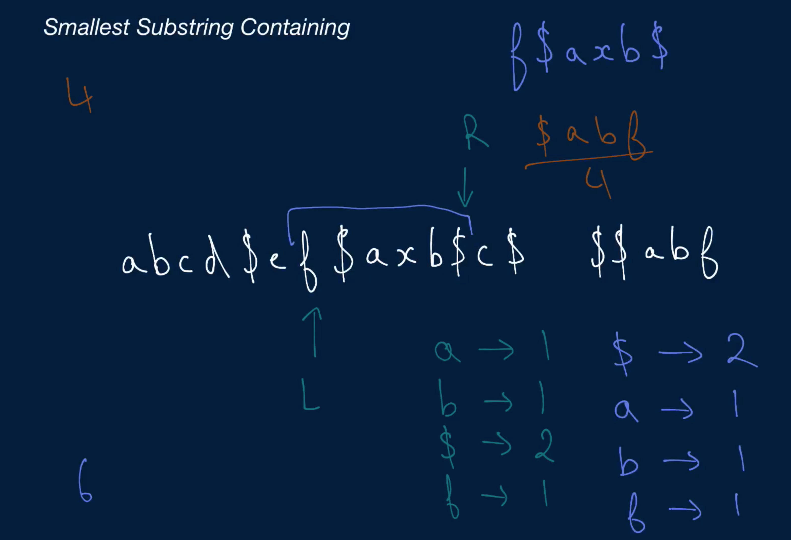

# Smallest Substring Containing

You're given two non-empty strings: a big string and a small string. Write a function that returns the smallest substring in the big string that contains all of the small string's characters.

Note that:

The substring can contain other characters not found in the small string.
The characters in the substring don't have to be in the same order as they appear in the small string.
If the small string has duplicate characters, the substring has to contain those duplicate characters (it can also contain more, but not fewer).
You can assume that there will only be one relevant smallest substring.

## Sample Input
```
bigString = "abcd$ef$axb$c$"
smallString = "$$abf"
Sample Output
"f$axb$"
```

### Hints

Hint 1
> Try storing all of the small string's character counts in a hash table where each character maps to the number of times that it appears in the small string.

Hint 2
> Try using two pointers (a left pointer and a right pointer) to traverse through the big string. How can this help you find the relevant smallest substring?

Hint 3
> With the two pointers mentioned in Hint #2, move the right pointer to the right in the big string, keeping track of all the characters you visit in a hash table identical to the one mentioned in Hint #1, until you've found all of the characters contained in the small string. At that point, move the left pointer to the right in the big string, keeping track of all the characters you "lose", and stop once you no longer have all of the small string's characters in between the left and right pointers. Then, repeat the process by moving the right pointer forward and implementing the same logic described in this Hint.

```
Optimal Space & Time Complexity
O(b + s) time | O(b + s) space - where b is the length of the big input string and s is the length of the small input string
```










